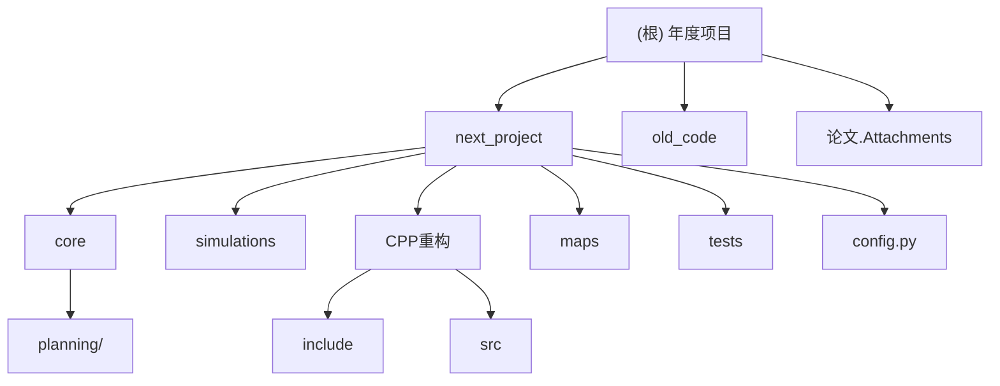

# 年度项目 - AI 上下文索引

## 项目愿景

本仓库为「低空经济导向：室内无人机集群技术验证平台」的年度研究与工程项目，聚焦于四旋翼无人机集群编队飞行的高保真建模、扰动建模、混合控制（PID+SMC）、路径规划与避障、拓扑协同与规范化评测，提供 Python 仿真主线与 C++ 重构加速版本两套实现，并配套相关论文与历史代码档案。

## 架构总览

仓库由「主活动子项目 next_project」、「历史代码归档 old_code」、「论文与素材」与若干顶层文档构成。next_project 进一步分为 Python 主仿真（core 内核 + simulations 编排）与 CPP重构（C++ 等价实现），两者输出口径一致，便于交叉验证。

- 入口层：`next_project/main.py`、`next_project/CPP重构/src/main.cpp`、`next_project/CPP重构/src/warehouse_main.cpp`
- 编排层：`next_project/simulations/`（仿真流程、批量评测、障碍场景、可视化）
- 模型层：`next_project/core/`（动力学、控制、滑模、风场、拓扑、旋翼、分配、障碍物、传感器、地图加载）
- 规划层：`next_project/core/planning/`（A*、Hybrid A*、Dijkstra、D* Lite、RRT*、Informed RRT*、ESDF、GNN 可见图、双模式调度、在线重规划器）
- 配置层：`next_project/config.py`（预设场景驱动，支持 16 个预设场景：basic/obstacle/warehouse/warehouse_a/warehouse_online/warehouse_danger/fault_tolerance/school_corridor/school_corridor_online/company_cubicles/company_cubicles_online/meeting_room/meeting_room_online/laboratory/laboratory_online/custom）
- 输出层：`outputs/` 与 `next_project/outputs/` 目录（轨迹图、误差图、统计图、benchmark JSON）
- 地图层：`next_project/maps/`（JSON 格式室内地图：走廊、办公室、仓库等）

## 模块结构图



## 模块索引

| 模块路径 | 职责一句话 | 语言 | 入口 |
|---|---|---|---|
| `next_project/` | 年度项目主仿真，包含动力学、混合控制、编队拓扑、路径规划与可视化 | Python | `main.py` |
| `next_project/core/` | 仿真内核：旋翼/分配/风场/动力学/控制器/滑模/拓扑/障碍物/传感器/地图加载 | Python | `__init__.py` |
| `next_project/core/planning/` | 路径规划算法集：A*、Hybrid A*、Dijkstra、D* Lite、RRT*、Informed RRT*、ESDF、GNN 可见图、双模式调度、在线重规划器 | Python | `base.py` |
| `next_project/simulations/` | 仿真编排：编队仿真、障碍场景仿真、批量评测、可视化 | Python | `formation_simulation.py` |
| `next_project/CPP重构/` | next_project 的 C++ 等价实现，含路径规划与避障，性能优先 | C++20 | `src/main.cpp` |
| `next_project/maps/` | 室内地图 JSON 文件（仓库、走廊、格子间、会议室、实验室等 9 个场景） | JSON | - |
| `next_project/tests/` | 单元测试与集成测试（APF 增强、故障容错、GNN 规划、障碍场景、基准对比） | Python | - |
| `old_code/` | 早期 PID 调参与初版编队飞行历史代码（仅参考） | Python | - |
| `论文.Attachments/` | 相关论文 PDF 资料 | - | - |

## 运行与开发

### Python 主线（推荐）

```bash
cd next_project
pip install -r requirements.txt   # numpy + matplotlib + scipy + cvxpy + osqp
python main.py                    # 单次仿真，输出 outputs/*.png
python simulations/benchmark.py   # 批量评测，输出 benchmark_results.json
```

支持预设场景快速切换（在 `main.py` 中通过 `config.py` 的 `get_config(preset)` 调用）：

| 预设 | 说明 |
| --- | --- |
| `basic` | 基础编队验证（30s，方形航线） |
| `obstacle` | 简单障碍物避障（三柱，厘米级精度） |
| `warehouse` | 工业仓库复杂场景（在线 A\* + 传感器 + D\* Lite + Backstepping+SMC，队形切换） |
| `warehouse_a` | 仓库场景 A\* 版（在线 + GNN Danger 模式 + ESDF 软代价） |
| `warehouse_online` | 仓库场景在线版（A\* + 传感器 + D\* Lite + WindowReplanner，30s 简化） |
| `warehouse_danger` | 仓库在线版 + GNN 双模式 + 改进 APF（保守档） |
| `fault_tolerance` | 容错测试场景（故障注入 + 拓扑重构） |
| `school_corridor` | 学校走廊（在线 + GNN Danger，窄通道+L型转角，编队收缩测试） |
| `school_corridor_online` | 学校走廊在线版（GNN 可见图 + Danger 模式 + 自适应间隔） |
| `company_cubicles` | 公司格子间（Hybrid A\* 离线，3×3 隔间矩阵+会议室，越顶飞行） |
| `company_cubicles_online` | 公司格子间在线版（A\* + 传感器 + D\* Lite + WindowReplanner） |
| `meeting_room` | 会议室（在线 A\* + 传感器 + D\* Lite，椭圆桌+座椅环绕） |
| `meeting_room_online` | 会议室在线版（A\* + 传感器 + 实时重规划，cm 级动态响应） |
| `laboratory` | 实验室（在线 A\* + 传感器 + D\* Lite，实验台+通风橱+试剂架） |
| `laboratory_online` | 实验室在线版（Hybrid A\* + 传感器 + D\* Lite + WindowReplanner） |
| `custom` | 自定义场景 |

### C++ 重构

```bash
cd next_project/CPP重构
cmake -S . -B build && cmake --build build --config Release
./build/sim_main.exe         # 单次仿真（编队飞行）
./build/sim_warehouse.exe    # 仓库避障场景
./build/sim_benchmark.exe    # 批量评测
```

## 测试策略

当前主仿真采用「指标阈值法」自检：`main.py` 在仿真结束后比对从机平均/最大误差是否 < 0.3 m 阈值；`simulations/benchmark.py` 通过多随机种子复现实验输出 mean/std/worst 指标。`tests/` 目录包含 APF 增强测试（`test_apf_enhanced.py`）、故障容错测试（`test_fault_tolerance.py`）、GNN 规划测试（`test_gnn_planner.py`）、障碍场景集成测试（`test_obstacle_scenario.py`）及基准对比（`benchmark_comparison.py`）。

## 编码规范

- Python 使用 `from __future__ import annotations` + 类型注解 + `dataclass` 配置对象。
- 中文文档字符串说明「用途/原理」，便于跨学科同事阅读。
- C++ 重构使用 C++20，`-O3` 优化，固定大小数组减少动态分配。
- 输出文件统一落到 `outputs/` 目录，PNG 格式。
- 配置驱动：调参优先在 `config.py` 预设场景或 `SimulationConfig` 字段层面调整，避免硬编码。

## 关键文档索引

| 文档 | 路径 |
|---|---|
| 路径规划与避障规划书 | [future.md](future.md) |
| 规划实施计划 | [plan.md](plan.md) |
| 理论公式与出处 | [next_project/docs/理论公式与出处.md](next_project/docs/理论公式与出处.md) |
| 技术文档 | [next_project/docs/技术文档.md](next_project/docs/技术文档.md) |
| GNN 分层双模式架构设计 | [next_project/docs/GNN分层双模式架构设计.md](next_project/docs/GNN分层双模式架构设计.md) |
| 避碰与控制技术文档 | [next_project/docs/避碰与控制技术文档.md](next_project/docs/避碰与控制技术文档.md) |
| 避碰优化技术文档 | [next_project/docs/避碰优化技术文档.md](next_project/docs/避碰优化技术文档.md) |
| 优化反效果归因分析 | [next_project/docs/优化反效果归因分析.md](next_project/docs/优化反效果归因分析.md) |
| 使用说明 | [next_project/docs/使用说明.md](next_project/docs/使用说明.md) |
| 需求符合性检查 | [next_project/docs/需求符合性检查.md](next_project/docs/需求符合性检查.md) |

## AI 使用指引

- 修改控制/动力学公式前，先阅读 `next_project/docs/理论公式与出处.md`。
- 修改仿真流程时，注意 Python 与 C++ 两侧需同步保持算法一致。
- 不要修改 `old_code/` 与 `__pycache__/`，前者为归档，后者为构建产物。
- 配置驱动：调参优先在 `config.py` 预设场景或 `SimulationConfig` 字段层面调整，避免硬编码。
- 路径规划相关修改需同步关注 Python (`core/planning/`) 与 C++（`include/` 中对应规划器头文件）两端。
- 新增地图文件放入 `next_project/maps/`，使用 JSON 格式。

## 变更日志 (Changelog)

- 2026-05-01：**8 个新场景 + 4 个新地图 + 文档审查修正**：
  - 新增 8 个预设场景：`school_corridor`、`school_corridor_online`、`company_cubicles`、`company_cubicles_online`、`meeting_room`、`meeting_room_online`、`laboratory`、`laboratory_online`
  - 新增 4 个 JSON 地图：`school_corridor.json`、`company_cubicles.json`、`meeting_room.json`、`laboratory.json`
  - 新增文档：`docs/GNN分层双模式架构设计.md`、`docs/优化反效果归因分析.md`
  - 技术文档逐章审查修正 10 项缺陷（公式/量纲/方向/命名），涉及 `controller.py`、`smc.py`、`artificial_potential_field.py`、`fault_detector.py` 等 7 个文件
  - 总预设场景从 6 个扩展至 16 个，地图从 5 个扩展至 9 个
- 2026-04-30：**GNN 双模式 + APF 增强 + 容错拓扑重构综合落地**（基于 4 篇论文，修复 7 项冲突修补 C1-C7）：
  - 新增 `core/planning/visibility_graph.py`：障碍物顶点可见图（386 顶点 vs 200k 体素）
  - 新增 `core/planning/gnn_planner.py`：GNN 可见图变体规划器（27ms@仓库）
  - 新增 `core/planning/dual_mode.py`：Safe/Danger 双模式调度 + 编队整体势场叠加
  - 新增 `core/fault_detector.py`：三规则在线故障检测（阈值配置化）
  - 修改 `core/artificial_potential_field.py`：n_decay 自适应(缓存88%)、Rodrigues 旋转力场(cos≈0)、通信约束力(tanh平滑, m/s²断言)
  - 修改 `core/topology.py`：TopologyGraph(Laplacian λ₂)、fault_reconfigure()、auto_shrink()
  - 修改 `core/drone.py`：fault_mask + inject_fault()
  - 修改 `core/planning/replanner.py`：RiskAdaptiveReplanInterval(0.1~1.0s)、双模式集成
  - 修改 `config.py`：+2 预设(warehouse_danger/fault_tolerance)、APF profile 三档化、+35 配置字段
  - 新增 16 项专项单测，全部通过；basic/obstacle 场景 0 回归
  - 文档更新：`技术文档.md` +§11-16、`避碰优化技术文档.md` +§14
- 2026-04-29：更新项目结构，反映已完成的核心变更：
  - 新增 `core/planning/` 路径规划子包（A*、Hybrid A*、Dijkstra、D* Lite、RRT*、Informed RRT*、ESDF、在线重规划器）
  - 新增 `core/obstacles.py`、`core/sensors.py`、`core/map_loader.py`、`core/allocator.py`、`core/artificial_potential_field.py`
  - 新增 `simulations/obstacle_scenario.py` 障碍场景仿真
  - 新增 `config.py` 预设驱动配置（6 个预设场景）
  - 新增 `maps/` 目录（5 个室内 JSON 地图）
  - 新增 `tests/` 测试目录
  - C++ 端大幅扩展：新增避障、路径规划（A*、Hybrid A*、D* Lite、ESDF）、传感器、占据栅格、人工势场、在线重规划器等模块
  - 文档整理至 `next_project/docs/`，新增技术文档、避碰文档等
  - 新增顶层 `future.md`（路径规划与避障规划书）、`plan.md`（实施计划）
  - requirements.txt 新增 scipy、cvxpy、osqp 依赖
- 2026-04-25：初始化 AI 上下文索引，添加 Mermaid 模块图与导航面包屑。
