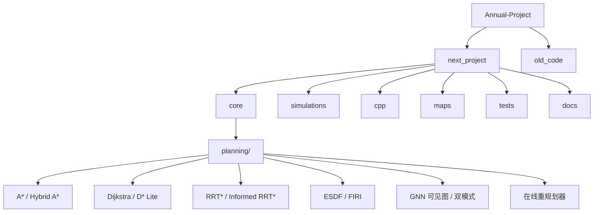

# 室内无人机集群技术验证平台

哈尔滨工业大学（HIT）大一学年项目 — 低空经济导向下的四旋翼无人机集群编队仿真系统。

面向室内复杂场景，实现高保真动力学建模、混合控制（PID+SMC）、多算法路径规划与避障、编队拓扑协同、在线重规划与故障容错，提供 **Python 仿真主线**与 **C++ 重构加速** 两套等价实现。

## 架构总览



## 目录结构

```text
├── next_project/                # 主仿真项目
│   ├── main.py                  # CLI 入口（16 个预设场景）
│   ├── config.py                # 仿真预设定义
│   ├── core/                    # 仿真内核
│   │   ├── drone.py             # 四旋翼动力学（+故障注入）
│   │   ├── controller.py        # PID + Backstepping 混合控制
│   │   ├── smc.py               # 滑模控制器
│   │   ├── topology.py          # 编队拓扑（Laplacian λ₂ + 故障重构）
│   │   ├── fault_detector.py    # 三规则在线故障检测
│   │   ├── artificial_potential_field.py  # 改进人工势场（Rodrigues 旋转力场）
│   │   ├── obstacles.py         # 障碍物模型
│   │   ├── sensors.py           # 传感器仿真
│   │   ├── wind_field.py        # 风场扰动
│   │   ├── rotor.py / allocator.py  # 旋翼与推力分配
│   │   ├── map_loader.py        # JSON 地图加载
│   │   └── planning/            # 路径规划算法集
│   │       ├── astar.py         # A* 搜索
│   │       ├── hybrid_astar.py  # Hybrid A*（3D 运动学约束）
│   │       ├── dijkstra.py      # Dijkstra 最短路径
│   │       ├── dstar_lite.py    # D* Lite 增量重规划
│   │       ├── rrt_star.py      # RRT* 渐近最优
│   │       ├── informed_rrt_star.py  # Informed RRT* 椭圆采样
│   │       ├── esdf.py          # 欧几里得符号距离场
│   │       ├── firi.py          # 快速迭代区域膨胀
│   │       ├── visibility_graph.py   # 障碍物顶点可见图
│   │       ├── gnn_planner.py   # GNN 可见图变体规划器
│   │       ├── dual_mode.py     # Safe/Danger 双模式调度
│   │       └── replanner.py     # 风险自适应在线重规划
│   ├── simulations/             # 仿真编排
│   │   ├── formation_simulation.py  # 编队飞行仿真
│   │   ├── obstacle_scenario.py     # 障碍场景仿真
│   │   ├── benchmark.py             # 批量评测
│   │   └── visualization.py         # 3D 可视化
│   ├── tests/                   # pytest 测试套件
│   ├── maps/                    # 9 个室内 JSON 地图
│   ├── docs/                    # 技术文档与答辩准备
│   ├── cpp/                     # C++20 等价重构（-O3）
│   │   ├── include/             # 29 个头文件
│   │   └── src/                 # 20 个源文件
│   └── web/                     # Web 3D 动态回放
├── old_code/                    # 早期 PID 调参历史代码
├── CLAUDE.md                    # AI 上下文索引
├── future.md                    # 路径规划与避障规划书
└── plan.md                      # 实施计划
```

## 关键技术

| 领域 | 技术方案 |
| ---- | -------- |
| **动力学** | 四旋翼刚体模型 + 旋翼推力分配 + 欧拉积分 |
| **控制** | PID + 前馈 + Backstepping + SMC 滑模混合控制 |
| **路径规划** | A\* / Hybrid A\* / D\* Lite / RRT\* / Informed RRT\* / ESDF / FIRI |
| **避障** | 改进 APF（Rodrigues 旋转力场 + n_decay 自适应） + GNN 可见图 + 双模式调度 |
| **编队** | 虚拟领航者 + 固定偏差 + 拓扑图（Laplacian λ₂） + 自适应收缩 |
| **容错** | 三规则在线故障检测 + 拓扑自动重构 |
| **重规划** | 风险自适应间隔（0.1~1.0s） + 滑动窗口动态重规划 |

## 快速开始

### Python 主线

```bash
cd next_project
pip install -r requirements.txt    # numpy + matplotlib + scipy + cvxpy + osqp
python main.py                     # 默认 basic 预设
python main.py --preset warehouse_danger --no-plot
python main.py --preset school_corridor_online --max-sim-time 60
```

### 批量评测

```bash
python simulations/benchmark.py
```

### 测试

```bash
python -m pytest
```

### C++ 重构

```bash
cmake -S cpp -B cpp/build
cmake --build cpp/build --config Release
./cpp/build/sim_main.exe          # 编队飞行
./cpp/build/sim_warehouse.exe     # 仓库避障
./cpp/build/sim_benchmark.exe     # 批量评测
```

### Web 3D 回放

```bash
cd web && python server.py
```

## 预设场景（16 个）

| 预设 | 场景描述 | 核心算法 |
| ---- | -------- | -------- |
| `basic` | 基础编队验证（方形航线） | PID+SMC |
| `obstacle` | 简单障碍物避障（三柱） | APF |
| `warehouse` | 工业仓库复杂场景 | A\* + D\* Lite + Backstepping+SMC |
| `warehouse_a` | 仓库 A\* 版 | GNN Danger + ESDF 软代价 |
| `warehouse_online` | 仓库在线简化版 | A\* + 传感器 + D\* Lite + WindowReplanner |
| `warehouse_danger` | 仓库在线 + GNN 双模式 | 改进 APF 保守档 |
| `fault_tolerance` | 容错测试 | 故障注入 + 拓扑重构 |
| `school_corridor` | 学校走廊（窄通道+L型转角） | 编队收缩 + GNN Danger |
| `school_corridor_online` | 学校走廊在线版 | GNN 可见图 + 自适应间隔 |
| `company_cubicles` | 公司格子间（3×3 隔间矩阵） | Hybrid A\* 越顶飞行 |
| `company_cubicles_online` | 格子间在线版 | A\* + D\* Lite + WindowReplanner |
| `meeting_room` | 会议室（椭圆桌+座椅环绕） | A\* + D\* Lite |
| `meeting_room_online` | 会议室在线版 | cm 级动态响应 |
| `laboratory` | 实验室（实验台+通风橱） | A\* + D\* Lite |
| `laboratory_online` | 实验室在线版 | Hybrid A\* + WindowReplanner |
| `custom` | 自定义场景 | 配置驱动 |

## 室内地图

`maps/` 目录包含 9 个 JSON 格式室内场景：`sample_simple`、`sample_corridor`、`sample_office`、`sample_open_office`、`sample_warehouse`、`school_corridor`、`company_cubicles`、`meeting_room`、`laboratory`

## 文档索引

| 文档 | 说明 |
| ---- | ---- |
| [技术文档](next_project/docs/技术文档.md) | 算法原理与公式推导 |
| [避碰与控制技术文档](next_project/docs/避碰与控制技术文档.md) | 避碰系统详解 |
| [GNN 分层双模式架构设计](next_project/docs/GNN分层双模式架构设计.md) | GNN 规划器架构 |
| [使用说明](next_project/docs/使用说明.md) | 详细使用教程 |
| [答辩准备索引](next_project/docs/答辩准备索引.md) | 答辩要点汇总 |
| [项目零基础讲解](next_project/docs/项目零基础讲解.md) | 入门引导 |
| [future.md](future.md) | 路径规划与避障规划书 |
| [plan.md](plan.md) | 实施计划 |

## 编码规范

- Python：`from __future__ import annotations` + 类型注解 + `dataclass`
- 配置驱动：调参统一在 `config.py` 预设场景层面，避免硬编码
- C++：C++20，`-O3`，固定大小数组减少动态分配
- 输出统一到 `outputs/`，PNG/HTML 格式

## 变更日志

- **2026-05-01**：新增 8 个场景 + 4 个地图，16 个预设全覆盖，文档审查修正
- **2026-04-30**：GNN 双模式 + APF 增强 + 容错拓扑重构综合落地
- **2026-04-29**：路径规划子包、障碍物/传感器模块、C++ 端大幅扩展
- **2026-04-25**：初始化 AI 上下文索引
