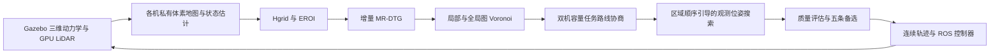
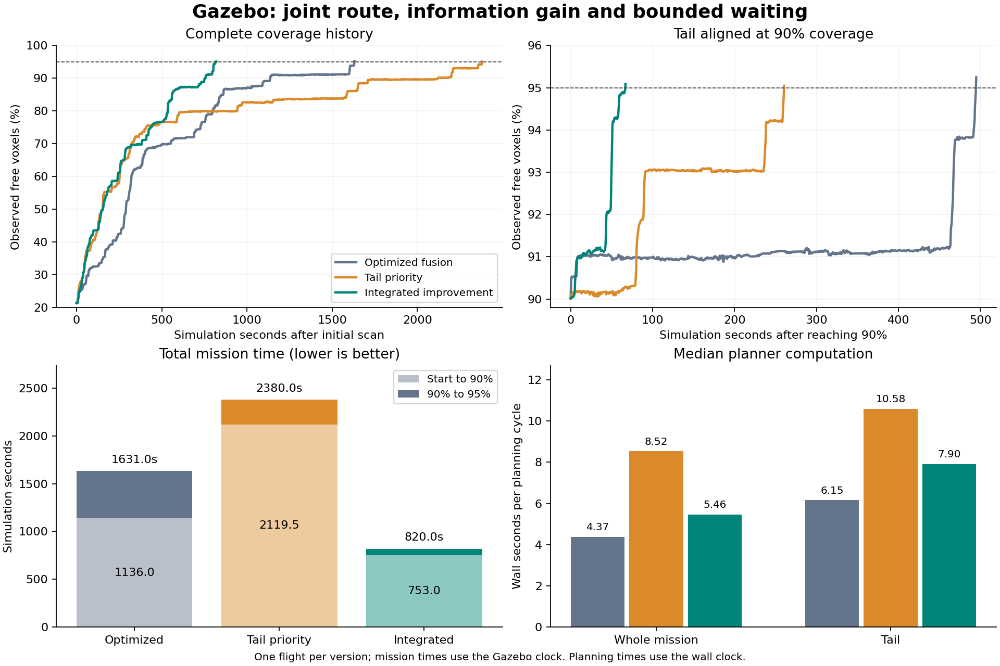
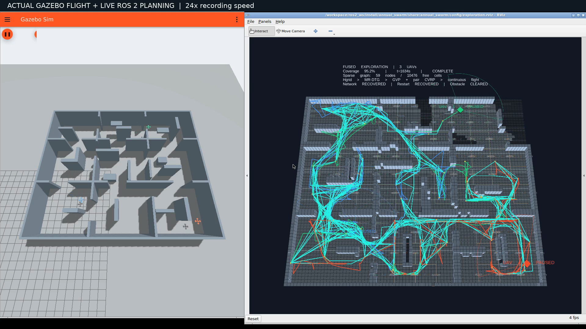

# 室内无人机集群：ROS 2 / Gazebo 仿真

最新联合路线/观测收益改进在同条件 Gazebo 中 **820.0 s 达到 95% 三维覆盖**，总航程 327.1 m，零接触；较此前 1631.0 s 优化融合版缩短 49.7%。[新录像、三版本对照及独立审计](ros2_ws/docs/validation/fusion-integrated/README.md)。这是单次工程实测，未声称所有场景都能获得同等改善。

早期策略接入同一三维传感环境时，2400.6 s 覆盖 53.53%，未达到 95%。[历史对照与全部尝试披露](ros2_ws/docs/validation/early-policy-3d/README.md) 保留当时的版本和指标；这不是原二维约 300 s 任务的复现。

主运行入口已迁移到 **ROS 2 Jazzy + Gazebo Harmonic（Ubuntu 24.04）**。当前主任务为三架四旋翼的去中心化三维搜索：自适应区域、增量 MR-DTG、图 Voronoi、双机容量路线协商、观测位姿与连续轨迹共同组成一条融合流程。复用仓库原有 C++ 飞控和 Python 规划算法，Gazebo 负责刚体动力学、重力与碰撞。网页服务、HTML 页面和 Plotly HTML 导出已移除。

```bash
source /opt/ros/jazzy/setup.bash
cd ros2_ws
rosdep install --from-paths src --ignore-src -r -y
colcon build --cmake-args -DCMAKE_BUILD_TYPE=Release
source install/setup.bash
ros2 launch annual_swarm decentralized_search.launch.py headless:=false rviz:=true
```

依赖安装、Docker（含 macOS 无界面验证）、地图切换、节点/话题、模型参数和验证命令见 **[ROS 2 使用说明](ros2_ws/README.md)**；实测结果见 **[验收记录](ros2_ws/VALIDATION.md)**。


```mermaid
flowchart LR
  G[Gazebo 三维动力学与 GPU LiDAR] --> M[各机私有体素地图与状态估计]
  M --> H[Hgrid 与 EROI]
  H --> T[增量 MR-DTG]
  T --> V[局部与全局图 Voronoi]
  V --> P[双机容量任务路线协商]
  P --> O[区域顺序引导的观测位姿搜索]
  O --> Q[质量评估与五条备选]
  Q --> C[连续轨迹与 ROS 控制器]
  C --> G
```

| 目录 | 用途 |
|---|---|
| `ros2_ws/src/annual_swarm` | ROS 节点、Gazebo 插件、SDF 模型、世界、launch、集成测试 |
| `next_project/cpp` | ROS 直接复用的 C++ 控制器、分配器、A* 与地图代码；原独立仿真作为离线基线 |
| `next_project/maps` | 共享障碍地图；启动时生成同源 Gazebo 几何 |
| `next_project/core`、`simulations`、`tests` | ROS 直接复用的 Python 规划/APF 算法、离线回归和静态图表 |
| `docker/Dockerfile.ros2` | 可复现 Linux ROS/Gazebo 环境 |
| `old_code`、`references` | 历史算法与项目资料 |

ROS 可选择 A*、航向约束 A*、Hybrid A*、Dijkstra、RRT*、Informed RRT*、D* Lite、GNN 与分层滑动窗口调度；控制可选 PID、SMC、反步＋SMC、反步＋PID，以及两种实验控制分支。ESDF、FIRI、轨迹后处理、APF 前馈可独立配置。支持飞行中更换目标和周期重规划，运行结果记录实际算法及回退信息。

```bash
ros2 launch annual_swarm swarm.launch.py planner:=window controller:=backstepping replan_interval:=3.0
ros2 launch annual_swarm swarm.launch.py planner:=informed_rrt_star controller:=smc
ros2 topic echo /swarm/planner_diagnostics
```

历史 `swarm.launch.py` 编队入口使用已知静态地图、定高、固定三机队形及 Gazebo 真值里程计。新增 portfolio 模式支持质量评分、五条备选及真实 Gazebo 圆柱障碍快照切换；未知环境融合探索由独立的 `decentralized_search.launch.py` 入口提供；MPC 仅复用原可行性评估器，不是在线 MPC 控制器。详细能力、实验分支含义和验收命令见 [ROS 使用说明](ros2_ws/README.md)。

实际 Gazebo 截图及动态恢复对照图见 [运行证据](ros2_ws/docs/validation/README.md)。

新增复杂环境三机独立搜索：有限视距观测、动态图任务分区、成对负载优化和动态任务转交，见 [搜索使用说明](ros2_ws/EXPLORATION.md) 和 [复杂地图实测图](ros2_ws/docs/validation/search/README.md)。

### 融合探索录像与证据

三维点云、IMU/定位估计、自适应区域、历史树握手拓扑、图分区与双机 CVRP、连续轨迹以及断连/重启恢复的实现及边界见 [融合架构与接口](ros2_ws/DECENTRALIZED_EXPLORATION.md)。主入口 `decentralized_search.launch.py` 将这些环节共同运行，没有 RACER/GVP 模式选择器。

最新版本将行驶时间与信息加权完成时间共同优化，保留优化后的路线；等待奖励有界，并通过压缩的实际观测回执减少跨机重复收益计算。区域粗评估有预算与轮转，执行视点仍做完整几何和预约核验。[本次视频与三版本数据](ros2_ws/docs/validation/fusion-integrated/README.md) 同时记录 90%→95% 为 67.0 s、173 项测试通过，以及单轮规划仍比此前优化融合版慢的限制。[上轮末端优先级版](ros2_ws/docs/validation/fusion-tail-priority/README.md) 的总耗时退化记录完整保留。



[观看优化版 Gazebo 原生视频](ros2_ws/docs/validation/fusion-optimized/fused-exploration.mp4) · [优化前后对照、独立审计与原始证据](ros2_ws/docs/validation/fusion-optimized/README.md)

同地图、相同飞行限速的一次完整对照中，达到 95% 覆盖用时由 2183.5 s 降至 1631.0 s（缩短 25.3%），视点间等待中位数由 10.05 s 降至 2.49 s；零接触。总航程同时增加 37.1%，重复探索仍需改进，不能据此声称能耗或路径长度也得到优化。[原三维融合基线](ros2_ws/docs/validation/fusion/README.md) 保留供复算。



[历史平面版录像与旧口径数据](ros2_ws/docs/validation/decentralized/README.md) 单独保留，不能与当前三维传感结果直接比较。旧集中式探索和编队入口继续用于原算法回归。
