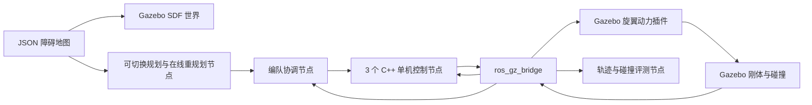

# 室内无人机集群：ROS 2 / Gazebo 仿真

主运行入口已迁移到 **ROS 2 Jazzy + Gazebo Harmonic（Ubuntu 24.04）**。三架四旋翼在 Gazebo 中通过旋翼推力起飞、编队绕障并在终点悬停。复用仓库原有 C++ 飞控和 Python 规划算法，Gazebo 负责刚体动力学、重力与碰撞。网页服务、HTML 页面和 Plotly HTML 导出已移除。

```bash
source /opt/ros/jazzy/setup.bash
cd ros2_ws
rosdep install --from-paths src --ignore-src -r -y
colcon build --cmake-args -DCMAKE_BUILD_TYPE=Release
source install/setup.bash
ros2 launch annual_swarm swarm.launch.py
```

依赖安装、Docker（含 macOS 无界面验证）、地图切换、节点/话题、模型参数和验证命令见 **[ROS 2 使用说明](ros2_ws/README.md)**；实测结果见 **[验收记录](ros2_ws/VALIDATION.md)**。


```mermaid
flowchart LR
  Map[JSON 障碍地图] --> World[Gazebo SDF 世界]
  Map --> Planner[可切换规划与在线重规划节点]
  Planner --> Formation[编队协调节点]
  Formation --> Controllers[3 个 C++ 单机控制节点]
  Controllers --> Bridge[ros_gz_bridge]
  Bridge --> Motors[Gazebo 旋翼动力插件]
  Motors --> Physics[Gazebo 刚体与碰撞]
  Physics --> Bridge
  Bridge --> Controllers
  Bridge --> Formation
  Bridge --> Metrics[轨迹与碰撞评测节点]
```

| 目录 | 用途 |
|---|---|
| `ros2_ws/src/annual_swarm` | ROS 节点、Gazebo 插件、SDF 模型、世界、launch、集成测试 |
| `next_project/cpp` | ROS 直接复用的 C++ 控制器、分配器、A* 与地图代码；原独立仿真作为离线基线 |
| `next_project/maps` | 共享障碍地图；启动时生成同源 Gazebo 几何 |
| `next_project/core`、`simulations`、`tests` | ROS 直接复用的 Python 规划/APF 算法、离线回归和静态图表 |
| `docker/Dockerfile.ros2` | 可复现 Linux ROS/Gazebo 环境 |
| `old_code`、`references` | 历史算法与项目资料 |

ROS 可选择 A*、航向约束 A*、Hybrid A*、Dijkstra、RRT*、Informed RRT*、D* Lite、GNN 与分层滑动窗口调度；控制可选 PID、SMC、反步＋SMC、反步＋PID，以及两种实验控制分支。ESDF、FIRI、轨迹后处理、APF 前馈可独立配置。支持飞行中更换目标和周期重规划，运行结果记录实际算法及回退信息。

```bash
ros2 launch annual_swarm swarm.launch.py planner:=window controller:=backstepping replan_interval:=3.0
ros2 launch annual_swarm swarm.launch.py planner:=informed_rrt_star controller:=smc
ros2 topic echo /swarm/planner_diagnostics
```

当前为已知静态地图、定高、固定三机队形，使用 Gazebo 真值里程计。新增 portfolio 模式支持质量评分、五条备选及真实 Gazebo 圆柱障碍快照切换；未知地图建图和故障拓扑重构尚未接入；MPC 仅复用原可行性评估器，不是在线 MPC 控制器。详细能力、实验分支含义和验收命令见 [ROS 使用说明](ros2_ws/README.md)。

实际 Gazebo 截图及动态恢复对照图见 [运行证据](ros2_ws/docs/validation/README.md)。
