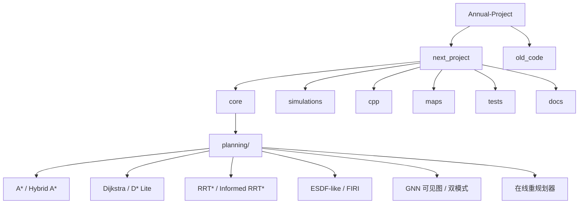

# 室内无人机集群技术验证平台

哈尔滨工业大学（HIT）大一学年项目 — 低空经济导向下的四旋翼无人机集群编队仿真系统。

面向室内复杂场景，实现高保真动力学建模、混合控制（PID+SMC）、多算法路径规划与避障、编队拓扑协同、在线重规划与故障容错，提供 **Python 仿真主线**与 **C++ 重构加速** 两套等价实现。

## 架构总览


```mermaid
graph TD
    A["Annual-Project"] --> B["next_project"]
    A --> C["old_code"]
    B --> CORE["core"]
    B --> SIM["simulations"]
    B --> CPP["cpp"]
    B --> MAPS["maps"]
    B --> TESTS["tests"]
    B --> DOCS["docs"]
    CORE --> PLAN["planning/"]
    PLAN --> P1["A* / Hybrid A*"]
    PLAN --> P2["Dijkstra / D* Lite"]
    PLAN --> P3["RRT* / Informed RRT*"]
    PLAN --> P4["ESDF-like / FIRI"]
    PLAN --> P5["GNN 可见图 / 双模式"]
    PLAN --> P6["在线重规划器"]
```

## 目录结构

```text
├── next_project/                # 主仿真项目
│   ├── main.py                  # CLI 入口（34 个预设场景）
│   ├── config.py                # 仿真预设定义
│   ├── core/                    # 仿真内核
│   │   ├── drone.py             # 四旋翼动力学（+故障注入）
│   │   ├── controller.py        # PID + Backstepping 混合控制
│   │   ├── smc.py               # 滑模控制器
│   │   ├── topology.py          # 编队拓扑（Laplacian λ₂ + 故障重构）
│   │   ├── fault_detector.py    # 三规则在线故障检测
│   │   ├── artificial_potential_field.py  # 改进人工势场（Rodrigues 旋转力场）
│   │   ├── obstacles.py         # 障碍物模型
│   │   ├── sensors.py           # 传感器仿真
│   │   ├── wind_field.py        # 风场扰动
│   │   ├── rotor.py / allocator.py  # 旋翼与推力分配
│   │   ├── map_loader.py        # JSON 地图加载
│   │   └── planning/            # 路径规划算法集
│   │       ├── astar.py         # A* 搜索
│   │       ├── hybrid_astar.py  # Hybrid A*（3D 运动学约束）
│   │       ├── dijkstra.py      # Dijkstra 最短路径
│   │       ├── dstar_lite.py    # D* Lite 增量重规划
│   │       ├── rrt_star.py      # RRT* 渐近最优
│   │       ├── informed_rrt_star.py  # Informed RRT* 椭圆采样
│   │       ├── esdf.py          # 栅格欧氏距离场 / ESDF-like 软代价
│   │       ├── firi.py          # 快速迭代区域膨胀
│   │       ├── visibility_graph.py   # 障碍物顶点可见图
│   │       ├── gnn_planner.py   # GNN 可见图变体规划器
│   │       ├── dual_mode.py     # Safe/Danger 双模式调度
│   │       └── replanner.py     # 风险自适应在线重规划
│   ├── simulations/             # 仿真编排
│   │   ├── formation_simulation.py  # 编队飞行仿真
│   │   ├── obstacle_scenario.py     # 障碍场景仿真
│   │   ├── benchmark.py             # 批量评测
│   │   └── visualization.py         # 3D 可视化
│   ├── tests/                   # pytest 测试套件
│   ├── maps/                    # 9 个室内 JSON 地图
│   ├── docs/                    # 技术文档与答辩准备
│   ├── cpp/                     # C++20 等价重构（-O3）
│   │   ├── include/             # 29 个头文件
│   │   └── src/                 # 20 个源文件
│   └── web/                     # Web 3D 动态回放
├── old_code/                    # 早期 PID 调参历史代码
├── CLAUDE.md                    # AI 上下文索引
├── future.md                    # 路径规划与避障规划书
└── plan.md                      # 实施计划
```

## 关键技术

| 领域 | 技术方案 |
| ---- | -------- |
| **动力学** | 四旋翼刚体模型 + 旋翼推力分配 + 欧拉积分 |
| **控制** | PID + 前馈 + Backstepping + SMC 滑模混合控制 |
| **路径规划** | A\* / Hybrid A\* / D\* Lite / RRT\* / Informed RRT\* / ESDF-like 软代价 / FIRI |
| **避障** | 改进 APF（Rodrigues 旋转力场 + n_decay 自适应） + GNN 可见图 + 双模式调度 |
| **编队** | 虚拟领航者 + 固定偏差 + 拓扑图（Laplacian λ₂） + 自适应收缩 |
| **容错** | 三规则在线故障检测 + 拓扑自动重构 |
| **重规划** | 风险自适应间隔（0.1~1.0s） + 滑动窗口动态重规划 |

## 操作教程

### 1. 环境准备

#### 1.1 Python 依赖

在 `next_project/` 目录下执行：

```bash
pip install -r requirements.txt
```

依赖项：`numpy`、`matplotlib`、`scipy`、`cvxpy`、`osqp`。

Web 回放后端需要额外依赖：

```bash
pip install -r web/requirements.txt   # fastapi + uvicorn
```

#### 1.2 C++ 工具链

需要 C++20 兼容编译器 + CMake + Ninja：

```bash
# 确认工具链可用
cmake --version     # >= 3.20
g++ --version       # >= 12  (或 clang++ >= 16)
ninja --version     # 可选，加速构建
```

### 2. Python 主线运行

```bash
cd next_project
python main.py                                    # 默认 warehouse_danger 预设
python main.py --preset basic                     # 基础编队验证
python main.py --preset warehouse_danger --no-plot # 跳过绘图
python main.py --preset school_corridor_online --max-sim-time 60
```

#### 完整 CLI 参数

| 参数 | 类型 | 说明 |
| ---- | ---- | ---- |
| `--preset` | str | 预设场景名（默认 `warehouse_danger`），见下方预设列表 |
| `--output-dir` | str | 结果根目录（默认 `outputs`），最终路径为 `<output-dir>/<preset>/<timestamp>/` |
| `--run-name` | str | 覆盖时间戳子目录名，便于 CI/复现脚本生成稳定路径 |
| `--max-sim-time` | float | 覆盖预设的仿真时长（秒） |
| `--no-plot` | flag | 不生成可视化图片 |
| `--no-validate` | flag | 跳过 sim_result.json 的 JSON Schema 校验 |
| `--include-trajectories` | flag | 将完整轨迹时序写入 sim_result.json（文件会变大） |
| `--no-report` | flag | 不生成中文 Markdown 结果报告 |
| `--report-title` | str | 覆盖报告标题 |

#### 输出文件

每次运行在 `<output-dir>/<preset>/<timestamp>/` 下生成：

| 文件 | 说明 |
| ---- | ---- |
| `trajectory_2d.png` | 2D 轨迹俯视图 |
| `error_plot.png` | 从机编队误差曲线 |
| `trajectory_3d.html` | 3D 交互式轨迹 |
| `sim_result.json` | 结构化仿真结果（含指标、碰撞日志、重规划事件） |
| `report.md` | 中文 Markdown 结果报告 |

### 3. 批量评测

```bash
cd next_project
python simulations/benchmark.py
```

通过多随机种子复现实验，输出 mean/std/worst 指标到 `benchmark_results.json`。

### 4. 测试

```bash
cd next_project
python -m pytest                     # 全量测试
python -m pytest -m "not slow"       # 跳过慢速测试（CI 默认入口）
python -m pytest tests/test_web_server_safety.py tests/test_cpp_sync_static.py -q  # 安全/同步专项
```

CI 已配置于 `.github/workflows/ci.yml`，PR/push 时自动运行。

### 5. C++ 重构构建与运行

#### 5.1 构建

```bash
cd next_project
cmake -S cpp -B cpp/build -G Ninja -DCMAKE_BUILD_TYPE=Release
cmake --build cpp/build -j 4
```

若使用 GCC：

```bash
cmake -S cpp -B cpp/build -G Ninja -DCMAKE_BUILD_TYPE=Release \
  -DCMAKE_CXX_COMPILER=g++
cmake --build cpp/build -j 4
```

仅构建特定目标：

```bash
cmake --build cpp/build --target sim_dynamic_replay -j 4
```

#### 5.2 运行

| 可执行文件 | 用途 |
| ---- | ---- |
| `cpp/build/sim_main.exe` | 编队飞行仿真 |
| `cpp/build/sim_warehouse.exe` | 仓库避障场景 |
| `cpp/build/sim_benchmark.exe` | 批量评测 |
| `cpp/build/sim_dynamic_replay.exe` | 动态回放 CLI |
| `cpp/build/sim_scene_3dgs.exe` | 3DGS 场景工具 |

```bash
./cpp/build/sim_main.exe
./cpp/build/sim_warehouse.exe
./cpp/build/sim_benchmark.exe
./cpp/build/sim_dynamic_replay.exe input.json -o output.json
./cpp/build/sim_scene_3dgs.exe model.ply --report
```

### 6. Web 3D 动态回放系统

用于验证 D\* Lite 增量重规划、A\* 全局重规划基线、动态障碍物 ADD/REMOVE 事件以及 replay JSON 回放。

#### 6.1 启动服务

```bash
# 先构建 C++ 回放可执行文件
cmake --build cpp/build --target sim_dynamic_replay -j 4

# 启动 FastAPI 后端
cd web
python -m uvicorn server:app --host 127.0.0.1 --port 8765
```

浏览器打开 `http://127.0.0.1:8765`。

#### 6.2 Web 界面操作流程

1. 选择**预设**（如 `warehouse_online`）和**地图**（如 `sample_warehouse`）
2. 勾选对比算法（`D* Lite` + `Grid A*`）
3. 调整栅格分辨率、安全裕度、仿真时长等参数
4. 编辑动态障碍物事件 JSON（支持 `add`、`remove`、`move`）
5. 点击运行，观察 2D 地图上的路径变化、耗时曲线和汇总指标
6. 仿真结束后可拖动进度条查看任意帧的 2D/3D 视图
7. 通过 `2D地图` / `3D视图` 按钮切换视图模式

#### 6.3 命令行运行动态回放

输入 JSON 示例（保存为 `input.json`）：

```json
{
  "preset": "warehouse_online",
  "map_file": "sample_warehouse",
  "repeat_count": 1,
  "compare_planners": ["dstar_lite", "astar"],
  "base_config": {
    "max_sim_time": 10.0,
    "planner_resolution": 0.8,
    "safety_margin": 0.0,
    "planner_replan_interval": 0.5,
    "leader_max_vel": 2.0,
    "wp_radius_final": 0.4
  },
  "events": [
    {
      "t": 5.0,
      "action": "add",
      "obstacle": {
        "type": "sphere",
        "center_or_min": [15, 10, 3],
        "size_or_max": [1.5, 0, 0]
      }
    },
    {
      "t": 8.0,
      "action": "remove",
      "target_id": "obs_3"
    }
  ]
}
```

运行：

```bash
cpp/build/sim_dynamic_replay.exe input.json -o replay_output.json
```

输出为 replay JSON 数组，每个元素包含 `metadata`、`static_map`、`dynamic_events`、`frames`、`summary`。

#### 6.4 动态事件格式参考

```json
// 添加球体障碍物
{ "t": 5.0, "action": "add", "obstacle": { "type": "sphere", "center_or_min": [15, 10, 3], "size_or_max": [1.5, 0, 0] } }

// 添加 AABB 障碍物
{ "t": 6.0, "action": "add", "obstacle": { "type": "aabb", "center_or_min": [20, 5, 0], "size_or_max": [22, 8, 4] } }

// 添加圆柱障碍物
{ "t": 7.0, "action": "add", "obstacle": { "type": "cylinder", "center_or_min": [10.5, 2, 0], "size_or_max": [0.3, 0, 6] } }

// 删除障碍物（使用静态地图的 obs_N 或动态生成的 dyn_N）
{ "t": 8.0, "action": "remove", "target_id": "obs_3" }

// 移动障碍物
{ "t": 9.0, "action": "move", "target_id": "obs_1", "obstacle": { "type": "sphere", "center_or_min": [18, 12, 3], "size_or_max": [1.5, 0, 0] } }
```

ID 规则：静态地图加载后自动生成 `obs_0`, `obs_1`, ...；动态新增生成 `dyn_0`, `dyn_1`, ...；REMOVE/MOVE 使用稳定字符串 ID。

### 7. 自定义预设场景

#### 7.1 快速修改现有预设

最简单的方式是直接修改 `custom` 预设。编辑 `config.py`，找到 `_config_custom()` 函数（文件末尾附近），按需修改参数后运行：

```bash
python main.py --preset custom
```

示例：将 custom 改为 4 从机、使用 RRT\* 规划器、加载学校走廊地图：

```python
def _config_custom() -> SimulationConfig:
    return SimulationConfig(
        max_sim_time=60.0,
        use_smc=True,
        use_backstepping=True,
        num_followers=4,                              # 改为 4 从机
        formation_spacing=0.6,
        initial_formation="diamond",
        leader_max_vel=1.5,
        leader_max_acc=2.0,
        leader_gain_scale=0.80,
        follower_gain_scale=1.0,
        leader_acc_alpha=0.30,
        enable_obstacles=True,
        map_file=str(PKG / "maps" / "school_corridor.json"),  # 切换地图
        planner_kind="rrt_star",                      # 切换规划器
        planner_mode="online",
        planner_resolution=0.3,
        safety_margin=0.3,
        sensor_enabled=True,
        planner_replan_interval=0.5,
        planner_horizon=5.0,
        waypoints=[
            np.array([1.0, 2.0, 2.0], dtype=float),
            np.array([23.0, 2.0, 2.0], dtype=float),
            np.array([47.0, 2.0, 2.5], dtype=float),
        ],
    )
```

#### 7.2 创建全新预设

**Step 1**：在 `config.py` 中新增一个构建函数。函数名必须以 `_config_` 开头，返回 `SimulationConfig`：

```python
def _config_my_scene() -> SimulationConfig:
    """我的自定义场景：3 从机，在线 A*，低矮障碍越顶飞行。"""
    return SimulationConfig(
        max_sim_time=45.0,
        use_smc=True,
        use_backstepping=True,
        num_followers=3,
        formation_spacing=0.5,
        initial_formation="diamond",
        wp_radius=0.6,
        wp_radius_final=0.3,
        leader_max_vel=1.5,
        leader_max_acc=2.0,
        leader_gain_scale=0.80,
        follower_gain_scale=1.0,
        leader_acc_alpha=0.30,
        enable_obstacles=True,
        map_file=str(PKG / "maps" / "sample_warehouse.json"),
        planner_kind="astar",
        planner_mode="online",
        planner_resolution=0.4,
        safety_margin=0.3,
        sensor_enabled=True,
        planner_replan_interval=0.4,
        planner_horizon=6.0,
        waypoints=[
            np.array([0.0, 0.0, 2.0], dtype=float),
            np.array([15.0, 10.0, 2.0], dtype=float),
            np.array([30.0, 5.0, 2.0], dtype=float),
        ],
    )
```

**Step 2**：将预设名加入 `_PRESETS` 注册表（在 `config.py` 末尾附近找 `_PRESETS = { ... }`）：

```python
_PRESETS: dict[str, Callable[[], SimulationConfig]] = {
    # ... 已有条目 ...
    "custom": _config_custom,
    "my_scene": _config_my_scene,   # 新增这一行
}
```

**Step 3**：将名称加入 `AVAILABLE_PRESETS` 列表：

```python
AVAILABLE_PRESETS = [
    # ... 已有条目 ...
    "custom",
    "my_scene",   # 新增这一行
]
```

**Step 4**：运行验证：

```bash
python main.py --preset my_scene
```

#### 7.3 关键配置字段速查

| 分类 | 字段 | 类型 | 说明 |
| ---- | ---- | ---- | ---- |
| **基础** | `max_sim_time` | float | 仿真时长（秒） |
| **基础** | `dt` | float | 仿真步长（默认 0.012） |
| **编队** | `num_followers` | int | 从机数量 |
| **编队** | `formation_spacing` | float | 从机间距（米） |
| **编队** | `initial_formation` | str | `"v_shape"` / `"diamond"` / `"line"` / `"custom"` |
| **编队** | `formation_schedule` | list | 队形切换事件，如 `[(15.0, "line", 6.0)]` 表示 15s 时切换到 line 队形，过渡 6s |
| **控制** | `use_smc` | bool | 启用滑模控制 |
| **控制** | `use_backstepping` | bool | 启用 Backstepping + SMC |
| **控制** | `leader_max_vel` | float | 领航机最大速度（m/s） |
| **控制** | `leader_max_acc` | float | 领航机最大加速度（m/s²） |
| **航点** | `waypoints` | list[np.ndarray] | 领航机航点序列 |
| **航点** | `wp_radius` | float | 普通航点到达半径（米） |
| **航点** | `wp_radius_final` | float | 终点到达半径（米） |
| **障碍物** | `enable_obstacles` | bool | 启用障碍物场景 |
| **障碍物** | `map_file` | str | 地图 JSON 文件的绝对路径 |
| **规划** | `planner_kind` | str | `"astar"` / `"hybrid_astar"` / `"dijkstra"` / `"rrt_star"` / `"informed_rrt_star"` |
| **规划** | `planner_mode` | str | `"offline"`（一次全局规划）/ `"online"`（传感器+重规划） |
| **规划** | `planner_resolution` | float | 栅格分辨率（米，越小越精细） |
| **规划** | `safety_margin` | float | 障碍物安全裕度（米） |
| **规划** | `planner_replan_interval` | float | 在线重规划周期（秒） |
| **规划** | `planner_horizon` | float | 在线规划前瞻距离（米） |
| **规划** | `planner_initial_map_unknown` | bool | 初始地图为空，仅靠传感器逐步发现（未知地图模式） |
| **传感器** | `sensor_enabled` | bool | 启用机载传感器 |
| **传感器** | `sensor_max_range` | float | 传感器最大探测距离（米） |
| **传感器** | `sensor_noise_std` | float | 传感器噪声标准差（米） |
| **双模式** | `danger_mode_enabled` | bool | 启用 GNN Danger 双模式调度 |
| **APF** | `apf_paper1_profile` | str | `"off"` / `"conservative"` / `"aggressive"` |
| **容错** | `fault_injection_enabled` | bool | 启用故障注入 |
| **容错** | `fault_detection_enabled` | bool | 启用故障检测 |
| **容错** | `fault_reconfig_enabled` | bool | 启用故障拓扑重构 |
| **高度** | `planner_z_bounds` | tuple | 规划高度范围，如 `(1.5, 3.0)`，None 表示不限 |

### 8. 自定义地图导入

#### 8.1 地图 JSON 格式

地图文件存放在 `next_project/maps/` 目录，使用 JSON 格式。完整结构：

```json
{
  "bounds": [[xmin, ymin, zmin], [xmax, ymax, zmax]],
  "description": "可选的地图描述文字",
  "obstacles": [
    { 障碍物对象 ... },
    { 障碍物对象 ... }
  ]
}
```

`bounds` 定义了场景的 3D 包围盒（所有障碍物和航点都应在此范围内）。

#### 8.2 支持的障碍物类型

**Sphere（球体）** — 适用于独立柱状物、吊灯：

```json
{ "type": "sphere", "center": [x, y, z], "radius": 1.2 }
```

**AABB（轴对齐包围盒）** — 适用于墙壁、桌子、货架：

```json
{ "type": "aabb", "min": [x1, y1, z1], "max": [x2, y2, z2] }
```

**Cylinder（圆柱）** — 适用于立柱、管道：

```json
{ "type": "cylinder", "center_xy": [x, y], "radius": 0.5, "z_range": [z_bottom, z_top] }
```

#### 8.3 创建地图示例：自定义仓库

创建文件 `next_project/maps/my_warehouse.json`：

```json
{
  "bounds": [[-5, -5, 0], [50, 30, 10]],
  "description": "自定义仓库：两排货架 + 中央通道 + 四角立柱",
  "obstacles": [
    { "type": "aabb", "min": [-5, -5, 0], "max": [50, 0, 10], "comment": "南墙" },
    { "type": "aabb", "min": [-5, 30, 0], "max": [50, 35, 10], "comment": "北墙" },
    { "type": "aabb", "min": [-5, 0, 0], "max": [0, 30, 10], "comment": "西墙" },
    { "type": "aabb", "min": [50, 0, 0], "max": [55, 30, 10], "comment": "东墙" },

    { "type": "aabb", "min": [10, 5, 0], "max": [14, 11, 4], "comment": "左排货架1" },
    { "type": "aabb", "min": [10, 13, 0], "max": [14, 19, 4], "comment": "左排货架2" },
    { "type": "aabb", "min": [24, 5, 0], "max": [28, 11, 4], "comment": "右排货架1" },
    { "type": "aabb", "min": [24, 13, 0], "max": [28, 19, 4], "comment": "右排货架2" },

    { "type": "cylinder", "center_xy": [5, 5], "radius": 0.3, "z_range": [0, 10], "comment": "西南立柱" },
    { "type": "cylinder", "center_xy": [5, 25], "radius": 0.3, "z_range": [0, 10], "comment": "西北立柱" },
    { "type": "cylinder", "center_xy": [45, 5], "radius": 0.3, "z_range": [0, 10], "comment": "东南立柱" },
    { "type": "cylinder", "center_xy": [45, 25], "radius": 0.3, "z_range": [0, 10], "comment": "东北立柱" }
  ]
}
```

#### 8.4 在预设中引用新地图

修改 `config.py` 中 `_config_custom()` 的 `map_file` 行：

```python
map_file=str(PKG / "maps" / "my_warehouse.json"),
```

运行：

```bash
python main.py --preset custom
```

#### 8.5 地图设计建议

| 要点 | 说明 |
| ---- | ---- |
| **bounds 范围** | 应略大于所有障碍物范围，留出边界飞行空间 |
| **障碍物间距** | 通道宽度至少 > 2×safety_margin + 无人机尺寸，建议 > 1.5m |
| **Z 轴覆盖** | AABB 的 z 轴决定障碍物高度，低矮障碍物（<2m）可支持越顶飞行 |
| **JSON 注释** | 支持 `"comment"` 字段用于标注（被代码忽略），方便维护 |
| **坐标精度** | 使用浮点数，一般保留 1-2 位小数即可 |
| **验证方式** | 新地图先以 `basic` 风格航点进行低强度测试，确认无误后再增加复杂度 |

### 9. 从 3D 模型导入地图

支持从 PLY、OBJ、STL 格式的 3D 模型（点云或网格）自动生成障碍物地图，免去手工编写 JSON 的繁琐。

#### 9.1 导入原理

```text
.ply / .obj / .stl 文件
  |
  v  解析顶点 & 三角面
  |
  v  三角面重心坐标采样 + 顶点体素化
  |
  v  游程编码 → 连续体素合并为 AABB 条带
  |
  v  输出 JSON 地图 或 直接用于仿真
```

核心参数：

| 参数 | 说明 | 默认值 |
| ---- | ---- | ------ |
| `voxel_size` | 体素尺寸（米），越小越精细但障碍物越多 | 0.3~0.4 |
| `scale` | 模型缩放因子，>1 放大，<1 缩小 | 1.0 |
| `padding` | 包围盒外扩距离（米），确保边界空间 | 0.5 |
| `max_obstacles` | 最大 AABB 障碍物数量，超出则报错 | 500（Python）/ 10000（C++） |

#### 9.2 Python 命令行导入

```bash
cd next_project

# 将 PLY 模型转为 JSON 地图
python -c "
from core.model_importer import parse_model_bytes, model_to_map_json
import json
from pathlib import Path

data = Path('path/to/model.ply').read_bytes()
mesh = parse_model_bytes(data, 'model.ply')
map_json = model_to_map_json(mesh, voxel_size=0.4, scale=1.0, padding=0.5)

Path('maps/my_imported_scene.json').write_text(
    json.dumps(map_json, indent=2, ensure_ascii=False),
    encoding='utf-8'
)
print(f'生成 {len(map_json[\"obstacles\"])} 个障碍物')
"
```

生成的地图文件直接放入 `maps/`，在 `config.py` 中引用即可：

```python
map_file=str(PKG / "maps" / "my_imported_scene.json"),
```

#### 9.3 C++ 工具导入（sim_scene_3dgs）

C++ 端提供了专用的命令行工具，可直接导入模型并运行仿真：

```bash
cd next_project

# 构建工具
cmake --build cpp/build --target sim_scene_3dgs -j 4

# 基本用法：导入 PLY 模型并运行仿真
./cpp/build/sim_scene_3dgs model.ply 0.3 1.0 0.5

# 参数说明：<模型文件> [体素尺寸] [缩放] [外扩] [最大障碍物数] [--report]
# 模型文件: .ply / .obj / .stl
# 体素尺寸: 默认 0.3m
# 缩放:      默认 1.0
# 外扩:      默认 0.5m
# 最大障碍物数: 默认 10000

# 生成 Markdown 报告
./cpp/build/sim_scene_3dgs model.ply --report
./cpp/build/sim_scene_3dgs --report model.ply 0.3 1.0 0.5

# 用更细粒度导入复杂场景
./cpp/build/sim_scene_3dgs complex_scene.ply 0.2 1.0 0.8 20000
```

#### 9.4 Web 界面上传导入

启动 Web 后端后，可通过 API 上传模型文件：

```bash
# 启动后端
cd web
python -m uvicorn server:app --host 127.0.0.1 --port 8765

# 通过 API 上传模型并自动转为 JSON 地图
curl -X POST http://127.0.0.1:8765/api/maps/import-model \
  -F "file=@/path/to/model.ply" \
  -F "voxel_size=0.4" \
  -F "scale=1.0"
```

浏览器打开 `http://127.0.0.1:8765`，也可直接通过页面上传模型文件。

#### 9.5 已导入的示例地图

`maps/` 目录中包含两个从点云模型导入的示例：

| 文件 | 来源 | 参数 | 障碍物数 |
| ---- | ---- | ---- | -------- |
| `open3d_redwood_fragment.json` | Open3D Redwood 数据集片段 | voxel_size=0.4 | - |
| `scene_3dgs_imported.json` | 3DGS PLY 点云 | voxel_size=0.3 | 547 |

#### 9.6 参数调优建议

| 场景 | 障碍物过多 | 障碍物丢失细节 |
| ---- | ---------- | -------------- |
| 调参方向 | 增大 `voxel_size` 或减小 `max_obstacles` | 减小 `voxel_size` 并增大 `max_obstacles` |
| 示例 | 0.3 → 0.5 | 0.5 → 0.2 |

| 要点 | 说明 |
| ---- | ---- |
| **PLY 格式兼容** | 支持 ASCII 和 binary_little_endian 两种编码 |
| **OBJ 三角剖分** | OBJ 中的四边形面会自动三角剖分 |
| **Z 轴范围** | 确保模型包含 Z 轴信息，否则体素化将退化到 2D |
| **内存限制** | 10000 个障碍物通常足够覆盖复杂场景；若触发上限，优先增大 voxel_size |
| **导入后验证** | 生成 JSON 后可先用 `obstacle` 预设验证：`python main.py --preset custom --max-sim-time 10` |

### 10. 推荐演示流程

1. **基础验证**：`python main.py --preset basic`，确认环境正常
2. **避障演示**：`python main.py --preset obstacle`，观察 APF 避障效果
3. **仓库复杂场景**：`python main.py --preset warehouse_danger`，观察 GNN 双模式 + 在线重规划
4. **Web 动态回放**：启动后端 → 选择 `warehouse_online` → 添加动态障碍物事件 → 观察路径实时变化
5. **批量评测**：`python simulations/benchmark.py`，获取统计指标
6. **交叉验证**：构建 C++ 端，运行 `sim_warehouse.exe` 对比 Python 输出一致性

### 11. 常见问题

| 问题 | 解决方案 |
| ---- | -------- |
| `cvxpy` 或 `osqp` 安装失败 | 使用 `pip install cvxpy==1.3.4` 或先安装 `cmake` |
| C++ 构建找不到 `sim_dynamic_replay` | 先 `cmake --build cpp/build --target sim_dynamic_replay -j 4` |
| Web 端口被占用 | 更换端口：`uvicorn server:app --host 127.0.0.1 --port 8766` |
| 中文路径导致 C++ filesystem 错误 | 将项目复制到纯 ASCII 路径（如 `C:\work\next_project`） |
| replay JSON 文件过大 | 降低 `max_sim_time`、`repeat_count` 或地图复杂度 |

## 预设场景（34 个）

每个场景提供最多三种模式变体 — `offline`（离线全局规划）、`online`（在线传感器+重规划）、`_unknown`（完全未知地图，仅靠传感器探索）：

| 场景 | 离线 | 在线 | 在线+未知地图 | 核心算法 |
| ---- | ---- | ---- | ---- | -------- |
| **基础编队** | `basic` | - | - | PID+SMC |
| **简单避障** | `obstacle` | - | `obstacle_unknown` | APF |
| **工业仓库** | `warehouse` | `warehouse_online` | `warehouse_online_unknown` | A\* + D\* Lite + Backstepping+SMC |
| **仓库 A\* 版** | `warehouse_a` | - | `warehouse_a_unknown` | GNN Danger + ESDF-like 软代价 |
| **仓库 Danger** | `warehouse_danger` | - | `warehouse_danger_unknown` | GNN 双模式 + 改进 APF 保守档 |
| **仓库完全未知** | - | - | `warehouse_unknown` | 初始空地图探索 |
| **容错测试** | `fault_tolerance` | `fault_tolerance_online` | `fault_tolerance_online_unknown` | 故障注入 + 拓扑重构 |
| **学校走廊** | `school_corridor` | `school_corridor_online` | `school_corridor_online_unknown` | 编队收缩 + GNN Danger/可见图 |
| **公司格子间** | `company_cubicles` | `company_cubicles_online` | `company_cubicles_online_unknown` | Hybrid A\* 越顶 / A\* + D\* Lite |
| **会议室** | `meeting_room` | `meeting_room_online` | `meeting_room_online_unknown` | A\* + D\* Lite / 实时重规划 |
| **实验室** | `laboratory` | `laboratory_online` | `laboratory_online_unknown` | A\* / Hybrid A\* + WindowReplanner |
| **RRT 双通道** | - | `rrt_dual_channel_online` | `rrt_dual_channel_online_unknown` | RRT\* + 双模式编队自适应 |
| **编队迷宫压力** | - | `formation_maze_stress_online` | `formation_maze_stress_online_unknown` | 前瞻窗口 + RRT Escape |
| **通用未知地图** | - | `unknown_map_online` | - | 通用在线探索 |
| **自定义** | - | - | - | `custom`（配置驱动） |

## 室内地图

`maps/` 目录包含 15 个 JSON 格式室内场景：9 个手工设计场景（`sample_simple`、`sample_corridor`、`sample_office`、`sample_open_office`、`sample_warehouse`、`school_corridor`、`company_cubicles`、`meeting_room`、`laboratory`）+ 4 个专用场景（`rrt_dual_channel_escape`、`formation_maze_stress`、`unknown_map_arena`、`sample_warehouse_edited`）+ 2 个 3D 模型导入场景（`open3d_redwood_fragment`、`scene_3dgs_imported`）。支持手工编写 JSON 地图或从 PLY/OBJ/STL 模型自动导入，详见上方操作教程第 8、9 节。

## 文档索引

| 文档 | 说明 |
| ---- | ---- |
| [技术文档](next_project/docs/技术文档.md) | 算法原理与公式推导 |
| [GNN 分层双模式架构设计](next_project/docs/GNN分层双模式架构设计.md) | GNN 规划器架构 |
| [能力对齐矩阵](next_project/docs/capability-matrix.md) | Python / C++ / Web 能力边界 |
| [中期验收记录](next_project/docs/中期验收记录.md) | pytest、C++ build、CI 和答辩证据 |
| [使用说明](next_project/docs/使用说明.md) | 详细使用教程 |
| [答辩准备索引](next_project/docs/答辩准备索引.md) | 答辩要点汇总 |
| [项目零基础讲解](next_project/docs/项目零基础讲解.md) | 入门引导 |
| [future.md](future.md) | 路径规划与避障规划书 |
| [plan.md](plan.md) | 实施计划 |

## 编码规范

- Python：`from __future__ import annotations` + 类型注解 + `dataclass`
- 配置驱动：调参统一在 `config.py` 预设场景层面，避免硬编码
- C++：C++20，`-O3`，固定大小数组减少动态分配
- 输出统一到 `outputs/`，PNG/HTML 格式

## 变更日志

- **2026-05-01**：新增 8 个场景 + 4 个地图，16 个预设全覆盖，文档审查修正
- **2026-04-30**：GNN 双模式 + APF 增强 + 容错拓扑重构综合落地
- **2026-04-29**：路径规划子包、障碍物/传感器模块、C++ 端大幅扩展
- **2026-04-25**：初始化 AI 上下文索引
