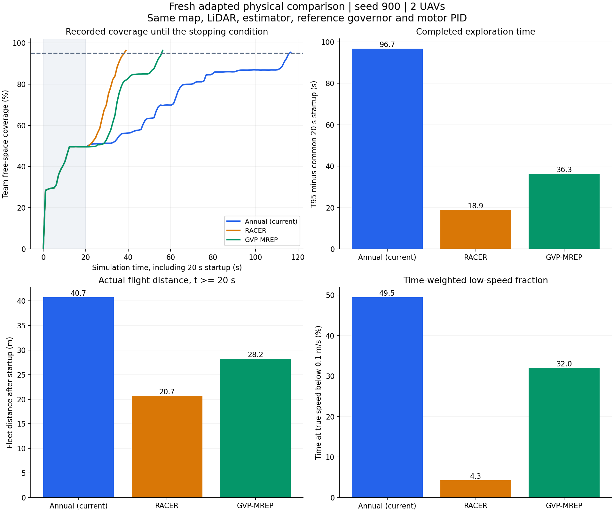

# 实验数据与对比结果下载

当前状态：11个附件已全部上传并通过[远端大小与SHA256核对](upload-verification.json)，Release仍为草稿，等待公开发布授权；下列附件下载链接在正式发布后对外生效。已入库的对比报告可直接查看。

[GitHub 数据发布](https://github.com/Wu-Chenjie/Annual-Project/releases/tag/experiment-data-2026-10-06)保存截至2026-10-06的原始实验资料。原来仅在本地 `artifacts/` 中的 **3603 个文件**共 6.23 GiB，打包为9个独立压缩包，共 3.65 GiB。每个文件均记录SHA256，且已逐包解压读取、逐文件比对大小与SHA256。

成功、失败、中止、超时和开发诊断样本完整保留。本次仅归档上传，没有新增仿真或重新计算历史成绩。排除115个Python缓存或系统元数据文件，具体列表见[文件清单](experiment-manifest.json)。

## 对比结果入口

| 批次 | 主要结果 | 范围与原报告 |
|---|---|---|
| 2026-09-28 三系统 | Annual / RACER / GVP T95为107.45 / 50.16 / 43.00s，含20s初始化 | [同一小图、seed=900各一次](../../system-comparison/2026-09-28/REPORT.md) |
| 2026-10-05 三系统 | 扣20s初始化耗时96.654 / 18.907 / 36.298s；低速占比49.45% / 4.26% / 31.97% | [当批适配对照、资源与速度超调边界](../../system-comparison/2026-10-05/REPORT.md) |
| 2026-10-06 开发配对 | 基线→最终候选：扣初始化T95 88.405→78.175s；规划P95 4.823→5.395s；收尾7.132→16.363s | [全部开发版本及失败记录](../../system-comparison/2026-10-06/README.md)，单种子、并非所有指标改善 |
| 主图五种子配对（9月28日样本＋10月5日独立续跑） | T95中位数636.500→420.505s，等待规划机秒中位数391.799→145.067 | [冻结版本与续跑说明](../../ros2_ws/docs/validation/todo-candidate10/resumed-status.md)，其余70项正式矩阵暂缓 |
| 规划器可行性与代码审核 | 可行性原型不等于生产实现；O23–O25仍待修复 | [可行性报告](../../planner-optimization/2026-10-06-feasibility/README.md)、[当前TODO](../../RACER_GVP_ENGINEERING_TODO.md) |

三系统、主图五种子及开发配对分别使用各自冻结版本与协议，不能跨批次拼成统一排行榜。三系统ROS运行时、计算资源分配和实际速度超调存在适配边界；单种子结果不能支持统计显著性或普遍优劣结论。



## 原始资料下载

| 压缩包 | 文件数 | 压缩大小（MiB） |
|---|---:|---:|
| [annual-early-baseline-20261006.tar.gz](https://github.com/Wu-Chenjie/Annual-Project/releases/download/experiment-data-2026-10-06/annual-early-baseline-20261006.tar.gz) | 180 | 297.8 |
| [annual-fusion-20261006.tar.gz](https://github.com/Wu-Chenjie/Annual-Project/releases/download/experiment-data-2026-10-06/annual-fusion-20261006.tar.gz) | 596 | 814.4 |
| [annual-other-experiments-20261006.tar.gz](https://github.com/Wu-Chenjie/Annual-Project/releases/download/experiment-data-2026-10-06/annual-other-experiments-20261006.tar.gz) | 518 | 334.0 |
| [annual-tail-priority-20261006.tar.gz](https://github.com/Wu-Chenjie/Annual-Project/releases/download/experiment-data-2026-10-06/annual-tail-priority-20261006.tar.gz) | 90 | 312.7 |
| [annual-todo-formal-10-20261006.tar.gz](https://github.com/Wu-Chenjie/Annual-Project/releases/download/experiment-data-2026-10-06/annual-todo-formal-10-20261006.tar.gz) | 348 | 525.7 |
| [annual-todo-formal-3-20261006.tar.gz](https://github.com/Wu-Chenjie/Annual-Project/releases/download/experiment-data-2026-10-06/annual-todo-formal-3-20261006.tar.gz) | 57 | 103.0 |
| [annual-todo-formal-8-20261006.tar.gz](https://github.com/Wu-Chenjie/Annual-Project/releases/download/experiment-data-2026-10-06/annual-todo-formal-8-20261006.tar.gz) | 443 | 462.3 |
| [annual-todo-other-20261006.tar.gz](https://github.com/Wu-Chenjie/Annual-Project/releases/download/experiment-data-2026-10-06/annual-todo-other-20261006.tar.gz) | 1048 | 320.7 |
| [annual-todo-runs-20261006.tar.gz](https://github.com/Wu-Chenjie/Annual-Project/releases/download/experiment-data-2026-10-06/annual-todo-runs-20261006.tar.gz) | 323 | 564.8 |

- `todo-formal-10`：主图五种子配对、原中止样本、独立续跑及审核资料。
- `todo-formal-8`、`todo-formal-3`、`todo-runs`：更早的实验协议、开发运行与失败记录。
- `todo-other`：动态障碍专项、冻结源码/工具及其他TODO验证资料。
- `fusion`、`early-baseline`、`tail-priority`：各历史融合/基线/收尾优先级版本的原始轨迹、日志与录像。
- `other-experiments`：去中心化、观测优先级、配色录像、迁移矩阵及其他实验记录。

[完整文件与压缩包SHA256清单](experiment-manifest.json)记录每个原始路径、字节数及所属压缩包；[SHA256SUMS.txt](SHA256SUMS.txt)用于核对下载文件。各包独立包含 `artifacts/` 相对路径，不是需要二进制拼接的分卷。

```bash
mkdir -p experiment-download
cd experiment-download
gh release download experiment-data-2026-10-06 --repo Wu-Chenjie/Annual-Project
# macOS：
shasum -a 256 -c SHA256SUMS.txt
# Linux可使用：sha256sum -c SHA256SUMS.txt
for archive in annual-*-20261006.tar.gz; do
  tar -xzf "$archive"
done
```

解压后可按清单定位 `artifacts/todo-execution/formal-10/` 等原路径；也可将已验证数据解压到仓库根目录，与报告中的本地路径对应。历史绝对路径、容器路径与冻结脚本保持原记录，重跑时需映射环境。下载数据和重跑仿真是不同操作，以上命令只下载、校验和解压。

## 已在Git中的资料

`system-comparison/`含三批对比的报告、图表、原始传感流、轨迹、配置、源码冻结与审计；本次逐文件核对本地工作区与仓库副本，1927个非构建/缓存文件全部一致。`planner-optimization/`的7个原型/结果文件同样一致，因此没有重复上传这些已入库文件。

数据发布锚定已有源码提交 `ff10bcbafccbee44efbe117533bc902cd33b98c2`，不将某次原始数据重新标注成当前工作区性能。新增清单只提供下载与完整性核验，不覆盖历史实验清单或改写旧审计结论。
