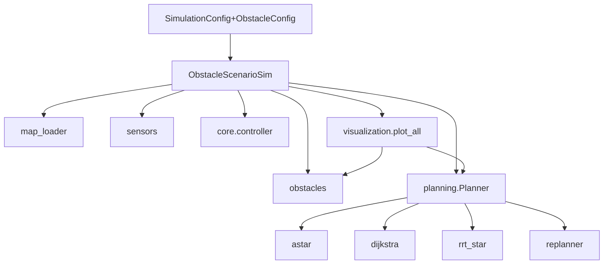

# 年度项目 路径规划与避障扩展 代码规划书 (future.md)

> 编制日期：2026-04-26
> 适用范围：`next_project/`（Python 主线）与 `next_project/CPP重构/`（C++ 等价实现）
> 关联文档：[plan.md](plan.md)、[next_project/CLAUDE.md](next_project/CLAUDE.md)、[next_project/core/CLAUDE.md](next_project/core/CLAUDE.md)、[next_project/simulations/CLAUDE.md](next_project/simulations/CLAUDE.md)

---

## 1. 目标与范围

在现有「领航-跟随 + 混合控制 + 风场扰动」闭环仿真之上，引入**障碍物建模、路径规划、实时避障与可视化**四大能力，使平台能：

1. 在已知静态地图中提前规划全局航点（离线规划路径）。
2. 在仅知起终点的工况下使用机载传感（六向距离探测器）进行**在线**重规划。
3. 把无人机集群视为带"安全包络半径"的整体，规划时显式约束**从机不撞障碍**。
4. 在 `outputs/trajectory_3d.png` 与新输出图中**绘制障碍物**与规划路径。

非目标（本次不做）：动态障碍预测、SLAM 自建图、实物部署、GPU 加速。

---

## 2. 顶层设计原则

- **配置驱动**：通过扩展 [SimulationConfig](next_project/simulations/formation_simulation.py#L42) 启用/关闭新功能，旧用例不受影响。
- **解耦分层**：`core/` 仅负责底层模型（地图、传感器、规划器算法），`simulations/` 负责编排、记录与可视化。
- **Python 优先 → C++ 同步**：先在 Python 主线落地并验证指标，C++ 端按相同接口语义同步重构，保证交叉验证一致性。
- **最小侵入**：保持现有 `FormationSimulation.run()` 返回字典向后兼容，新字段以可选键追加（`obstacles`、`planned_path`、`sensor_logs` 等）。
- **两条路线共存**：方案 A（在线 Hybrid A\*）与方案 B（离线 Dijkstra/RRT\*）通过策略模式切换，复用同一 `Planner` 抽象基类。

---

## 3. 模块结构演进

### 3.1 目录新增

```
next_project/
├── core/
│   ├── obstacles.py          # 新增：障碍物原语 + 占据栅格
│   ├── sensors.py            # 新增：六向测距探测器
│   ├── map_loader.py         # 新增：室内地图导入与体素化
│   └── planning/             # 新增子包：路径规划算法集合
│       ├── __init__.py
│       ├── base.py           # Planner 抽象基类
│       ├── astar.py          # A* / Hybrid A*（方案 1）
│       ├── dijkstra.py       # Dijkstra（方案 2）
│       ├── rrt_star.py       # RRT*（方案 2）
│       └── replanner.py      # 在线重规划调度器（窗口式）
├── simulations/
│   ├── obstacle_scenario.py  # 新增：含障碍物场景仿真
│   └── visualization.py      # 修改：增加障碍物 + 路径绘制
└── maps/                     # 新增：示例室内地图（npz / json）
    ├── sample_office.npz
    └── README.md
```

### 3.2 模块依赖图



---

## 4. 数据模型

### 4.1 障碍物原语 [core/obstacles.py](next_project/core/obstacles.py)

```python
@dataclass
class AABB:        # 轴对齐立方体
    min_corner: np.ndarray  # (3,)
    max_corner: np.ndarray  # (3,)

@dataclass
class Sphere:
    center: np.ndarray
    radius: float

@dataclass
class Cylinder:    # 立式（z 轴），用于建模柱子
    center_xy: np.ndarray
    radius: float
    z_range: tuple[float, float]

class ObstacleField:
    """统一容器：可包含若干 AABB / Sphere / Cylinder。"""
    def signed_distance(self, p: np.ndarray) -> float: ...
    def is_collision(self, p: np.ndarray, inflate: float = 0.0) -> bool: ...
    def to_voxel_grid(self, bounds, resolution) -> OccupancyGrid: ...
```

### 4.2 占据栅格

```python
@dataclass
class OccupancyGrid:
    origin: np.ndarray     # (3,) 世界坐标原点
    resolution: float      # 单位 m
    shape: tuple[int, int, int]
    data: np.ndarray       # uint8, 0=free, 1=occupied, 2=inflated
    def world_to_index(self, p): ...
    def index_to_world(self, idx): ...
    def inflate(self, radius: float) -> "OccupancyGrid": ...
```

膨胀半径：`r_inflate = arm_length + formation_envelope + safety_margin`。其中 `formation_envelope` 由当前队形与 `formation_spacing` 决定，详见 §6.3。

### 4.3 配置扩展

在 [SimulationConfig](next_project/simulations/formation_simulation.py#L42) 中追加：

```python
# ---- 路径规划与避障 ----
enable_obstacles: bool = False
obstacle_field: ObstacleField | None = None
map_file: str | None = None              # 优先级高于 obstacle_field

planner_kind: str = "astar"              # "astar" | "hybrid_astar" | "dijkstra" | "rrt_star"
planner_mode: str = "offline"            # "offline" | "online"
planner_resolution: float = 0.5          # 栅格分辨率 m
planner_replan_interval: float = 0.4     # 在线重规划周期 s
planner_horizon: float = 6.0             # 在线规划前瞻距离 m
safety_margin: float = 0.3               # 安全裕度 m

sensor_enabled: bool = False             # 是否启用机载测距
sensor_max_range: float = 8.0
sensor_noise_std: float = 0.02
sensor_directions: int = 6               # ±x, ±y, ±z
```

### 4.4 仿真结果新增字段

`FormationSimulation.run()` 返回值追加：

```python
{
    ...原有字段...,
    "obstacles": ObstacleField | None,
    "planned_path": np.ndarray,          # (K, 3) 离线规划航点
    "executed_path": np.ndarray,         # 实际飞行结果（领航机历史）
    "replan_events": list[dict],         # [{t, from, to, reason}, ...]
    "sensor_logs": np.ndarray | None,    # (T, 6) 各方向距离
}
```

---

## 5. 路径规划层设计

### 5.1 抽象基类 [core/planning/base.py](next_project/core/planning/base.py)

```python
class Planner(ABC):
    @abstractmethod
    def plan(self, start: np.ndarray, goal: np.ndarray,
             grid: OccupancyGrid, **kw) -> np.ndarray: ...
    """返回 (K,3) 路径航点。失败抛 PlannerError。"""

    def smooth(self, path: np.ndarray) -> np.ndarray:
        """默认实现：Catmull-Rom 或 B-spline 平滑，便于控制器跟踪。"""
```

### 5.2 算法实现要点

| 算法 | 文件 | 适用 | 关键实现 |
|---|---|---|---|
| A\* / Hybrid A\* | `astar.py` | 在线（方案 1）+ 离线 | 6/26 邻域，启发式 = 欧氏距离；Hybrid A\* 增加运动学约束（最小转弯半径，对应 `leader_max_acc`） |
| Dijkstra | `dijkstra.py` | 离线（方案 2） | 等价 A\* 启发=0，作为 baseline 对比 |
| RRT\* | `rrt_star.py` | 离线（方案 2） | 渐近最优，`rewire_radius` 默认 1.5 m，`max_iter=4000` |

每种算法都需经过 `Planner.smooth()` 后再写入 `waypoints`，避免栅格化阶梯波形给控制器引入高频参考。

### 5.3 在线重规划 [core/planning/replanner.py](next_project/core/planning/replanner.py)

策略：**滑动窗口**。

```python
class WindowReplanner:
    def __init__(self, planner: Planner, interval: float, horizon: float): ...
    def step(self, t, leader_pose, sensor_reading, goal) -> np.ndarray | None:
        """每 interval 秒调用一次：
        1) 用 sensor_reading 局部更新 OccupancyGrid（仅 horizon 内）
        2) 从当前位姿到 horizon 边界 / goal 重新规划
        3) 若新路径与旧路径偏差 > epsilon 则发布更新并记录 replan_event
        """
```

注意：在线模式下，**主流程的 `waypoints`** 由 replanner 动态写入，原 `waypoint switch` 判据保持不变（仍以 `wp_radius` 触发）。

---

## 6. 集群避障策略

### 6.1 核心思路

将整个编队抽象为一个**等效圆盘 / 椭球**，对其重心（≈领航机）规划路径，但膨胀半径反映整个编队空间足迹。这样规划单次即可保证从机也安全，复杂度不增加。

### 6.2 编队包络计算

在 [FormationTopology](next_project/core/topology.py) 增加：

```python
def envelope_radius(self, formation_type: str | None = None) -> float:
    """返回当前/指定队形下从领航机到最远从机的距离 + 臂长。"""
```

供规划器调用：`r_inflate = topology.envelope_radius() + arm_length + safety_margin`。

### 6.3 队形切换时的临时收缩

当 `replan_event` 触发且检测到通道宽度 < 2·envelope，调度收缩到 `formation_spacing/2` 的紧凑列队：

```python
config.formation_schedule.append((t_event, "line_compact", 1.0))
```

由 `obstacle_scenario.py` 自动注入，不需用户手工配置。

---

## 7. 探测器仿真

### 7.1 设计 [core/sensors.py](next_project/core/sensors.py)

```python
class RangeSensor6:
    """六向（±x, ±y, ±z）测距，简化为射线-AABB 求交。"""
    def __init__(self, max_range, noise_std, seed): ...
    def sense(self, pose: np.ndarray, field: ObstacleField) -> np.ndarray:
        """返回 (6,)，无障碍方向返回 max_range；附加高斯噪声。"""
```

### 7.2 与规划器联动

每仿真步采样 sensor → 写入循环缓冲区 → replanner 按 `interval` 拉取最新一帧合成局部 grid。在线模式下 `obstacle_field` 对规划器**不可见**，仅作 ground-truth 用于碰撞检查与可视化。

---

## 8. 地图导入

### 8.1 [core/map_loader.py](next_project/core/map_loader.py)

支持两种来源：

1. **JSON 原语描述**（推荐，便于编辑与版本控制）：
   ```json
   {"bounds": [[-5,-5,0],[25,25,8]],
    "obstacles": [{"type":"aabb","min":[5,5,0],"max":[7,15,4]}, ...]}
   ```
2. **NPZ 占据栅格**：来自 Open3D / 公开数据集后处理脚本（提供 `tools/voxelize.py`，本规划书不展开）。

### 8.2 示例地图

[maps/sample_office.npz](maps/sample_office.npz) 与 [maps/sample_corridor.json](maps/sample_corridor.json)，分别覆盖：
- 走廊 + 立柱 + 一处低梁（z 限位测试）
- 房间 + 居中障碍 + 窄出口（队形收缩测试）

---

## 9. 仿真编排：[simulations/obstacle_scenario.py](next_project/simulations/obstacle_scenario.py)

继承并扩展 `FormationSimulation`：

```python
class ObstacleScenarioSimulation(FormationSimulation):
    def __init__(self, config: SimulationConfig):
        super().__init__(config)
        self.obstacles = self._load_obstacles()
        self.grid = self.obstacles.to_voxel_grid(...).inflate(self._inflate_r())
        self.planner = make_planner(config.planner_kind)
        if config.planner_mode == "offline":
            self.config.waypoints = self._plan_offline()
        else:
            self.replanner = WindowReplanner(self.planner, ...)
            self.sensor = RangeSensor6(...)

    def run(self):
        # 复用父类循环结构，在 _maybe_switch_formation 之后插入：
        #   1) sensor.sense (仅 online)
        #   2) replanner.step
        #   3) 碰撞检测 (ground-truth) -> 累计 collision_count
        # 末尾追加 obstacles / planned_path / replan_events
```

碰撞检测：每步对领航机和每架从机调用 `obstacles.is_collision(p, inflate=arm_length)`，命中即记录到 `collision_log`，但**不中断仿真**（用于评估算法鲁棒性）。

---

## 10. 可视化扩展 [simulations/visualization.py](next_project/simulations/visualization.py)

新增/修改：

- `_plot_trajectory` 中追加 `_draw_obstacles(ax, obstacles)`：
  - AABB → `Poly3DCollection` 立方体面片（半透明灰色，alpha=0.25）
  - Sphere → `plot_surface` 球面（线框 + 半透明）
  - Cylinder → 参数化曲面
- 叠加 `planned_path`（黑色虚线，linewidth=1.0）与 `executed_path`（领航机蓝色实线）。
- 新增图：`replan_events.png`：时间-高度图，标注每次重规划点。
- 新增图：`sensor_distance.png`：六条距离曲线（仅 online）。

不破坏现有三张图的命名与格式，便于 `main.py` 旧逻辑继续工作。

---

## 11. 入口与配置范例

修改 [main.py](next_project/main.py) 提供两个示例（保留原默认仿真）：

```python
# 范例 A：离线 RRT* 规划
config = SimulationConfig(
    enable_obstacles=True,
    map_file="maps/sample_office.json",
    planner_kind="rrt_star",
    planner_mode="offline",
    waypoints=[np.array([0,0,1.5]), np.array([22,18,1.5])],  # 仅起终点
    formation_spacing=1.5,
)
sim = ObstacleScenarioSimulation(config)
```

```python
# 范例 B：在线 Hybrid A* + 六向测距
config = SimulationConfig(
    enable_obstacles=True,
    map_file="maps/sample_corridor.json",
    planner_kind="hybrid_astar",
    planner_mode="online",
    sensor_enabled=True,
    planner_replan_interval=0.4,
    planner_horizon=5.0,
)
```

---

## 12. C++ 重构同步计划

[CPP重构](next_project/CPP重构/) 端按相同语义同步实现：

- `include/core/obstacles.hpp`、`sensors.hpp`、`occupancy_grid.hpp`
- `include/core/planning/{base,astar,rrt_star}.hpp`
- 复用 Eigen，避免动态分配；A\* 使用 `std::priority_queue` + flat array 索引
- 单元一致性测试：在相同 seed 与相同地图下，Python/C++ 规划路径节点序列差异 < 1 个体素
- 性能目标：单次 A\* 规划在 50³ 体素地图下 C++ < 5 ms（Python 参考实现 < 80 ms）

---

## 13. 测试与验收

### 13.1 单元/算法级

- `tests/test_planner.py`（新增 pytest 入口）：
  - A\* 在已知最短路径地图上节点数等于参考解
  - RRT\* 渐近最优：迭代 4000 次后路径长度 ≤ 1.05·dijkstra 最优
  - sensor 噪声方差 ≈ 配置值
  - ObstacleField AABB / Sphere / Cylinder signed_distance 正确性

### 13.2 集成级（指标阈值法，沿用现有风格）

| 场景 | 通过条件 |
|---|---|
| `sample_corridor` 离线 RRT\* | 0 次碰撞；从机最大误差 < 0.4 m；航点完成率 100% |
| `sample_office` 在线 Hybrid A\* | 0 次碰撞；重规划次数 ≥ 3；总耗时 < 仿真时长×1.5（实时余量） |
| 无障碍回归 | 与当前 main 输出指标差异 < 1%（保证不引入劣化） |

### 13.3 批量评测

扩展 `simulations/benchmark.py`：在 `seeds × planners × maps` 网格上跑，输出新版 `benchmark_results.json` 增加：

```json
"obstacle_metrics": {
    "collision_count": 0,
    "planning_time_ms": {"mean": 12.3, "max": 28.4},
    "replan_count": 4,
    "path_length_ratio": 1.07
}
```

---

## 14. 里程碑（建议工时，单人）

| # | 里程碑 | 内容 | 工时 |
|---|---|---|---|
| M1 | 数据骨架 | obstacles / occupancy_grid / map_loader / 配置扩展 + 示例地图 | 2 d |
| M2 | 离线规划 | Planner 基类 + Dijkstra + A\* + 平滑 + visualization 障碍物绘制 | 3 d |
| M3 | RRT\* | rrt_star + 单测 + 范例 A 跑通 | 2 d |
| M4 | 集群避障 | envelope 计算 + 队形收缩调度 + 集成测试 | 1.5 d |
| M5 | 在线方案 | sensors + Hybrid A\* + WindowReplanner + 范例 B | 3 d |
| M6 | C++ 同步 | obstacles / a\* / occupancy_grid 移植 + 一致性测试 | 3 d |
| M7 | 评测与文档 | benchmark 扩展、CLAUDE.md 更新、理论公式与出处补章 | 1.5 d |

合计约 **16 人日**。M1 → M2 → M4 → M5 为关键路径；M3、M6 可与 M5 并行。

---

## 15. 风险与对策

| 风险 | 影响 | 对策 |
|---|---|---|
| 在线 Hybrid A\* 在 50³ 体素上超出实时预算 | 在线仿真不可用 | 限制 `planner_horizon`；提供"懒重规划"模式（仅在 sensor 报警时触发） |
| 膨胀半径不足 → 从机切角时擦碰 | 评测失败 | 引入"动态膨胀"：转弯处临时增大 `safety_margin` |
| 控制器对路径阶梯敏感 | 抖动、误差超阈值 | `Planner.smooth()` 默认开启；同时降低 `leader_max_acc` |
| 地图来源缺失 | 难以构造方案 2 场景 | 先以 JSON 原语手工编辑作为基线，后续再接入公共数据集 |
| Python/C++ 算法实现漂移 | 交叉验证失效 | 制定固定 seed 的"金样本"路径文件，CI 比对 |

---

## 16. 与现有文档的对接

落地后需同步更新：

- [CLAUDE.md](CLAUDE.md) 模块索引追加 `core/planning/`、`maps/`
- [next_project/CLAUDE.md](next_project/CLAUDE.md) 增补「障碍场景」章节与配置说明
- [next_project/core/CLAUDE.md](next_project/core/CLAUDE.md) 增补 obstacles / sensors / planning 的接口
- [next_project/simulations/CLAUDE.md](next_project/simulations/CLAUDE.md) 增补 `ObstacleScenarioSimulation`
- 新增 `next_project/路径规划与避障.md`，记录算法推导与超参依据，与 `理论公式与出处.md` 同级

---

## 17. 附录：关键接口签名速查

```python
# core/obstacles.py
class ObstacleField:
    def signed_distance(self, p: np.ndarray) -> float
    def is_collision(self, p: np.ndarray, inflate: float = 0.0) -> bool
    def to_voxel_grid(self, bounds, resolution: float) -> OccupancyGrid

# core/planning/base.py
class Planner(ABC):
    def plan(self, start, goal, grid, **kw) -> np.ndarray
    def smooth(self, path) -> np.ndarray

# core/planning/replanner.py
class WindowReplanner:
    def step(self, t, leader_pose, sensor_reading, goal) -> np.ndarray | None

# core/sensors.py
class RangeSensor6:
    def sense(self, pose, field) -> np.ndarray  # shape (6,)

# simulations/obstacle_scenario.py
class ObstacleScenarioSimulation(FormationSimulation):
    def run(self) -> dict   # 字典字段见 §4.4
```
