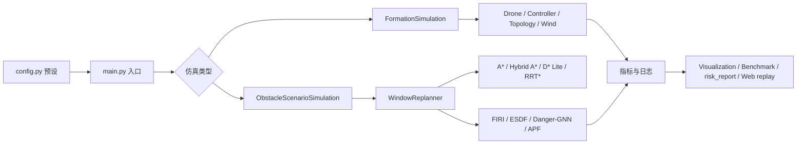
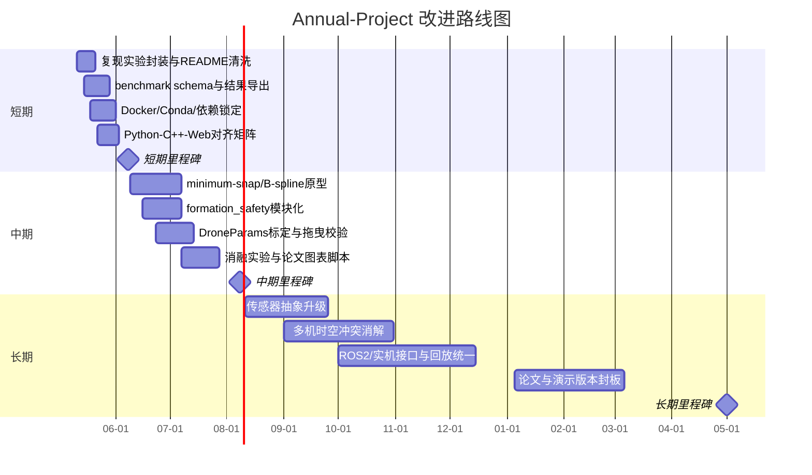

# Annual-Project 仓库深度研究与答辩材料

> `urlAnnual-Project 仓库https://github.com/Wu-Chenjie/Annual-Project` 已经从“单一编队仿真脚本”演化为一个以 `next_project` 为核心的多无人机研究型平台：Python 主线覆盖动力学、规划、安全链路、容错重构与风险报告，C++ 与 Web 提供性能验证和动态回放子集。仓库文档给出了默认场景约 2.3 s、5 组随机种子 benchmark 约 2.591 s，以及多个在线场景零碰撞的结果；但连续轨迹优化、依赖锁定、Python/C++ 对齐、真实数据/CI/许可证等仍未闭环或未说明。 

## 仓库分析与关键判断

从公开结构看，真正承载研究主线的是 `next_project`：其中包含 `core`、`simulations`、`tests`、`cpp`、`web`、`docs`、`maps` 等目录；而仓库根目录还并置了图片建模脚本、模型目录和额外计划文档，说明当前仓库边界并不完全聚焦在“多无人机编队仿真”这一条线上。对于答辩来说，这既是优点——材料丰富、演化脉络完整；也是工程风险——主线与支线耦合，增加了新人上手和后续维护成本。 

技术文档把系统清晰划分为三条运行线：**Python 主线**是“语义最完整”的研究与回归基线，覆盖动力学、PID/SMC/反步与实验性 SE(3) 控制、A*/Hybrid A*/D* Lite/RRT*/Informed RRT*、FIRI、ESDF、在线重规划、Danger+GNN、故障检测拓扑重构、参数 profile、轨迹后处理和风险报告；**C++ 普通在线仿真**是可部署子集，强调性能与在线运行；**C++ dynamic replay / Web**则主要面向动态障碍与路径门禁展示，明确标注为 `leader_centric` 和 `illustrative_lateral_offsets`，不能当作完整编队动力学证据。这个分层写得很清楚，也是该仓库最值得肯定的地方之一：作者已经主动给出了“哪些证据能证明什么，不能证明什么”的解释边界。 

上图对应的主链路来自仓库文档：`config.py` 通过预设驱动场景，`main.py` 进入普通编队仿真或障碍场景，规划与控制在循环中协同，最终汇总到可视化、benchmark、风险报告与 Web 回放。文档还说明了结果结构中存在 `time`、`leader`、`followers`、`errors`、`metrics`，以及障碍物场景中的 `planned_path`、`executed_path`、`replan_events`、`sensor_logs`、`collision_log`、`fault_log` 等字段，这为后续答辩与论文写作提供了非常好的证据链基础。

仓库依赖本身并不重，但存在典型“研究代码可跑、工程交付未锁定”的问题：`pyproject.toml` 只要求 Python ≥ 3.10，运行依赖为 `numpy`、`matplotlib`、`scipy`、`plotly`、`cvxpy>=1.4`、`osqp>=0.6`，开发依赖只有 `pytest`；测试入口既写在 `pyproject.toml`，也单独放在 `pytest.ini`。这说明作者已经有包化意识，但仍缺少 lockfile、容器化和跨平台一键环境说明。尤其 `cvxpy`/`osqp` 这种求解器组合，一旦平台差异或底层数值后端不同，就很容易带来“别人能装但跑不一致”的复现实验风险。 

下面这张表可以作为答辩时的“仓库体检表”直接使用：

| 维度 | 当前状态 | 研判 |
|---|---|---|
| 主研究目录 | `next_project` 下含 `core / simulations / tests / cpp / web / docs / maps` | 主线清晰，可作为论文/答辩主体 |
| 运行分层 | Python 主线最完整；C++ 为性能/部署子集；Web 为动态回放子集 | 架构合理，但跨语言对齐压力较大 |
| 包依赖 | Python≥3.10；`numpy/scipy/plotly/cvxpy/osqp`；dev 仅 `pytest` | 能跑，但环境锁定不足 |
| 数据来源 | 地图与障碍参数在 `maps/*.json`；公开文档未说明真实飞行数据集 | 当前更像“高质量仿真平台”，不是“数据驱动项目” |
| GNN 模块 | `GNNPlanner` 被明确定义为**神经动力学活动扩散**，不是离线训练深度网络 | 这有利于复现，且避免了训练数据与模型版权问题 |
| 结果导出 | 文档说明 benchmark 输出 `outputs/benchmark_results.json`，场景结果可导出 JSON/CSV 字段 | 证据链不错，但公开页面未完整展示所有原始结果文件 |
| 测试 | 覆盖 ESDF、GNN、在线语义、终端保持、风险报告、障碍场景、C++ 静态同步等 | 已超过一般课程作业水准，接近研究工程代码习惯 |
| 许可证 | 未说明 | 对外复用和二次分发存在合规不确定性 |
| CI/CD | 未说明；文档展示的是本地 `pytest` 命令 | 自动回归与协作流程仍需补齐 |
| 隐私/数据治理 | 若扩展到图片建模与照片采集，数据保留、脱敏、授权策略未说明 | 当前阶段问题不大，但若走向实采/展示必须补文档 |

从算法侧看，这个仓库的“系统性”明显强于“单点最优”：一方面，控制器被统一到 `controller_kind` profile，下层有 PID+SMC、反步+SMC 和实验性 `se3_geometric`；另一方面，参数被逐渐抽象到 `DroneParams`，支持 `default_1kg`、`indoor_micro` 和 `light_uav_regulatory` 三类 profile，并显式检查质量、惯量、推力系数与悬停转速的物理可行性。这个设计非常适合作为答辩亮点，因为它说明作者不是“参数堆出来”，而是在逐步把研究变量显式化、可切换化。

规划层则体现出明显的“研究拼装能力”。文档明确写出：在线重规划的 `WindowReplanner` 使用局部滑窗 A*、增量 D* Lite 和全局 Informed RRT* 的三级回退；Danger 模式下，通过 SDF 和传感器阈值切换到可见图 + `GNNPlanner`，并且在新路径接收前做连续 clearance 门禁、必要时回退到 fallback 路径；执行层再叠加 APF 排斥、从机安全目标投影与 SDF 屏障。这意味着仓库的核心贡献不是“发明了一个全新规划器”，而是把多个成熟部件组织成了**多层安全链路**。这恰好适合答辩：解释性强，容易回答“为什么这样设计”。 

实验与结果方面，公开文档给了三组比较硬的量化证据。其一，`main.py` 默认配置下，运行耗时约 2.3 秒，三架从机平均误差约 0.1805 m、0.2110 m、0.1999 m，均小于 0.3 m 阈值；其二，`simulations/benchmark.py` 在 5 组随机种子上平均运行约 2.591 秒，三架从机误差均值约 0.2027 m、0.2022 m、0.1991 m；其三，在线场景 `meeting_room_online`、`company_cubicles_online`、`school_corridor_online`、`laboratory_online` 的航点完成度分别为 4/4、5/5、5/5、6/6，碰撞数均为 0。就课程/课题答辩而言，这已经足够构成“系统可运行且结果稳定”的证据基础。 

但同样重要的是，文档也如实承认了瓶颈：`trajectory_optimizer.py` 目前只是轻量轨迹后处理器，做的是重采样、可选 moving-average 平滑、clearance gate、时间戳/速度/加速度有限差分；它**还不是**真正的 minimum-snap、minimum-jerk 或 B-spline 联合优化器。再加上复杂度表中明确写出 `Hybrid A*` 的动作原语采样成本、可见图的 $O(M^2N_s)$、GNN 扩散的边级复杂度，以及 FIRI 对凸优化求解器的依赖，这些都说明下一步最应该投入的地方，不是再加一个新模块，而是把“离散路径 → 连续时间可执行轨迹”这段链路真正做扎实。

## 详细评估与优先级改进建议

如果只用一句话概括：**这个仓库已经具备答辩价值，但离“公开、长期、可复现实验平台”还差工程化闭环。** 换言之，现在最值得做的不是推翻重写，而是“补齐短板、压缩复杂度、把证据链沉淀成标准产物”。这个判断主要来自四类事实：文档已经非常完整、测试覆盖不低、结果有量化支撑，但连续轨迹优化仍偏原型、C++/Web 与 Python 仍存在语义差、环境锁定与仓库治理还不充分。 

下面这张优先级表按“预期收益 / 实现难度 / 时间估算”给出排序。难度和时间是基于仓库现状的**工程估算**，不是仓库作者承诺值。

| 优先级 | 改进建议 | 预期收益 | 难度 | 时间估算 | 依据 |
|---|---|---|---|---|---|
| P0 | **补齐一键复现实验入口**：统一 `main.py`、`benchmark.py`、典型 pytest 组合、结果导出目录 | 新人上手成本显著下降；答辩、论文和复现实验更可信 | 低 | 2–4 天 | 文档给出了多组 pytest 与 benchmark 入口，但分散在技术文档和检查文档中 |
| P0 | **建立统一 benchmark schema**：Python/C++/Web 共用结果字段约定 | 便于跨语言对比、绘图、追踪回归退化 | 中 | 3–5 天 | 文档已列出丰富结果字段，但也明确指出 C++ 日志字段不完整 |
| P0 | **做 Python / C++ / Web 能力对齐矩阵**，并把 `test_cpp_sync_static.py` 扩成场景级回归 | 防止“文档说有、某条运行线没有”的漂移 | 中 | 4–7 天 | 技术文档多次强调三条运行线边界不同，并已有 C++ 静态同步测试入口 |
| P0 | **补 lockfile / Docker / Conda 环境**，并说明求解器依赖 | 大幅提高复现成功率 | 中 | 3–6 天 | `pyproject.toml` 只有宽松依赖下界，且包含 `cvxpy`/`osqp` 求解器栈 |
| P0 | **仓库边界收敛**：把图片建模/照片采集相关内容与 UAV 主线解耦，至少分子目录或分仓库 | 降低认知负担，便于答辩聚焦主线 | 中 | 2–5 天 | 仓库根目录和 docs 中存在图片建模、照片采集与 UAV 主线并存现象 |
| P1 | **实现真正的连续轨迹优化器**：minimum-snap / minimum-jerk / B-spline，并统一接入 offline/online | 直接改善跟踪平滑性、动态可行性与论文价值 | 高 | 2–4 周 | 当前 `trajectory_optimizer.py` 仍是轻量后处理；规划文档已把 FIRI 多段轨迹优化列为重点方向 |
| P1 | **把编队安全模块彻底独立化**：机间距、下洗区、错层、收缩、恢复逻辑统一收口 | 提高多机场景可解释性与可维护性 | 中 | 1–2 周 | 文献调研计划书显示 `formation_safety` 已有首版，但尚未形成完整全链路抽象 |
| P1 | **把六向测距升级为可插拔传感器抽象**：六向测距 / LiDAR / 深度相机 | 让感知假设更真实，也便于对接相关论文 | 中 | 1–2 周 | 当前明确是 `RangeSensor6`、六向固定方向，属于简化 LiDAR 模型 |
| P1 | **补 `DroneParams` 标定链路**：电机时滞、阻力系数、推力曲线、BEM/简化模型切换验证 | 让动力学参数“有出处”，而不是“能跑即可” | 中 | 1–3 周 | 文档已承认主流程仍以简化 rotor 为主，系统辨识流程待补齐 |
| P2 | **故障诊断做抗误报增强**：将风扰、瞬态跟踪误差与真正故障进一步区分 | 降低误检，提高容错场景可信度 | 中 | 1–2 周 | 规划文档已明确指出风扰或跟踪误差可能误判为故障 |
| P2 | **多障碍局部通道稳定策略**：Voronoi/侧向稳定选择/局部区域化 | 减少最近障碍频繁切换引起的振荡 | 中 | 1–2 周 | 项目总改进规划已把该问题列为长期增强项 |
| P2 | **治理层补齐**：LICENSE、CHANGELOG、Issue 模板、Security Policy | 使仓库具备公开协作条件 | 低 | 1–3 天 | 许可证、CI/CD、数据治理在公开页面与文档中均未说明或未形成制度化材料 |

如果要在答辩中解释“为什么这么排序”，逻辑很简单：**P0 解决“别人能不能稳定复现和理解你的项目”；P1 解决“论文层面最硬的技术短板”；P2 解决“系统成熟以后才值得投入的升级项”。** 这与仓库现状高度匹配，也最容易获得老师认可。 

## 近五年相关论文与开源实现

下表优先选取了 **2019–2024** 年间、与该仓库最相关的论文与官方实现。为了便于答辩使用，我把它们分成三类：**轨迹与在线规划**、**多机系统与仿真平台**、**控制/感知补强**。结论先说在前：就“下一步最值得吸收什么”而言，**Fast-Planner / EGO-Planner / GCOPTER / RotorPy / Flightmare** 的参考价值最大；如果目标是把现有仓库推向“更平滑、更可执行、更可部署”，则 **GCOPTER、Search-based Receding Horizon、Tal&Karaman 2021、感知综述 2024** 最值得优先看。 

| 项目 | 年份 | 与本仓库的关联 | 可借鉴点 | 代码/模型可否直接复用 | 证据 |
|---|---:|---|---|---|---|
| urlFast-Planner 论文turn53search5 / url官方实现turn53search6 | 2019 | 与本仓库的 A* / ESDF / 轨迹平滑链路最接近 | kinodynamic search + B-spline 优化 + 动态可行时间调整 | **部分可复用**；算法思想很强，但代码是 ROS/C++ 体系 |  |
| urlFUEL 论文turn53search1 / url官方实现turn53search4 | 2021 | 与在线探索、分层规划、局部视点更新相关 | hierarchy + frontier structure + 最小时间轨迹 | **部分可复用**；更适合扩展探索任务，不适合直接替换当前主线 |  |
| urlEGO-Planner 官方实现turn55search0 | 2021 | 与本仓库在线局部规划场景高度相关 | ESDF-free 局部规划、极低规划时延 | **部分可复用**；思路很值得借鉴，直接代码移植成本较高 |  |
| urlEGO-Swarm 官方实现turn55search3 | 2021 | 对应多机去中心化在线规划 | 单/多机统一架构、机载资源、异步协作 | **部分可复用**；更像“下一代平台方向” |  |
| urlMADER 官方实现turn54search5 / urlMIT 项目页turn54search9 | 2021 | 与多机动态环境轨迹规划、冲突规避强相关 | 多机/动态障碍轨迹约束、多面体分离、安全再检查 | **部分可复用**；最适合启发“多机时空冲突约束”模块 |  |
| urlGCOPTER 官方实现turn57search0 | 2022 | 与本仓库最缺失的“连续轨迹优化”高度匹配 | MINCO、走廊约束、非线性 drag、状态/输入约束优化 | **可中度复用**；最值得用来升级 `trajectory_optimizer.py` |  |
| urlFlightmare 官方实现turn55search7 | 2020 | 与高保真四旋翼仿真、RL 和多模态传感器有关 | 灵活传感器套件、并行仿真、VR/视觉接口 | **部分可复用**；更适合做高保真基线或感知仿真对照 |  |
| urlgym-pybullet-drones 官方实现turn54search1 / url项目页turn54search0 | 2021 | 与多机控制/强化学习实验平台相关 | 轻量多机物理环境、RL 基线、downwash 示例 | **部分可复用**；适合补 benchmark 和教学演示 |  |
| urlRotorPy 官方实现turn57search2 | 2023 | 与 Python 生态、高可读仿真、风场/气动建模相关 | 纯 Python、多机批量仿真、气动力与 RL 接口 | **高参考价值**；最适合作为 Python 仿真工程对照 |  |
| urlSearch-based Path Planning and Receding Horizon 论文turn56search0 | 2024 | 与 `WindowReplanner` 思想最接近 | 搜索式前端 + 非线性平滑 + B-spline + receding horizon | **无官方实现信息**；论文思路可直接借鉴 |  |
| urlTal & Karaman 跟踪论文turn56search5 | 2021 | 与当前控制层、前馈项和高阶导数跟踪直接相关 | INDI + differential flatness，直接跟踪 jerk/snap | **代码未说明**；可作为 `se3_geometric` 后续对照方向 |  |
| url低空障碍感知综述turn56search2 | 2024 | 与当前六向测距传感器模型升级最相关 | 感知传感器、障碍规避技术与硬件架构综述 | **无代码**；适合指导 `core/sensors.py` 的重构方向 |  |

把这些相关工作映射回本仓库，可以得到一个很清晰的建议：**轨迹层看 GCOPTER / Fast-Planner / 2024 的 Search-based RH；控制层看 Tal & Karaman 2021；多机场景看 MADER / EGO-Swarm；仿真工程看 RotorPy / Flightmare / gym-pybullet-drones；感知建模看 2024 综述。** 其中如果必须只挑三项立刻投入，我会选 **GCOPTER、RotorPy、MADER**：一个补连续轨迹，一个补 Python 仿真工程化，一个补多机冲突约束。

## 路线图与时间表

下面这份路线图不是仓库作者原计划的复述，而是**基于现有代码与文档状态的可执行建议版**。时间起点按当前日期 **2026-05-08** 计算。它的原则是：先把**证据链和复现实验做扎实**，再做**连续轨迹与安全模块升级**，最后才往**真实感知和部署接口**推进。这个顺序与仓库文档中已经给出的 P0/P1/P2 改进脉络是一致的，只是这里把它进一步工程化了。

## 未明确事项与报告边界

本报告尽量优先使用了仓库 README、技术文档、改进规划、需求检查、配置文件与官方相关论文/实现；但仍有几项信息在公开页面上**未说明**或无法逐条独立复算，因此已显式保留边界：**开源许可证未说明、CI/CD 未说明、真实飞行数据集未说明、图片建模支线与 UAV 主线的正式关系未说明、公开页面无法逐一核验所有原始 benchmark 产物。** 这并不影响答辩材料组织，但会影响仓库作为“长期公开研究平台”的成熟度判断。
https://github.com/ZJU-FAST-Lab/ego-planner

https://github.com/uzh-rpg/flightmare

https://github.com/ZJU-FAST-Lab/ego-planner-swarm

https://github.com/mit-acl/mader

https://github.com/ZJU-FAST-Lab/GCOPTER

https://github.com/spencerfolk/rotorpy

https://github.com/HKUST-Aerial-Robotics/Fast-Planner

https://researchportal.hkust.edu.hk/en/publications/robust-and-efficient-quadrotor-trajectory-generation-for-fast-aut

https://researchportal.hkust.edu.hk/en/publications/fuel-fast-uav-exploration-using-incremental-frontier-structure-an/

https://learnsyslab.github.io/gym-pybullet-drones/

https://link.springer.com/article/10.1007/s12555-022-0742-z

https://ieeexplore.ieee.org/document/9121690/

https://www.sciencedirect.com/science/article/abs/pii/S0921889024000125