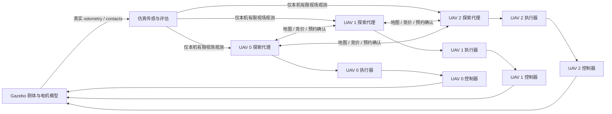

# 去中心化区域探索（ROS 2 Jazzy / Gazebo Harmonic）

入口：`decentralized_search.launch.py`。旧 `search.launch.py` 保留作集中式基线，旧编队、控制器选择和多规划器路径池保持可用。

本实现借鉴 [RACER](https://github.com/Robotics-STAR-Lab/RACER) 的分层区域任务和路线负载联合分配，以及 [GVP-MREP](https://github.com/NKU-MobFly-Robotics/GVP-MREP) 的动态拓扑表示。代码为本仓库实现，**不是原论文代码的直接 ROS 2 移植或性能复现**。

## 已实现的六层能力

| 需求 | 实际实现 | 源码 |
|---|---|---|
| 去中心化协作 | 每机独立地图副本、插入竞价、访问序列、路径池和执行器；同伴发布状态，所有参与者各自计算赢家；没有任务分配服务器 | `decentralized.py`, `decentralized_agent_node.py` |
| 区域级任务 | 4 m × 4 m 稳定区域 ID、剩余未知单元、多个候选观测点、在途区域服务优先权；一个区域可连续执行多个观测位姿 | `regions.py:RegionTasks` |
| 任务与路线联合优化 | 对每个可竞价区域重新做最小代价插入及 2-opt；出价含访问顺序变化的边际代价、服务工作量、总负载和归属滞回；下一轮使用本轮获胜区域序列 | `regions.py:insertion_bids` |
| 真正的稀疏拓扑图 | 已观测安全空间细化为骨架，压缩二度节点为走廊折线；保留分叉、端点、区域边界门户和环；距离查询和区域访问序列实际使用此图 | `sparse_graph.py` |
| 分层搜索 | 区域竞价 → 区域访问序列 → 拓扑走廊路线 → 两步观测位姿搜索 → 多候选路径评分 → 单机位置/偏航执行 → Gazebo 电机动力学 | 三个核心模块与 ROS 节点 |
| 观测与运动联合规划 | 120°、3.5 m 遮挡视场，离散位置与 8 个朝向共同搜索；两步信息增益取集合并集；联合考虑平移时间、偏航时间、路径质量；真实偏航跟踪和到点观测停留 | `regions.py:ObservationPlanner`, `view_executor_node.py` |

联合分配采用有界的分布式路线插入启发式，不声称求得 CVRP 全局最优。观测规划是离散候选上的滚动搜索，不是连续空间的信息论最优控制。

## 节点与信任边界



探索代理只接收外边界参数，不接收地图文件、隐藏障碍物或真值覆盖率。`exploration_experiment_node.py` 读取场景真值，用于生成被墙遮挡的理想观测、覆盖率分母及实验暂停/结束。它不会发布归属、任务、路径、观测朝向。真值覆盖率触发 95% 的**实验结束**，不是规划器的完成判据。

传感器是由 Gazebo 实际机体位姿驱动的理想平面射线模型；没有假称已实现 Gazebo LiDAR、视觉 SLAM、噪声定位或完整三维探索。当前飞行高度 1.5 m，复杂度来自 24 × 20 m 多房间、遮挡、回路、错位门、U 型障碍和 1.8 m 窄门。

## 同伴协议与执行约束

- `/drone_i/peer_state`：每 0.4 s 发布序号、时间、位置、竞价、区域序列、当前意图、预约 ACK 和本机最新观测。旧序号、重复观测被丢弃。
- `/drone_i/map_sync`：每 6 s 修复遗漏观测。单元按观测时间及来源 ID 决定新旧；后续自由观测可以清除离开的动态障碍物。
- `/drone_i/topology`：带版本和序号的稀疏图快照，包含走廊真实折线；定期完整快照可修复掉包。当前仍交换地图单元，未声称实现 GVP-MREP 的通信压缩率。
- `/drone_i/view_command`：该代理只给自己的执行器下命令。`epoch` 防止旧工作线程结果和旧路线重新生效。
- `/drone_i/view_execution`：该机到点、偏航、停留和悬停原因。

新路径必须得到其余两架机的预约确认。确认方同时检查自身路径、悬停位置以及已授予别人的预约；不能批准相交预约或同一区域的竞争服务。冲突提案按 `(创建时刻, UAV ID)` 让步。未确认、掉包或分区会降低进度，不会绕过确认执行。执行器每次推进参考位姿前还独立检查有效租约和所有同伴 ACK。撤销路径后，代理保留旧预约，直到本机执行器确认取消序号、且实测速度低于 0.08 m/s 持续 0.5 s，才通知同伴释放。

固定成员心跳超过 3 s：暂停前进，且不批准新路径。允许 0.1 s 的时钟消息传递偏差。**这不是任意网络分区下仍然持续探索的协议**；失联成员不会被静默剔除。进程重启需要重新启动实验，尚未实现跨进程 incarnation 和成员变更。

轨迹按 0.6 m/s、偏航按 0.65 rad/s 执行。正常规划净空 0.65 m，规划时对同伴完整路线保留 1.25 m，预约冲突检查阈值为 1.20 m，执行器还检查实际机间距离。短距离跟踪恢复只在已观测空间内、距离不超过 0.65 m、净空至少 0.50 m 的条件下允许；此净空大于机体水平外接半径 0.453 m。未知区域不能作为恢复捷径。

后台优化不会阻塞心跳。工作结果执行前重新检查 epoch、当前位置、最新地图和所有同伴预约。新障碍使路线失效时，先撤销执行，重新检查已有候选路径，再预约切换；候选不足时悬停重新规划。

## 运行

```bash
source /opt/ros/jazzy/setup.bash
cd ros2_ws
colcon build --cmake-args -DCMAKE_BUILD_TYPE=Release
source install/setup.bash
ros2 launch annual_swarm decentralized_search.launch.py \
  headless:=false rviz:=true \
  output_dir:=/tmp/decentralized_demo \
  pause_after:=60.0 pause_duration:=25.0
```

默认复杂迷宫，也可以指定 `map:=.../search_office.json`。`dynamic_obstacle:=true` 启用原动态障碍物服务及真实 Gazebo 障碍物，仍需通过 `/swarm/move_obstacle` 移动它。规划器只能在观测到变化后响应。

无人机首先实际旋转一周扫描，然后开始探索。到达 `pause_after` 后，在 UAV 1 下一次处于已提交路线时触发暂停，保证实际中断在途服务。暂停实验只让 UAV 1 悬停并撤回区域服务，通信和预约确认仍保持运行；其他飞机重新竞价，恢复后该机重新加入竞价。

```bash
# 完整真实动力学验收，保留每机事件、候选路径和公共协议消息
python3 ros2_ws/src/annual_swarm/scripts/decentralized_smoke.py \
  --output-dir artifacts/decentralized/maze --timeout 2400
```

输出 `summary.json`、`trajectory.csv`（含实际 yaw）、`coverage.json`、`peer_states.jsonl`，以及每机 `events.jsonl` 和 `candidates.jsonl`。候选日志保留质量分数、实际路径坐标、视场增益、朝向和至多五条备选。原始失败运行也应保留，不能与验收数据混用。

## 录制

原生 Gazebo 和 RViz 并排显示，RViz 的车辆、已飞轨迹和 FOV 均来自实时 Gazebo 里程计；区域、预约路径和稀疏图来自实际代理。屏幕由 X11/ffmpeg 录制，后处理只做裁剪、倍速和标题，不用轨迹日志生成替代飞行视频。

使用 `docker/Dockerfile.demo` 构建含 Xvfb、Openbox、RViz、ffmpeg 的演示环境。运行 `record_decentralized_demo.py` 后得到原始录屏、带倍速标注的 MP4、录制元数据和同次飞行的验收记录。

## 验证边界

单元测试覆盖图压缩与连通性、窄门、动态观测新旧合并、重复和乱序包、竞价与不可用成员重分配、相交预约互斥、缺 ACK 不执行、通信过期、区域 ID、多视点、朝向增益、遮挡、轨迹安全和短距离恢复。Gazebo 验收额外要求覆盖率 ≥95%、零起飞后接触、最小间距 >0.8 m、每机实际飞行和完成观测、暂停后恢复、拓扑节点数少于可通行栅格的四分之一。

可对完成的记录执行独立审计：

```bash
python3 ros2_ws/src/annual_swarm/scripts/audit_decentralized_run.py artifacts/decentralized/demo
```

审计检查提交/结束区间是否发生跨机区域租约重叠、提交参与者是否齐全、候选数量、实际偏航、覆盖率、接触和机间距，输出 `audit.json`。它不替代任意异步故障模型下的形式化证明。

单次演示不是多随机种子的统计结论；不同视场、任务粒度和传感假设的旧集中式实验不应直接用于宣称速度提升。
