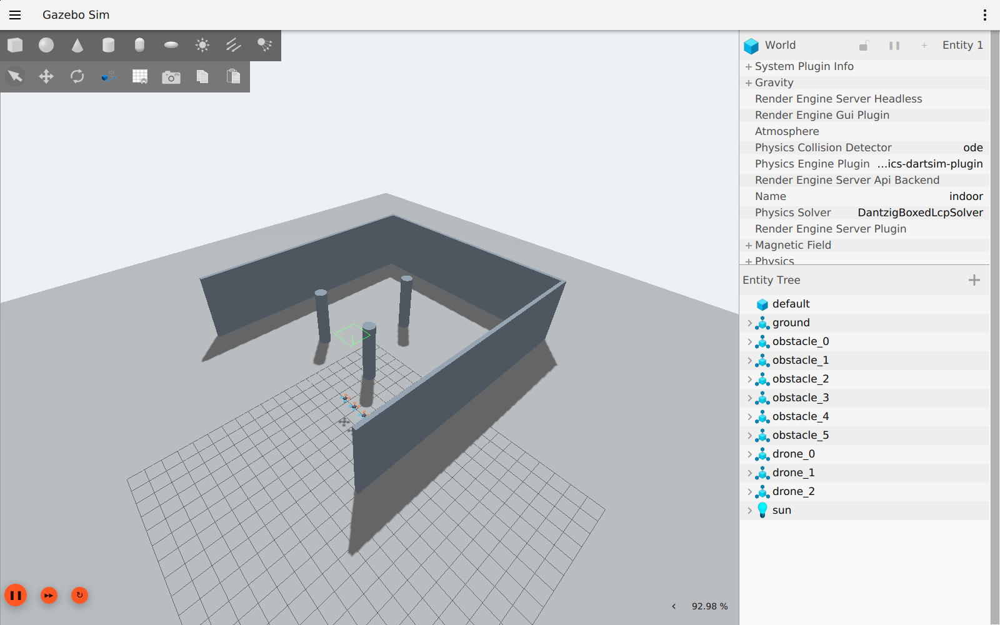
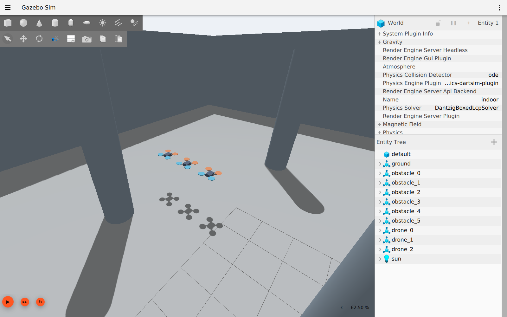
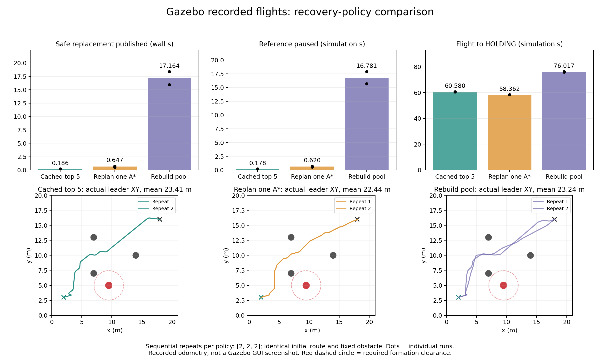

# 实测证据

最新三维融合探索的 [原生视频、统计与审计](fusion/README.md) 包含复杂三维场景、规划通信中断、动态障碍和进程重启。以下为 2026-09-22 首轮迁移的历史记录，口径和任务均不同。

以下是本次迁移在 Gazebo 中实际运行的记录。完整方法、口径、限制和测试结果见 [验收记录](../../VALIDATION.md)。

## Gazebo GUI 截图

## 动态恢复对照

下图根据真实里程计和状态记录绘制，不是 GUI 截图。三组各两次，六次均到达，起飞后接触均为 0。

[逐次结果](recovery-results.json) 的 summary 字段指向同目录的原始运行摘要。完整轨迹 CSV、候选快照和进程日志保存在本地 artifacts/controlled_comparison；重新运行 compare_recovery.py 可生成完整工件。
