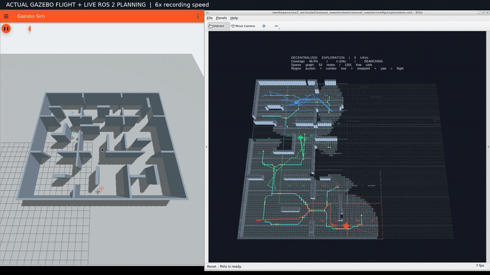

# 去中心化探索：真实 Gazebo 录屏与验收

[完整 1080p 视频（113.6 秒）](decentralized-exploration.mp4) · [运行说明](../../../DECENTRALIZED_EXPLORATION.md)

视频来自同一次 Gazebo / ROS 2 运行的原生窗口，6 倍录屏时间播放，画面保留仿真时钟。没有用轨迹日志生成飞行动画。`demo.gif` 是完整视频第 35–51 秒的节选。

| 验收项 | 实测 |
|---|---:|
| 真实自由空间覆盖率 | 95.0497% |
| 达到 95% 的仿真时间（初始扫描完成后） | 361.999 s |
| 起飞后接触数 | 0 |
| 最小采样机间距 | 2.031 m |
| 三机累计水平航程 | 193.004 m |
| 完成观测 | 85 |
| 全体同伴确认的路径提交 | 90 |
| 跨机重叠区域执行租约 | 0 |
| 停稳后确认释放预约 | 5 |
| 同伴不可用后的区域归属变更 | 2 |
| 实际保留的最大备选路径数 | 5 |
| 最终各机拓扑节点 / 可通行栅格 | 114 / 3046–3051（约 3.74%） |
| ROS 包测试 | 76 通过，0 错误、失败或跳过 |

默认场景是 24 × 20 m 的复杂迷宫，有多房间、错位门、遮挡、回路、U 型障碍和 1.8 m 窄门。视频在 UAV 1 执行已提交路线期间暂停该机 25 秒。日志记录了约 75.5 s 的取消请求、76.4 s 的停稳预约释放、同伴区域重分配，以及约 101 s 的恢复。

独立审计见 [audit.json](audit.json)；90 次提交均有完整参与者记录，执行租约区间没有跨机重叠。283 条候选路径还接受了场景真值几何的事后检查：正常路线净空至少 0.65 m，唯一的短距离跟踪恢复候选至少 0.50 m，见 [geometry-audit.json](geometry-audit.json)。它们来自原 A*、带惩罚的多路径搜索、稀疏拓扑路由和短距离恢复；路径池仍保留原来的质量评估与至多五条备选。

旧 A* + PID 三机编队也完成真实动力学回归，目标 `(8, 3, 1.5)`，零接触，见 [formation-pid.json](formation-pid.json)。手动 GitHub Actions 工作流已提供，本次未在 GitHub 上运行。

[summary.json](summary.json) 是未改写的运行摘要；[events.jsonl](events.jsonl) 合并三机原始事件；[environment.json](environment.json) 保留录制模块 SHA-256 与环境；[recording.json](recording.json) 和 [video-probe.json](video-probe.json) 保留录制与媒体属性。原始 10 fps 录屏、逐帧里程计、完整同伴消息和所有候选坐标保留在本地 `artifacts/decentralized/release_demo/`，不把调试失败运行计入上述结果。

当前是固定 1.5 m 高度的平面探索，使用由实际 Gazebo 位姿驱动的理想 120° / 3.5 m 遮挡射线传感器。固定成员预约协议在失联时悬停；尚未实现三维建图、视觉 SLAM、动态成员变更或任意网络分区下的持续探索。单次演示不构成对 RACER/GVP-MREP 的性能复现，也不用于和不同传感假设的旧集中式结果宣称速度提升。
