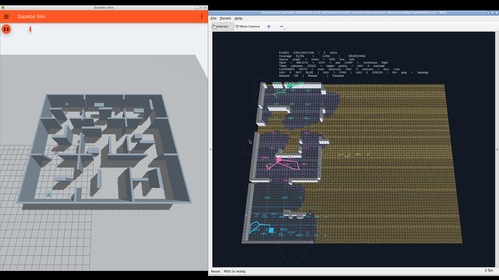

# 探索配色与图例

| 显示元素 | 颜色/样式 |
|---|---|
| UAV 0：机体、轨迹、所属区域 | 天蓝 `#38BDF8` |
| UAV 1：机体、轨迹、所属区域 | 粉紫 `#F472B6` |
| UAV 2：机体、轨迹、所属区域 | 翠绿 `#34D399` |
| 全队仍未知的高优先级区域 | 金色，越明亮相对优先级越高 |
| 全队已观测为自由、本机仍未知 | 淡紫色小格点 |
| 已观测自由空间 | 灰蓝 |
| 未知空间底色 | 深蓝灰 |
| 障碍 | 灰白立方块 |
| 稀疏拓扑 | 半透明细灰蓝线 |

实际轨迹和已提交路线加粗，视场边界减淡。Gazebo 与 RViz 共用机体配色常量。全队已观测图只用于可视化分类；规划器、控制器与任务评分未修改。团队图尚未收到或网格不一致时，图例明确使用 `Local unknown`；组件体积仍标记为 `Local C`，表示指定无人机自己的未知组件。

此图来自一次新的短时原生 Gazebo/RViz 运行，任务开始后约 50 秒，专门检查新配色。它不是此前 820 秒完整验收的重新测量，也没有修改原始验收视频。[预览元数据](preview-metadata.json) · [相关 8 项测试](tests.txt)。

随后已用同一已提交配色版本录制[完整新视频（62.47 秒，24 倍墙钟加速）](../palette-video/palette-exploration.mp4)：本次 890.5 个仿真秒达到 95% 覆盖，最终 95.07%，零接触。[本次完整验收与数据](../palette-video/README.md)单独保存。
