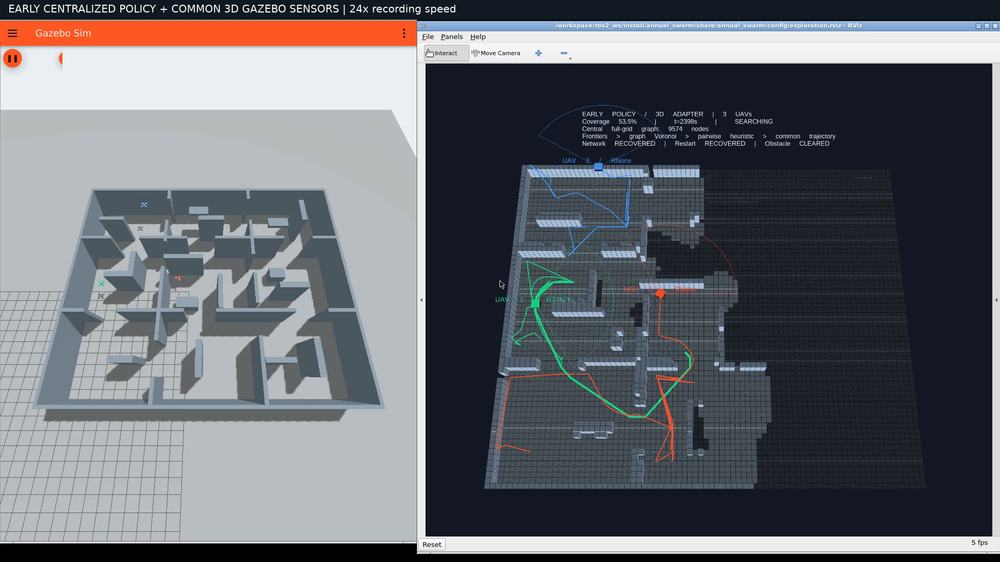
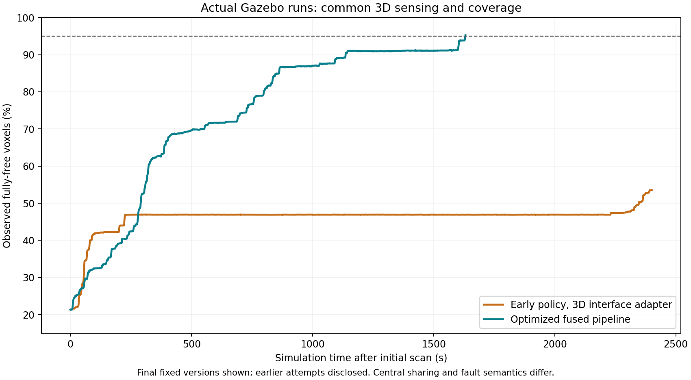

# 早期策略接入相同三维传感环境：实际 Gazebo 对照

[原生 Gazebo / RViz 录像](early-policy-3d.mp4) · [逐项结果](comparison.json) · [覆盖与轨迹审计](audit.json) · [独立飞行检查](flight-audit.json) · [优化融合版对照](../fusion-optimized/README.md)



用户选择将早期策略接入当前三维传感环境，按相同三维覆盖率评价。本次固定适配版本 `964c451` 实际运行 **2400.641 仿真秒**，结果为 **SIMULATION_TIME_LIMIT**，最终覆盖 **53.5288%**。**到停止时仍未达到 95%**。未完成任务时，运行上限不能当成完成时间。

| 指标 | 早期策略＋三维适配 | 当前优化融合版 |
|---|---:|---:|
| 300 s 时三维覆盖率 | 46.925% | 52.547% |
| 362 s 时三维覆盖率 | 46.927% | 62.665% |
| 1000 s 时三维覆盖率 | 46.935% | 87.059% |
| 1631.005 s 时三维覆盖率 | 46.932% | 95.247% |
| 达到 90% / s | 未达到 | 1136.003 |
| 达到 95% / s | 未达到 | 1631.005 |
| 最终三维覆盖率 | 53.5288% | 95.2465% |
| 运行记录累计航程 / m | 434.737 | 652.625 |
| 完成观测 | 128 | 370 |
| 路线提交 | 150 | 395 |
| 最小采样机间距 / m | 1.283 | 1.744 |
| 起飞后接触计数 | 0 | 0 |

航程取各自记录摘要；覆盖和任务完成状态不同时，较短航程不能解释为完成同一任务更高效。检查点采用不晚于该时刻的最后一个覆盖样本。图中只展示最终固定版本各一次运行，前序接口联调及失败尝试全部另列，不做统计显著性结论。



## 保留、适配与比较边界

- 历史核心为 [`7136591`](https://github.com/Wu-Chenjie/Annual-Project/commit/71365916e1a4851d937f493c93bfa0beec73eacf)：集中式图 Voronoi 分配、有限次成对优化、任务顺序、质量池策略。`vendor` 五个源文件逐字保存，历史 SHA 校验通过。
- 四邻接全栅格图扩为六邻接体素图；二维未知邻域计数扩为 2 m 球；增加有限视场目标偏航与当前执行接口。路径预约保留原水平语义。完整范围、参数和复现命令见 [适配说明](../../../benchmarks/early_policy_3d/README.md)。这不是原始旧二进制直接完成三维任务，也没有将新融合规划器冒充旧策略。
- 两次使用相同九房间 `search_fusion_3d.json`、原生 120°×120° / 4.5 m GPU LiDAR、带噪定位＋IMU EKF、0.3 m 体素、58589 个完全自由体素、0.6 m/s 参考限速、0.8 m/s²、jerk 2 m/s³、0.7–3.1 m 高度。独立重新计算最终覆盖率。定位不是 SLAM。
- 保留旧版集中式实测地图共享与中央授权。融合版有独立本地图、协商和提交协议，因此是整套系统的工程对照，不能将全部差异归因于分配器，不能据此证明每个新增模块都有必要。
- 同一 6 CPU / 8 GiB Colima 环境，共用运行代码为 `620d1aa`；80 个实际安装源文件与已发布融合录像逐项一致。录制过程中没有修改算法或参数。另有 10 项实际安装的模型、地图、场景及配置与融合录像源码一致，见 [资源核对](installed-assets-verification.json)。
- 初始扫描结束起计时，预设上限 2400 仿真秒 / 14400 墙钟秒，达到 95% 后保持 3 仿真秒；执行失稳另行停止。视频为真实双窗口 X11 录屏，24 倍墙钟播放，时间指标来自仿真时钟。

早期原办公室成绩为 259.5 s、另一二维去中心化成绩为约 362 s，采用不同地图、定高搜索、理想射线和二维覆盖。它们不能直接作为当前三维任务完成时间。本次结果只说明这个明确披露维度适配的旧策略在当前环境中的表现；不排除其他适配或改进后的旧策略取得更好成绩。

## 飞行、停滞与故障记录

约 2230 s 前覆盖率长期停在 46.9% 附近，末段恢复部分推进，最终仍未完成。300 s 后，UAV 0 对两个局部目标分别派发 40 次、37 次，见 [任务审计](policy-audit.json)。规划墙钟中位耗时 6.911 s，全自由体素图最多 9591 个节点；这些是诊断统计，不能单独解释任务耗时差异。

在最终传感地图上离线复算，这两个重复目标所选偏航的可见未知表面预测均为零；其中一个目标附近仍有 129 个未知体素，说明“附近未知格子多”与“当前朝向能看到新空间”并不等价。见 [事后可见增益检查](repeat-gain-audit.json)。该检查使用最终地图，不是当时每次决策的回放，也不是因果消融。

真实位置差分速度 >0.05 m/s 的平移时间占比，按任务开始至完成或停止时间加权。其余时间包含转向、驻留和等待：

| 飞行器 | 早期策略 | 优化融合版 |
|---|---:|---:|
| UAV 0 | 32.57% | 42.63% |
| UAV 1 | 6.08% | 31.48% |
| UAV 2 | 4.59% | 39.53% |

暂停：已完成；规划通信中断：已恢复；客户端重启：已恢复；动态障碍试验：已完成。旧架构没有每机规划器，重启的是实际单机命令客户端，中央规划器保持运行；融合版重启的是单机规划器，不能称为等价的重启消融。各事件具体时刻保存在 `summary.json` 和原始日志中。恢复标志表示通信或客户端恢复，不保证持续取得有效探索任务。

动态障碍在任务开始后 2349.002 s 触发并完成横穿；对目标路径的首个撤销请求发生在触发后 1.000 s，替代授权在 7.998 s 后出现。本轮没有记录到历史 `backup_switch` 事件，实际表现为撤销后重规划，不能算作缓存备选无缝切换验收。当前接口在最新地图验证失败时先撤销执行并向旧调度器释放任务，因此不能将它视为旧执行机制的完全等价重现。故障触发规则相同，实际触发时刻与融合版不同。

独立飞行检查根据 Gazebo 真值高度排除起飞段，意外落地样本为 0。接触计数只是一个观测通道，不能独立证明安全；仍需结合真值轨迹、跟踪误差和采样机间距，采样检查也不等同于连续避碰证明。多候选池最多保留 5 条备选，连续参考约束检查通过。参考速度上限与真实差分速度不同；本轮记录的真实差分速度最高约 0.660 m/s。独立高度审计也正确检出了前序已知失败轮的落地记录，见 [审计反例检查](audit-self-check.json)。

## 前序尝试完整披露

[尝试清单](diagnostic-attempts.json) 和 [诊断原始证据包](diagnostic-evidence.tar.gz) 保存前序启动检查及中止/失败尝试：

1. ROS Python 环境错误在飞行前退出；随后 60 s 联调发现完成事件使用瞬时状态造成丢失，改为持久完成契约。
2. 首轮正式尝试发现旧策略撤销命令没有完整转发，主动中止修正。
3. `87489a4` 尝试在客户端重启附近三机失稳落地，接触计数仍为零；真实高度已记录。没有证明具体根因，不能用该轮证明安全或任务性能。后续移除客户端无用的重型规划导入并增加独立执行失败停止条件。
4. `2668f5e` 尝试在约 82.6% 时发现三维距离预约与原水平预约/公共执行器不一致，主动中止。`964c451` 恢复水平预约并加入回归测试后，才录制本报告的固定版本。

没有将这些尝试拼接成一次成功录像，也没有从中挑选最快完成成绩。

## 证据与复现

[原始证据包](raw-evidence.tar.gz) 包含完整录制源码、覆盖曲线、真值轨迹、跟踪参考、同伴状态、候选及分配日志、最终实测地图、运行元数据。未倍速录屏保留在本地 `artifacts/early-baseline/final/`。8 项适配测试通过，见 [tests.txt](tests.txt)；生产融合运行代码未变，本轮没有声称重新执行其全部测试。

停止检测时刻与 ROS 退出后的最后记录相差约 0.64 s；表中最终覆盖及航程取最后摘要。`run-result.json` 保存检测到时限时的原值，没有将时限当成任务完成时间。录制结束后只补充报告生成和离线审计脚本，见 [分析源码清单](analysis-source-manifest.json)；录制源码快照保持为 `964c451`。

媒体为 H.264、1920×1080、30 fps、159.80 s；全片解码通过，人工检查前、中、结尾帧。见 [媒体检查](media-audit.json)、[录制源码检查](source-verification.json)、[安装文件检查](installed-source-verification.json)、[SHA256 清单](SHA256SUMS)。

```bash
# 解压本目录及 fusion-optimized/ 下的 raw-evidence.tar.gz
PYTHONPATH=next_project python3 ros2_ws/benchmarks/early_policy_3d/analyze.py \
  early-policy-3d-final optimized-final --output-dir comparison-output
```
