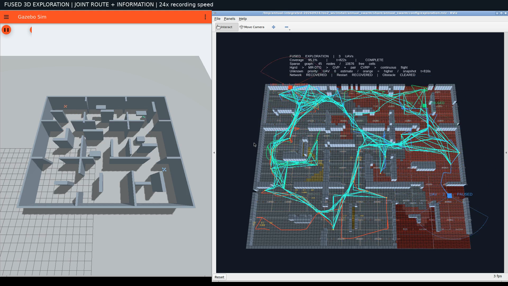

# 联合路线与观测收益改进：同条件 Gazebo 实测

[观看 1080p 视频（58.27 秒）](integrated-exploration.mp4) · [三版本数据](three-way-comparison.json) · [完整验收](full-acceptance.json) · [运行机制核对](integrated-audit.json)



这次改动将任务收益、路线与观测放在同一条融合流程中：保留插入/有向 2-opt 优化后的路线，取消优化后的分数重排；路线和双机分配共同最小化行驶/服务时间与信息加权完成时间；等待改为最高 1.5 倍的乘法奖励。各机通过 MR-DTG 增量协议交换实际观测存在性位图，历史重复观测保留 10% 收益，既减少重复覆盖，也允许为本机通行继续观测。每轮最多细化 24 个区域，其中 4 个轮转名额，配合局部几何缓存。实际执行视点仍做完整射线、碰撞、连续轨迹和预约检查，没有新增算法模式切换。

三个版本均使用 24×20×4 m 九房间地图、0.3 m 体素、原生 Gazebo GPU LiDAR（181×31、120°×120°、4.5 m、5 Hz）、带噪定位与 IMU 估计、0.6 m/s 参考限速、0.7–3.1 m 飞行范围、同一暂停/通信中断/重启/动态障碍触发规则，以及 6 CPU / 8 GiB 的原生 ARM64 Linux 环境。覆盖率分母始终为 58589 个几何上完全自由的三维体素。动态障碍实际触发时刻取决于路线，异步调度也会不同。

| 指标 | 此前优化融合版 | 上轮末端优先级版 | 本次联合改进 |
|---|---:|---:|---:|
| 达到 90% / 仿真秒 | 1136.003 | 2119.502 | **752.999** |
| 达到 95% / 仿真秒 | 1631.005 | 2379.999 | **820.000** |
| 90%→95% / 仿真秒 | 495.002 | 260.497 | **67.001** |
| 总航程 / m | 652.625 | 916.148 | **327.109** |
| 规划中位耗时 / 墙钟秒 | 4.367 | 8.524 | 5.457 |
| 视点完成至下一提交中位等待 / 仿真秒 | 2.489 | 3.229 | 2.263 |
| 最小采样机间距 / m | 1.744 | 1.593 | 1.800 |
| 起飞后接触 | 0 | 0 | 0 |

总耗时较此前优化融合版缩短 **49.72%**、较上轮末端优先级版缩短 **65.55%**；航程分别缩短 **49.88% / 64.30%**。末端 90%→95% 耗时分别缩短 **86.46% / 74.28%**。这次同时改善了任务完成时间和航程。


单轮规划仍比此前优化融合版慢（5.457 对 4.367 秒），不能声称所有计算阶段都更快。相对上轮末端优先级版，规划中位时间由 8.524 降到 5.457 秒，优先级阶段由 1.161 降到 0.694 秒。累计应用层通信负载为 79.871 MB（其中图同步 41.485 MB），未含 DDS/IP 开销；单位任务时间平均负载约 97.4 kB/s，与此前优化版的约 97.1 kB/s 接近。加入回执并不意味着通信开销为零。

每版本只有一次完整飞行；这是一组工程对照，不能据此保证所有地图或随机条件下都能缩短相同比例，也不能将所有收益归因于某一个单独改动。低收益服务反馈仍有 43 次，重复访问仍存在；当前不是全局最优或已经消除冗余探索的算法。

## 本次运行证据

最终覆盖率 **95.0912%（55713 / 58589）**。独立审计从最终传感器体素图和场景几何重新计算，结果与 summary 完全一致；没有通过更换覆盖率分母或读取真值来决定路线。RViz 橙色收益层显示 UAV 0 的私有未知地图，而顶部覆盖率来自实验端全队实际传感地图，因此橙色区域不等于全队未观测区域。

三架机的真值跟踪误差 P95 为 0.03049 / 0.02972 / 0.03055 m，最大误差 0.05033 m；无异常落地。实际有限差分速度最高 0.659 m/s，需与 0.6 m/s 的参考约束区分。连续参考速度/加速度/jerk 约束通过逐条提案审计。

暂停恢复、规划通信中断恢复、真实节点重启及动态障碍试验均完成。圆柱在仿真绝对时刻 216.503 s 开始横穿 UAV 2 路线，首个撤销事件在 217.503 s，延迟 **1.000 s**；该次响应是撤销，不能称为缓存切换。全程另有 2 次缓存路线切换，候选池最多 5 条备选。双方均记录应用的任务交换 45 次，同区域跨机执行租约重叠为零。

本次记录到 5 次运动暂停及 5 次恢复；其中 UAV 1 曾因本机净空检查悬停，其他机继续搜索，随后 UAV 1 恢复运动。这段时间保留在录像和总耗时里。规划通信中断时仍有独立邻机安全状态通道，不能作为所有网络链路同时失效的证明。

运行诊断核对 334 个去重规划样本和 219 条带收益记录的提交：等待倍率最高 1.5，等待项最多占正分数 1/3；每轮细化区域最多 24 个，粗射线调用最多 174 次。历史回执只影响收益，单测验证它不改变本机占据值、安全格或未知空间通行条件。

## 可复现性与版本

本次实际编译和录制的是基于 `25084e2957d1746ee539d40c050e284e9e8dce8d` 的冻结工作区，包含此前未提交的末端优先级改动和本轮联合改进，**不能仅用该基线提交标识运行源码**。完整录制源码位于原始证据包中的 `recorded-source.tar.gz`，202 个文件的 SHA256 见 [source-manifest.json](source-manifest.json)。108 个实际安装源文件逐项匹配，录制后工作区再次核对一致；全程未热替换。

[173 项 ROS 测试](tests.txt) 零错误、零失败、零跳过。新增测试覆盖有界等待、非对称路线增量对完整目标重算、子集路线与联合分配的穷举对照、容量/固定任务、回执合并/重启/错误包、历史收益折扣及预评估预算/缓存失效。测试与完整仿真验收分别记录。

视频是原生 Gazebo/RViz 的实时 X11 录屏，仅做 24 倍墙钟加速和标题叠加；H.264、1920×1080、30 fps。任务用时取 Gazebo 仿真时钟，不能从 58.27 秒视频直接乘 24 计算。全片解码通过，前、中、结尾画面已检查，结尾显示 95.1% / COMPLETE。未倍速原录屏保留在本地 `artifacts/priority-integrated/final/gazebo-rviz-raw.mp4`。

[本次原始证据](raw-evidence.tar.gz) 包含最终地图、各机地图/事件/候选、轨迹与跟踪 CSV、同伴状态、启动日志、源码快照、测试、审计及复算脚本。[此前优化版证据](../fusion-optimized/README.md) 与 [上轮末端优先级证据](../fusion-tail-priority/README.md) 保留供对照。

解压三个原始证据包后，可在对应 ROS 环境中执行：

```bash
python3 ros2_ws/src/annual_swarm/scripts/audit_fusion_run.py integrated-final
python3 integrated-final/audit_integrated.py integrated-final
MPLCONFIGDIR=/tmp/annual-mpl-cache python3 integrated-final/compare_three.py \
  optimized-final tail-priority-final integrated-final --output comparison
```

`profile-*-container.json` 只是相同末端地图快照上的辅助计时，不与完整任务用时混用。
