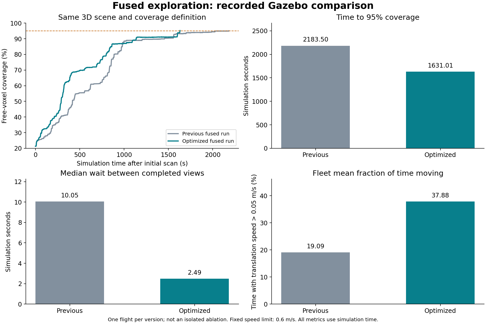

# 融合探索性能优化：同地图原生 Gazebo 录像

[1080p 完整视频（109.4 秒）](fused-exploration.mp4) · [原版三维融合录像](../fusion/README.md) · [可复算对照](comparison.json) · [独立审计](fusion-audit.json)


保持 Hgrid → MR-DTG → 图 Voronoi → 双机任务/路线协商 → 观测/运动联合搜索 → 多候选质量池 → 连续轨迹的同一条流程。优化包括区域路线增量代价、局部搜索与几何缓存、占据中心线快速拒绝，以及独立工作进程中的下一视点/连续轨迹预规划。到达后以当前地图、epoch、归属和预约复验，再执行原有提交协议。

两次运行使用相同 `search_fusion_3d.json` 九房间地图、原生 GPU LiDAR、0.3 m 体素、0.6 m/s 参考上限、0.7–3.1 m 高度范围及相同覆盖率分母 58589。保留同一故障触发逻辑；动态障碍具体触发时刻取决于实际路线。视频均为真实 Gazebo/RViz 窗口的 24 倍录屏墙钟播放，表中时间取仿真时钟，不从视频时长换算。

| 指标 | 原三维融合版 | 优化版 |
|---|---:|---:|
| 达到 90% 覆盖 / s | 1456.500 | 1136.003 |
| 达到 95% 覆盖 / s | 2183.500 | 1631.005 |
| 视点完成至下一提交的中位等待 / s | 10.051 | 2.489 |
| 累计三维航程 / m | 476.048 | 652.625 |
| 规划墙钟中位耗时 / s | 4.185 | 4.367 |
| 最小采样机间距 / m | 1.308 | 1.744 |
| 起飞后接触 | 0 | 0 |
| 路线提交 | 310 | 395 |
| 完成观测 | 279 | 370 |

本次达到 95% 的时间下降 **25.30%**，视点间等待中位数下降 **75.24%**；代价是总航程增加 **37.09%**。本轮改善了等待和任务完成时间，重复探索仍未消除，不能声称路径长度或能耗同时得到优化。

每版本仅一次完成飞行，属于工程实测对照，不是统计显著性结论或严格单因素消融。旧录像源码为 `314fd02`，新录像同时包含此前 `8076b22` 的冷启动估计协方差修复；不能把所有差异都单独归因于预规划。旧规划计时不含 ROS 回调中的连续轨迹拟合，新规划计时包含此项。

实际平移时间占比按 Gazebo 相邻位姿差分、速度 >0.05 m/s、任务开始至完成的时间加权计算。非平移时段也包含必要的转向和观测驻留，不全部等同于无效等待。

| 飞行器 | 原版平移时间占比 | 优化版平移时间占比 |
|---|---:|---:|
| UAV 0 | 19.34% | 42.63% |
| UAV 1 | 19.48% | 31.48% |
| UAV 2 | 18.44% | 39.53% |



新录像覆盖率 **95.2465%**（55804/58589）；实际采用预规划下一视点 153 次，连续曲线直接复用 401/419 次提案；最多保留 5 条有效备选。独立审计确认同区域跨机执行租约重叠为零、双机容量与连续参考约束通过，双方确认应用的任务交换共 74 次。

暂停恢复、18 s 规划通信中断、真实进程重启及圆柱横穿路径均在本次录制内完成。动态障碍开始于 522.500 s，目标 UAV 2，首个撤销/切换事件延迟 0.500 s。独立邻机安全状态通道在规划通信中断时仍保留。定位为带噪仿真定位与 IMU 融合，未声称实现 SLAM。

安全悬停与恢复可服务状态发生次数：17 / 17，详见 [motion-events.json](motion-events.json)。无法验证安全退让时保持悬停、继续图同步并退出竞价，让同伴接管；这不等同于保证单机主动脱困，也不将进程重新加入等同于恢复飞行。

## 版本、原始证据与复算

视频为 H.264、1920×1080、30 fps、109.37 s。全片解码通过，已检查前段、中段及显示 95.2% / COMPLETE 的结尾画面；预览图直接提取自 109.3 s。见 [媒体检查](media-audit.json) 与 [文件 SHA256 清单](SHA256SUMS)。

录像源码固定为 [`620d1aa`](https://github.com/Wu-Chenjie/Annual-Project/commit/620d1aa344c87f513aa2121ba12aa4e531dbc2c6)，197 个文件逐项核对一致，见 [源码清单](source-manifest.json) 和 [差异检查](source-differences.json)。80 个实际安装源文件与录制快照一致，见 [安装文件核对](installed-source-verification.json)。129 项 ROS 包测试零失败，见 [tests.txt](tests.txt)。最终运行没有热替换代码。

[原始证据包](raw-evidence.tar.gz) 包含轨迹/跟踪 CSV、同伴状态、各机事件与候选、最终传感地图、启动日志、完整录制源码快照和元数据。未倍速原生录屏保留在本地 `artifacts/fusion/optimized-final/`。第一轮在 66.90% 覆盖时主动结束，用于剖析剩余碰撞查询开销；第二轮在 80.07% 覆盖时主动结束，暴露单机安全悬停后停止任务/拓扑更新的问题。两轮均仅保留为本地诊断记录，不列为完整验收。

```bash
# 分别下载旧版和新版原始证据包并解压，得到 native-tenth/ 和 optimized-final/
python3 ros2_ws/src/annual_swarm/scripts/audit_fusion_run.py optimized-final
python3 ros2_ws/src/annual_swarm/scripts/compare_fusion_performance.py \
  native-tenth optimized-final --output comparison.json --figure performance.png
```

[最初快照剖析](profile-baseline.json)、[首轮优化快照](profile-first-optimization.json) 与 [中心线快速拒绝交替对照](profile-early-reject-paired.json) 是辅助定位数据，不与完整任务时间混用。
