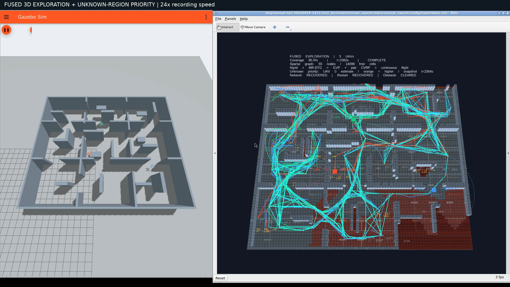
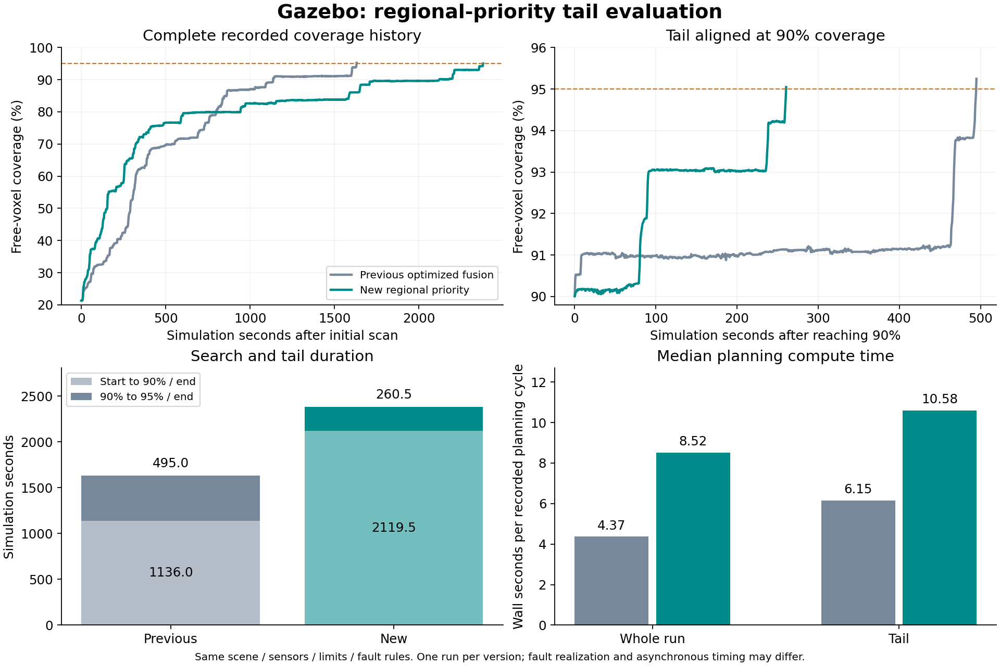

# 末端区域优先级优化：Gazebo 实测与录像

[完整视频（1080p，2 分 59 秒）](tail-priority-exploration.mp4) · [对照数据](comparison.json) · [独立审计](fusion-audit.json) · [飞行检查](flight-audit.json)

**本轮完成了 95% 覆盖。90%→95% 收尾时间下降 47.37%，但总任务时间增加 45.92%。因此只能说本次收尾阶段较快，不能说整体探索效率得到改善。**



录像是实际 Gazebo 与 RViz 窗口，展示复杂九房间地图、三架无人机、三维观测、稀疏拓扑、任务协商与橙色未知区域优先级。橙色层是 UAV 0 的局部估计；HUD 覆盖率来自实验端的全队观测并集，两者不是同一张地图。没有用示意动画替代飞行。

## 同条件结果

时间从初始扫描完成开始，单位为 Gazebo **仿真秒**。视频为原生录屏的 **24 倍墙钟播放**，不能用视频时长换算任务仿真时间。

| 指标 | 上一版优化融合 | 本次区域优先级 | 本轮变化 |
|---|---:|---:|---:|
| 到达 90% / s | 1136.003 | 2119.502 | 增加 86.58% |
| 90%→95% / s | 495.002 | 260.497 | 减少 47.37% |
| 到达 95% / s | 1631.005 | 2379.999 | 增加 45.92% |
| 累计三维航程 / m | 652.625 | 916.148 | 增加 40.38% |
| 规划墙钟中位耗时 / s | 4.367 | 8.524 | 增加 |
| 视点完成至下一提交中位等待 / 仿真秒 | 2.489 | 3.229 | 增加 |
| 完成观测数 | 370 | 221 | — |
| 路线提交数 | 395 | 265 | — |
| 最小采样机间距 / m | 1.744 | 1.593 | — |
| 起飞后接触次数 | 0 | 0 | — |



两次使用相同 `search_fusion_3d.json` 地图、原生 GPU LiDAR、0.3 m 体素、带噪定位与 IMU EKF、0.6 m/s 参考速度上限、0.7–3.1 m 规划高度及相同故障触发规则。地图 SHA256 与覆盖率定义逐项一致，分母均为 **58589 个几何上完全空闲的体素**。本次最终观测 55686 个，覆盖率 **95.045145%**，由保留的最终传感地图独立复算一致。

这是每版一次飞行的工程对照。异步计算、传感噪声、几何相关的动态障碍触发时刻以及到达 90% 时剩余区域的形状均可能不同，不能据此作统计显著性或严格单因素因果结论。两次均使用同一 6 CPU / 8 GiB Colima 配置和运行容器；本次在容器 `/tmp` 的冻结源码副本内构建，安装路径与旧版不同。

## 中段变慢的观测证据

本轮前期较快，随后在约 80%、83.6%、89.6% 附近出现长平台，最终在接近 2400 秒预算时完成。全曲线保留了这些时段，没有删去低效率过程。

- 600 秒之后的 129 次附带优先级评分的提交中，**117 次等待加分超过总评分的 80%**。128 次正评分提交中，等待项占比中位数为 **98.20%**。等待项已经经常压过观测收益与路程代价。
- 一个具体例子：绝对仿真时刻 878.0 s，UAV 2 提交区域 197，预估收益 0.027 m³，即 1 个体素；模型估计移动需 49 秒，等待项占其评分 99.926%。另一个任务预估 2 个体素、移动 46.5 秒，等待项占 99.959%。见 [阶段性原始诊断](interim-priority-diagnostic.json)，完整统计见 `comparison.json` 的 `current.phases.after_600`。
- 新增优先级预评估阶段的墙钟中位耗时为 1.161 秒，整体规划中位耗时从 4.367 秒增至 8.524 秒。其他阶段和工作负载也发生变化，不能把全部增加都归因于这 1.161 秒。
- 累计航程增加 40.38%，而三机跟踪误差 95 分位约为 3.0–3.3 厘米。任务选择、往返距离与规划开销比控制跟踪失效更值得优先排查。

上述是日志支持的现象及排查方向，不是通过消融证明的唯一原因。区域重复访问也可能补充不同高度或朝向的有效信息；局部新增体素不等于全队唯一新增空闲体素，未将二者混算为“重复率”。本轮只冻结、运行、录制和分析已有改动，没有在飞行中修改策略或参数。

## 验证

- ROS 包 **148 项测试通过，0 错误、0 失败、0 跳过**：[测试结果](test-results.txt)。
- [完整融合验收](full-acceptance.json) 通过：同区域跨机执行租约重叠为零，双机容量约束、提交确认、连续轨迹参考约束、稀疏图及三维观测均通过；57 次双机事务在双方日志中确认应用。
- 最多保留 5 条备选路线，整场有 12 次缓存路线切换。动态障碍专项的首个响应是 **0.505 仿真秒后的路线撤销**，不能把该专项响应描述为缓存切换。
- 暂停、规划通信中断、真实节点重启均恢复，动态障碍专项完成。独立邻机安全通道在规划通信中断时保留；定位不是 SLAM。
- [独立飞行检查](flight-audit.json) 确认三机全程真值流保留，起飞后无低于 0.5 m 的异常落地样本。记录参考速度最大 0.591 m/s；真实位置差分速度与参考速度是不同量。采样检查不构成任意环境下的安全证明。
- 视频为 H.264、1920×1080、30 fps、179.10 秒；全片解码通过，已逐一检查 5.0 秒、89.55 秒与 179.0 秒画面，最后一帧显示 **95.0% / COMPLETE**。详见 [媒体检查](media/media-audit.json)。

## 版本与复算

上一版运行源码为 `620d1aa344c87f513aa2121ba12aa4e531dbc2c6`。本次基于 `25084e2957d1746ee539d40c050e284e9e8dce8d` 加上用户尚未提交的末端优化，**并非仅运行该 Git 提交本身**。201 个实际使用的源码/资源文件已冻结，108 个安装文件与快照逐项一致，运行结束再次校验通过；相对上一版有 12 个源码、配置或测试文件不同。

[源码清单](source-manifest.json) · [完整冻结源码](recorded-source.tar.gz) · [安装文件核对](installed-source-verification.json) · [版本差异](changes-from-reference.patch) · [运行配置](run-configuration.json) · [环境](environment.json)

预先设定终止条件为达到 95% 后保留 3 仿真秒、执行失败或搜索满 2400 仿真秒。本轮达到目标正常结束，录制墙钟约 4297.56 秒。未倍速视频保留在本地 `artifacts/tail-priority/final/gazebo-rviz-raw.mp4`；各机事件/候选、轨迹/跟踪 CSV、同伴状态与最终传感地图位于本目录的原始证据压缩包。

解压此前优化版和本版原始证据压缩包后复算（需要 Python、NumPy、Matplotlib）：

```bash
MPLCONFIGDIR=/tmp/annual-mpl-cache python3 tail-priority-final/analyze_run.py \
  optimized-final tail-priority-final --output comparison
```

`post_checks.py` 需在已加载冻结 ROS 工作区的环境中执行；调用原有 `audit_fusion_run.py` 和随包保留的 `audit_flight.py`。本目录 [SHA256 清单](SHA256SUMS) 覆盖交付文件；[原始证据压缩包](raw-evidence.tar.gz) 包含源快照、任务/轨迹/地图日志和验收元数据，不重复装入大体积视频、预览图与压缩包本身。
