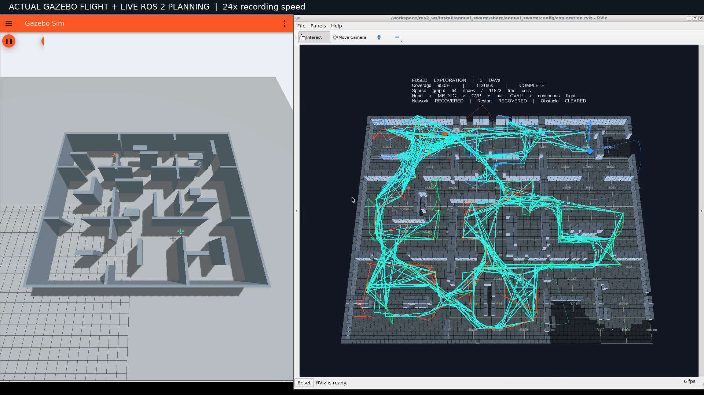
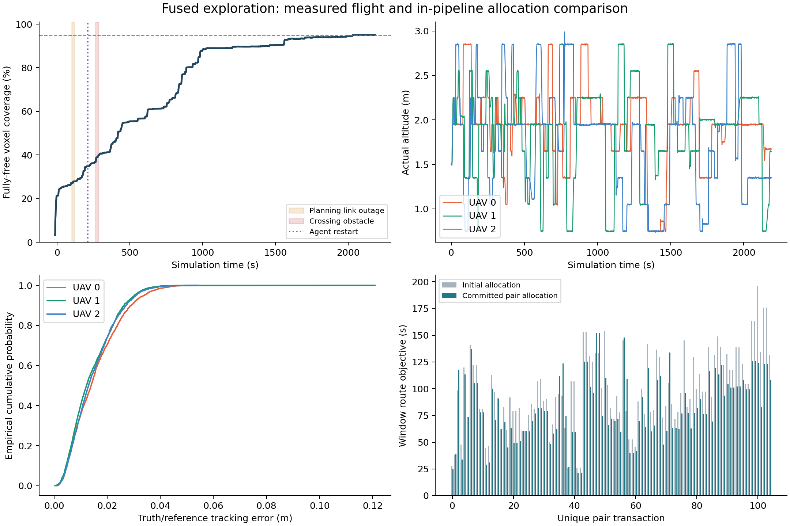

# 三维融合探索：Gazebo 原生录像与可复核证据

[1080p 完整视频（140.1 秒）](fused-exploration.mp4) · [实现与接口](../../../DECENTRALIZED_EXPLORATION.md) · [独立审计](fusion-audit.json)



一条运行链路：原生 GPU LiDAR/IMU → 私有三维地图 → Hgrid/EROI → 增量 MR-DTG → 两级图 Voronoi → 双机容量任务/路线协商 → 位置/偏航联合观测规划 → 多候选质量池 → 连续五次轨迹 → C++ PID/真实 Gazebo 电机动力学。没有 RACER/GVP 算法模式选择器。

场景为 24×20×4 m、九房间、错位门、回路、死胡同、1.8 m 瓶颈、低货箱与悬空货架。录像为同一次运行的 Gazebo 与 RViz 原生窗口，24 倍录屏墙钟播放；仿真时钟保留在画面内。没有从轨迹日志生成飞行动画。

| 项目 | 本次实测 |
|---|---:|
| 完全自由体素覆盖率 | 95.0247% |
| 旧体素中心口径（仅供口径核对） | 89.7978% |
| 已观测 / 真值完全自由体素 | 55674 / 58589 |
| 初始扫描后达到 95% 的仿真时间 | 2183.500 s |
| 起飞后接触 | 0 |
| 最小采样机间距 | 1.308 m |
| 三机累计实际三维航程 | 476.048 m |
| 完成观测 / 路线提交 | 279 / 310 |
| 双方均记录应用的独立任务交换 | 106 |
| 最大有效备选路线数 / 实际缓存切换 | 5 / 3 |
| 跨机重叠同区域执行租约 | 0 |
| 最终历史节点 / 图边 | 64 / 437 |
| 各机带安全余量可通行体素 | 7121–12357 |

覆盖率采用实际传感器已观测自由体素 / 几何上完全自由体素，体素盒与几何相交即为占据；它不是连续空间体积的精确积分。审计用 `observed_final.npz` 与场景几何独立重算分子、分母。旧中心口径把部分墙边界格子误判为自由，因此保留两个数值，不能把口径修复当成算法性能提升。详见 [同地图同观测的口径诊断数据](metric-consistency-evidence.tar.gz)。

实际执行真值 / 参考跟踪误差（取参考遥测到达时，非严格同时间戳对齐）：

| 飞行器 | RMS m | P95 m | 最大 m | 起飞后高度跨度 m |
|---|---:|---:|---:|---:|
| UAV 0 | 0.0182 | 0.0339 | 0.0534 | 2.116 |
| UAV 1 | 0.0168 | 0.0303 | 0.1208 | 2.117 |
| UAV 2 | 0.0171 | 0.0308 | 0.0544 | 2.252 |

暂停恢复、18 s 规划通信中断、真实代理进程重启，以及真实圆柱横穿路径均在同次录像内执行。动态障碍开始于仿真 277.503 s，目标 UAV 1；首条撤销/候选切换响应延迟为 1.006 s。日志同时保留停止确认与后续路线预约，不能把“发出撤销”解释为已经完成避障机动。中断的是规划通信，独立邻机安全状态通道仍存在。



右下图比较同一双机窗口在融合优化前后的任务路线目标，保留全部有限代价且双方确认的事务；初始分配可能违反容量，此时不能仅凭代价上升判断改进失败。它不是 RACER 与 GVP-MREP 两个完整系统的基准竞赛。原始事务见 [pair-transactions.json](pair-transactions.json)。

视频为 H.264 / 1920×1080 / 30 fps，全片解码通过，已检查前、中、完成阶段画面；校验记录见 [media-audit.json](media-audit.json)。手动 GitHub Actions 工作流已对齐融合版目录与审计器，本次未在 GitHub 上执行工作流。

## 源码与复现

主录像启动时 Git HEAD 为 `2b38f93`，工作区含当时尚未提交的延迟定位修复。已逐项验证录制快照全部 196 个文件与随后提交 [`314fd02`](https://github.com/Wu-Chenjie/Annual-Project/commit/314fd02) 完全一致。源文件逐项 SHA-256 见 [source-manifest.json](source-manifest.json)，完整录制时源码快照在原始证据包中。没有在仿真中热替换代码。

后续提交 [`8076b22`](https://github.com/Wu-Chenjie/Annual-Project/commit/8076b22) 修复另一冷启动运行暴露的接触冲量估计问题；同时更正离线图表覆盖率标签。它没有改动探索分配、拓扑或轨迹算法，但主录像不作为该冷启动修复的验证。[source-differences.json](source-differences.json) 精确列出文件差别。修复独立通过 [30 s 打包镜像冷启动](packaged-startup.json)、[同一失败传感记录修复前后回放](startup-impulse-evidence.tar.gz) 与 117 项包测试；录像版本为 116 项。另有 13 项原规划器专项回归。见 [tests.txt](tests.txt)。

[原始证据包](raw-evidence.tar.gz) 包含实际轨迹/跟踪 CSV、完整同伴状态、每机事件与候选、最终观测地图、地图配置、启动日志、录制元数据及源码快照。原始未倍速 MP4 另保存在本地 `artifacts/fusion/native-tenth/`。

```bash
tar -xzf raw-evidence.tar.gz
# 在 ROS 包环境或已安装 numpy/scipy 的源码环境中执行：
python3 ros2_ws/src/annual_swarm/scripts/audit_fusion_run.py native-tenth
python3 ros2_ws/src/annual_swarm/scripts/summarize_fusion_run.py native-tenth --output analysis
```

定位源是带噪仿真定位与 IMU 融合，外部 VIO/LIO 通过标准里程计接口接入，目前没有实现视觉/激光 SLAM。双机优化只精确求解有限交互窗口。单次成功与故障注入不证明任意网络的安全性，也不等同于两篇论文完整复现。
