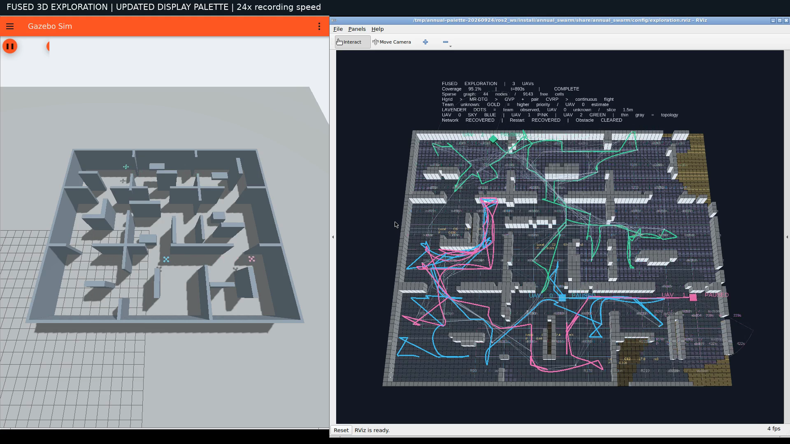

# 新配色完整 Gazebo 录像

[播放 1080p 视频（62.47 秒）](palette-exploration.mp4) · [配色说明](../display-palette/README.md) · [完整验收](full-acceptance.json)



这次使用已提交的 `1b0a6b5b4af7d391b88c77199266799f7e2c2165` 重新运行完整探索并录制原生 Gazebo/RViz 窗口。UAV 0/1/2 分别为天蓝、粉紫、翠绿；金色显示全队仍未知的高优先级区域，淡紫小格点显示全队已观测自由但当前无人机仍未知的位置。新配色不修改规划器、控制器或任务评分。

| 本次实际测量 | 结果 |
|---|---:|
| 最终三维覆盖率 | 95.0656%（55698 / 58589） |
| 达到 90% / 仿真秒 | 732.505 |
| 达到 95% / 仿真秒 | 890.500 |
| 90%→95% / 仿真秒 | 157.995 |
| 总航程 / m | 402.354 |
| 起飞后接触次数 | 0 |
| 最小采样机间距 / m | 1.323 |

地图、三维传感器、运动约束、6 CPU / 8 GiB 仿真资源及暂停、断连、重启、动态障碍触发规则与[此前联合改进录像](../fusion-integrated/README.md)相同。本次独立运行的统计单独保留；此前 820.000 秒的结果属于此前那次飞行。异步规划调度与按路线触发的动态障碍会使运行结果变化。

暂停恢复、通信恢复、真实节点重启恢复及动态障碍试验均通过完整验收。独立飞行检查确认三架机真值流完整且没有异常落地；[跟踪误差与参考量](flight-audit.json)及[最终传感地图独立复算](sensor-map-audit.json)单独保存。参考量约束与实际采样运动量不可混用。

视频来自原生 X11 录屏（10 fps 采集），仅做 24 倍墙钟加速和标题叠加，输出 H.264、1920×1080、30 fps；没有重绘飞行画面。任务时间使用 Gazebo 仿真时钟，不能由视频时长直接乘 24 得到。[全片解码与抽帧检查](media/media-audit.json)通过。未倍速录像保留在本地 `artifacts/palette-video/final/gazebo-rviz-raw.mp4`。

录制源码为已提交快照，无未提交运行改动；203 个源码文件和 110 个安装文件已逐项核对，运行中没有热替换。[源码清单](source-manifest.json)与[安装文件核对](installed-source-verification.json)可复查。本次配色相关的 8 项测试在录制前通过，见[测试记录](../display-palette/tests.txt)；本次没有重新执行此前算法版本的 173 项完整测试。

[原始证据压缩包](raw-evidence.tar.gz)保留各机事件、候选路径、同伴状态、实际轨迹/跟踪 CSV、最终体素地图、启动日志、源码快照与复算脚本。解压后可在对应 ROS 环境中运行：

```bash
python3 ros2_ws/src/annual_swarm/scripts/audit_fusion_run.py palette-video-final
python3 palette-video-final/post_checks.py palette-video-final
python3 palette-video-final/audit_integrated.py palette-video-final
```
