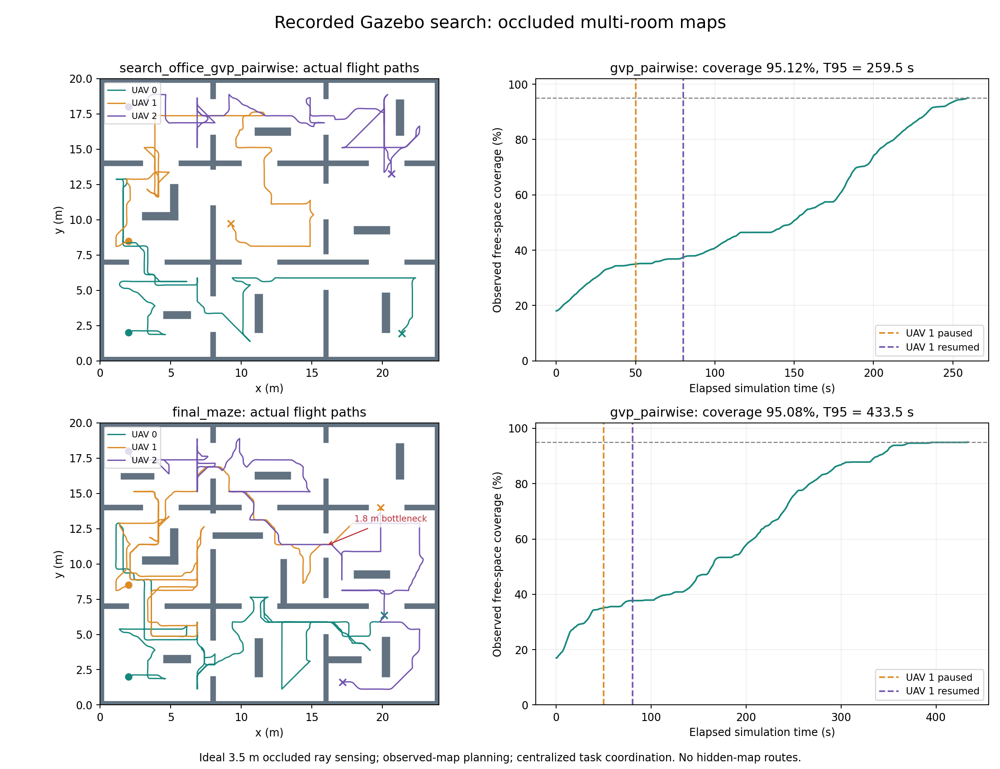
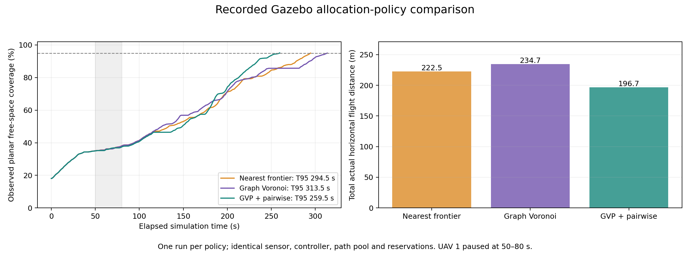

# 复杂搜索实测证据

方法与完整数据表见 [验收记录](../../../VALIDATION.md)；运行方式和能力边界见 [使用说明](../../../EXPLORATION.md)。

两图来自 Gazebo 真实里程计与观测记录，不是 GUI 截图。[逐场景结果](results.json) 链接原始 summary；[运行环境与代码哈希](environment.json) 用于追溯。每组一次，不宣称统计显著性。
