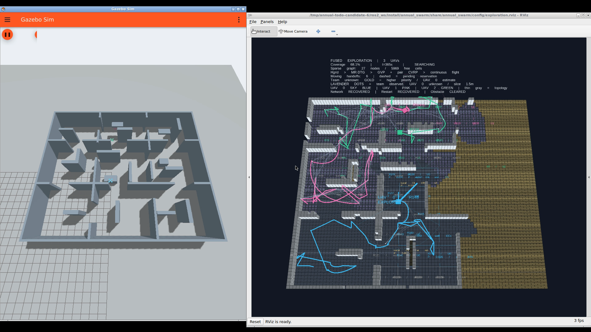

# 候选6：残余任务、实际曲线与执行证据

冻结源码231项，完整ROS环境219项测试通过，128个安装后的文件与冻结清单逐项一致。

- 只有1个实际可观测体素的有效残余区域仍能生成任务和视点。
- 提前交接的旧服务收益核对限定为原目标视野的实际观测集合，不能用其他沿途观测替代。
- 共享入口改变时不沿用旧入口的预测体素范围；实际回执与通行几何继续分开。
- 从当前状态重新拟合后，按实际连续轨迹的时间、jerk和净空重新排序，并按实际曲线去重。
- 同一候选重新拟合记录为 `cached_route_refitted`；只有不同候选才记录为 `cached_route_switched`。普通提案与运动交接均记录候选曲线、质量、期限及ID，独立观察器保存实际发布指令。
- 独立协议审计核对指令曲线不可变、解析动力学、C2交接、ACK集合、区域预约排他及实际执行token；与真实Gazebo飞行/覆盖核对分别报告。

原始测试首次217项通过/1项失败：全自由场景中两条几何路线拟合为同一直线，因此正确去重后无法用于验证不同绕行路线的排序。测试在任何运行前改为障碍两侧绕行，并单独验证全自由场景的曲线去重。飞行源码未因测试场景修正改变。

原生恢复录像 `candidate-6-video-900` 已完成。正式协议仍要求5配对种子、分组故障、3专项地图及6源码消融共80项；开发录像、单测通过或一次样本不构成完整TODO验收。

证据：[源码清单](source-manifest.json)、[冻结源码](recorded-source.tar.gz)、[安装一致性](installed-source-verification.json)、[全部测试](tests.log)。

## 同次原生运行

T95=616.999s，90%→95%=44.999s；总航程330.204m，规划等待286.158机秒，全部已测规划请求P95=7.234s。最终覆盖95.1783%，起飞后零接触，采样最小机距2.18265m。8次实际运动交接，最快交接实测速度0.52769m/s，最大边界误差约1e-14。探索低/零团队收益服务54/10次，通行补图7次，安全恢复8次。该运行包含暂停、规划通信分区、代理重启及实际移动圆柱；不与无故障开发样本混合评价性能。

[真实飞行与覆盖](independent-acceptance.json)和[独立授权协议](execution-protocol-audit.json)均通过。后者捕获197份曲线指令，核对207次提案及预约区间。一次实际不同备选的切换链通过，但发生在动态障碍结束后，因此**动态障碍触发备选专项尚未完成**。必要通行、交接、收尾片段都来自本次运行，不拼接其他版本。

- [完整原始录像，16分32秒](gazebo-rviz-raw.mp4)
- [24倍完整演示，约42秒](todo-exploration.mp4)
- [正常速度运动交接](moving-handoff-normal-speed.mp4)、[不同候选备选执行](cached-backup-normal-speed.mp4)、[必要通行补图](transit-reobserve-normal-speed.mp4)、[90%→95%完整收尾](tail-90-95-normal-speed.mp4)
- [实际收益账本](todo-audit.json)、[全部原始证据](raw-evidence.tar.gz)、[时间对齐](clip-alignment.json)

片段时间锚点由原视频末帧时间与执行器墙钟推算，约2s定位不确定性；已核对实际HUD。交接前为 t=364s、handoffs=5、ARMED，随后 t=365s、handoffs=6，与global t=380.001s减去任务起点15.501s一致。HUD覆盖率为当前评估值，区域热图为代理当时收益估计；离线团队新增量只在审计结果中呈现。

