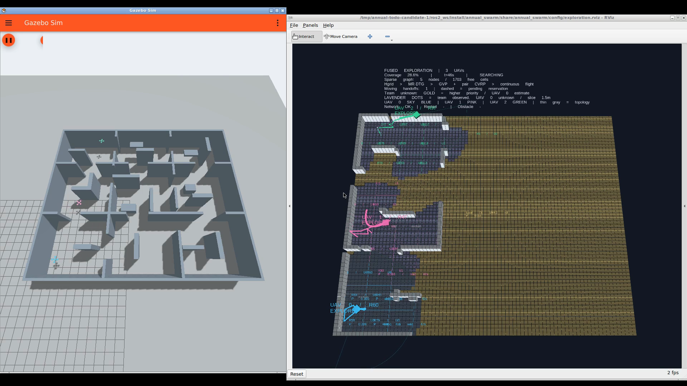

# TODO 开发阶段的原生 Gazebo 证据

[24倍演示录像](todo-exploration.mp4) · [完整未加速原始录像](gazebo-rviz-raw.mp4) · [正常速度交接片段](handoff-detail.mp4)



运行 ID：`candidate-1-video-900`。这是第一版未提交源码冻结快照的开发试验，包含暂停、规划通信分区、节点重启和动态障碍注入。212个源码文件保留在[清单](source-manifest.json)及原始证据包中；没有运行中热替换源码。后续第二、第三版修改了工作进程缓存与截止预算，不能把本片当成后续版本的录像。

117个安装后的Python/配置/地图文件与冻结源码逐项匹配，见[安装核对](installed-source-verification.json)。第一版服务窗口按代理反馈时刻封闭，第二版开始按执行器的实际交接时刻封闭；旧候选日志的 `gain_m2` 字段在三维任务中实际保存体积收益，独立账本采用明确的体素计数，不使用这个历史字段计算覆盖率。

| 本次实际测量 | 结果 |
|---|---:|
| 三维最终覆盖率 | 95.0076%，固定几何自由格分母58589 |
| T95 / 仿真秒 | 551.001 |
| 90%→95% / 仿真秒 | 33.985 |
| 总航程 / m | 195.144 |
| 接触次数 | 0 |
| 最小采样机距 / m | 3.473 |
| 非零速度交接次数 | 4 |
| 交接边界最大误差 | 3.58e-15 |
| 低/零团队新增探索服务 | 17 / 2，低收益口径为窗口新增已知格少于30 |
| 工作进程规划超时 | 58 |

[收益与时间账本](todo-audit.json)按实际传感时刻及最早观测来源独立归因，在线区域估计与离线整个服务窗口实测的空间范围不同。[逐窗口CSV](service-windows.csv)保留两种口径。已知格、曾观测自由格与最终几何自由格覆盖率分别报告，不能互相替代。

[独立飞行检查](flight-audit.json)确认三机真值流完整、无异常落地，跟踪误差P95约3cm；[最终传感地图复算](sensor-map-audit.json)与完成时汇总一致。真实采样速度与参考曲线约束是不同指标。[原有恢复验收](full-acceptance.json)通过，但不是E01–E10全部验收通过。

本次动态障碍试验完成了避障和恢复，**没有发生已验证的缓存备选路线切换**；本片也没有通行补图任务。上述片段和正式五种子重复、消融仍待补齐。[当前执行进度](../../../TODO_EXECUTION.md)保持未完成状态。单次开发结果不能证明总体提速，不能与不同故障/GUI配置的历史运行计算改善百分比。

录像为原生X11窗口10fps采集，演示片仅24倍墙钟加速与标题叠加，1920×1080 H.264/30fps；[全片解码检查](media/media-audit.json)通过。交接片段没有加速，画面HUD约44秒显示待交接预约、约46秒显示交接计数变为1。日志使用全局仿真时间，HUD使用任务经过时间；[片段定位](handoff-clip-timing.json)保留墙钟/视频近似对齐及边界余量。

[原始证据压缩包](raw-evidence.tar.gz)包含逐帧真实观测、执行状态、同伴状态、各机协商/预约与候选事件、真值轨迹、跟踪数据、覆盖率序列、最终体素地图、启动日志、录制器、源码快照及复算脚本。解压后使用冻结源码中的ROS依赖及核心包：

```bash
python3 audit_todo_evidence.py candidate-1-video-900
python3 verify_todo_run.py candidate-1-video-900
```

第一版录制前全套180项测试通过；第二版188项、第三版190项分别对应各自源码快照。测试记录保留，不将后续测试数量归到本片源码上。
