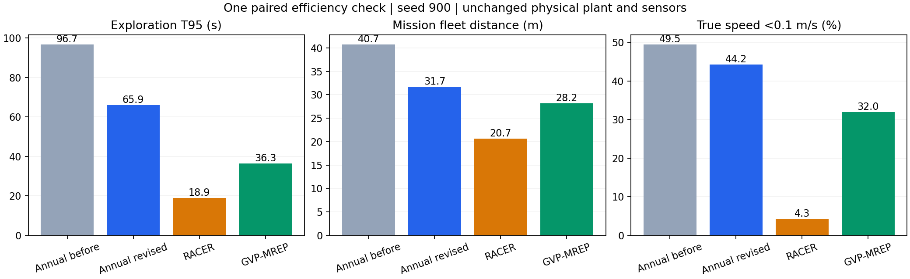
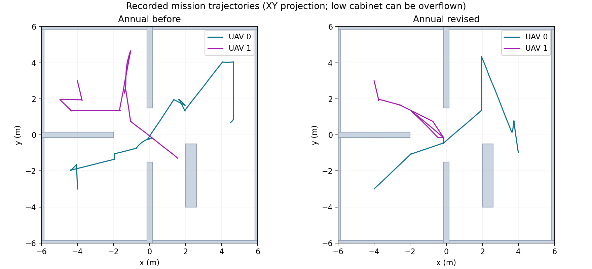

# 重复服务与低速优化：单种子开发复测

已修复已完成服务仍被锁定的问题，并保留真实帧完成、最新几何检查、区域预约和曲线授权。只增加一轮完整开发复测，沿用本日已完成的 RACER/GVP 对照；没有展开剩余70次正式矩阵。

## 修改及直接证据

- 服务结束后释放 `active` 和旧执行任务的 `-1e6` 出价。原运行有23条无活动意图却保留active的遥测、28条空闲却保留执行出价的遥测，修改版两项均为0。
- 比较优化路线前3个任务的实际视点信息/运动收益，明显更有价值时越过微小残余任务；近似相同收益保留路线顺序，远端通行仍保留其角色。预约许可仍由原协议决定。
- 缓存视点的有效团队信息少于初始预测20%时重新规划。没有固定体素下限，新规划的1格残余任务仍可执行；预测不作为已观测证据。
- 停止执行时的规划提交间隔由2秒改为0.25秒；在飞行、恢复、停机、授权及单工作进程边界内继续使用原门槛。

## 同口径实测

同一12×12×3m地图、双机、seed=900、相同传感/估计器/公共参考限速。所有时间扣除统一20秒初始化，总航程和低速占比从仿真20秒计至停止。低速指Gazebo真实线速度 <0.1m/s，按时间加权。

| 指标 | 修改前 | 修改后 |
|---|---:|---:|
| 95%覆盖耗时 | 96.654s | 65.932s |
| 双机总航程 | 40.727m | 31.696m |
| 低速占比 | 49.45% | 44.23% |
| 探索服务数 | 22 | 16 |
| 连续同区域服务数 | 7 | 2 |
| 在线团队新增为0的探索服务 | 4 | 1 |
| 规划请求墙钟P95 | 1.484s | 2.136s |

完成时间减少31.8%，航程减少22.2%，低速占比减少5.23个百分点。连续同区域服务可以在不同朝向/高度观察不同信息，其次数不等于无效重复航程比例。在线零团队收益也不等于全局离线重复率。

## 剩余低速来源

以下单位为机秒，由真实位置差分低速与原生执行状态配对；阶段标签是观测分类，不自动证明因果。

| 低速阶段 | 修改前 | 修改后 |
|---|---:|---:|
| 执行/转向/跟踪 | 29.082 | 19.266 |
| 到点观测 | 6.599 | 3.509 |
| 分配等待 | 35.311 | 15.605 |
| 预约等待 | 17.201 | 9.793 |
| 规划等待 | 5.000 | 10.199 |
| 通行重观测 | 2.575 | 0.000 |

低速仍为44.23%。视点窗口增加了规划工作量，规划墙钟P95和规划等待机秒均上升；分配/预约等待及过多短段的减小抵消了这部分成本。后续优先降低视点预览与轨迹构造的重复计算，再改善转向和短段衔接。当前仍慢于本场景的 RACER 18.907s 和 GVP 36.298s，也仍比二者低速更多。单种子结果不能作稳定改进或普遍算法优劣的结论。

## 验证和复现

- 321项完整pytest和C++控制器测试通过；274项冻结源码及136项安装资源一致：[构建](efficiency-build.log)、[回归](efficiency-tests.log)、[安装核对](annual-efficiency-install-verification.json)。
- 新源码独立冻结274文件：[源码清单](annual-efficiency-source-manifest.json)。原272文件源码和原三组数据未覆盖。
- 为确保物理一致，复测使用原基线控制器与电机插件，两个二进制SHA256完全相同：[物理二进制](efficiency-physics-binaries.json)。首次构建生成不同编译二进制，在初始化阶段停止，未进入任务，保留为 [排除的启动检查](trial-annual-efficiency-900/excluded.json)；该检查不计作性能样本。
- 修改版记录覆盖率96.3939%，原始传感器独立重放96.3276%，差-0.0663个百分点；积分帧215/215与在线计数一致，均超过95%。
- 零接触、零几何碰撞，最小采样机距1.736m；公共参考v≤0.6m/s、a≤0.8m/s²，真实速度最大0.722m/s。真实速度允许控制器跟踪超调，不称严格相同实飞速度排名。
- [原生授权审核](trial-annual-efficiency-900-r1/native-protocol-audit.json)通过，4次实际运动交接；新地图使1个未授权交接取消。审核原生整形前曲线，公共整形后的参考限速与真实碰撞另行核对。
- 新容器与原容器独立，Gazebo分区精确清理为空；最终停止本次启动的容器和Colima环境。
- [复测启动器](run_efficiency.py)、[原始复测结果](trial-annual-efficiency-900-r1/result.json)、[同口径分析代码](efficiency_analysis.py)、[机器可读比较](efficiency-comparison.json)、[阶段诊断](trial-annual-efficiency-900-r1/execution-diagnostics/diagnostics.json)。
- 原始[三系统报告](REPORT.md)继续保留。ROS版本、算力分配与适配边界仍按该报告解释；本次是开发性配对检查，不替代原正式主图5种子与专项场景。
