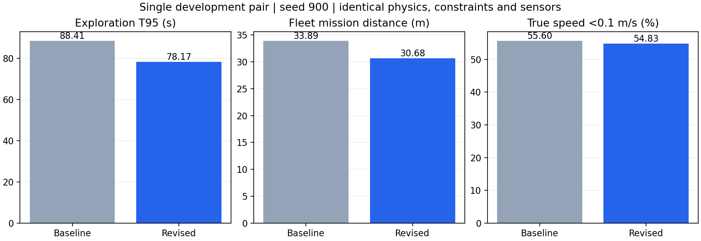

# 2026-10-06：当前优先 TODO 实现与小规模验证

本轮处理 `RACER_GVP_ENGINEERING_TODO.md` 顶部的运动交接、短航段成本、走廊争用与开发验证。代码已实现并通过回归；正式 E01–E10 验收仍未完成，既有 70 项矩阵继续暂缓。历史未提交修改和所有失败样本保留。

## 实现

| 项目 | 实际改动 | 保留的约束 |
|---|---|---|
| 运动交接 | 新段提交后立即提前准备；优先选择减速前可用边界。完整视点准备与缓存曲线重拟合使用各自实测耗时窗口；缓存终点视点可从未来运动状态重新拟合。 | 提议可早于观测完成，执行授权仍必须有旧服务目标至少 60% 的实际观测证据；最新收益、归属、生命周期、几何、预约及 C2/偏航连续性继续复核。 |
| 时延测量 | 单独记录 ACK 准备完成、真实观测等待、提议、授权、消费、取消；完整规划和缓存拟合分别取滚动 P95。样本不足用保守默认/样本最大值，保留慢与截尾样本。 | 不裁剪实测提前量，不降低授权条件；窗口不足安全回退。 |
| 服务成本 | 视点比较计入停止到停止的五次曲线加减速时间、路径转角、并行偏航、观测和重复经过软成本；单机与双机路线使用一致的时间代理。 | 这是可解释成本代理，不是精确 ETA；拟合后的实际曲线仍独立做动力学与几何认证。一格残余任务、必要通行和最多五条既有备选规则保留。 |
| 走廊争用 | 逐机计算路线起点/边的预计通行等待，支持两机不同边成本的精确 DP；剔除队友已走过前缀，按弧长均匀采样，只惩罚预计仍被占用的交集，同一队友预约取最大值防双算。 | 等待只是软预测，不替代硬预约；真实信息收益不再因交通重复打折。缺队友位置安全降级。 |
| 过期执行出价 | 工作进程结果应用时过滤已失效的执行偏好，并在状态发布时重新过滤，覆盖“结果应用后租约才退休”的情况。 | 当前、待交接及退休中租约的有效偏好保留；普通出价和任务本身不删除。 |

入口：`Annual-Project/next_project/core/exploration/{service_cost,service_selection,team_evidence,fusion,pairwise,regions,priority}.py`、`core/planning/{handoff,handoff_timing}.py`、`ros2_ws/src/annual_swarm/scripts/decentralized_agent_node.py`。

邻近视点使用既有前段视点窗口/后继收益比较，复核路线和新成本；本轮没有把不同视野任务强行合并，也没有把路径重叠直接当作浪费。

## 版本与验证条件

最终交付源码：[candidate-publish-source-manifest.json](candidate-publish-source-manifest.json) 和 [源码归档](candidate-publish-source.tar.gz)，276 项冻结文件，归档 SHA256 `37b8327948dac09eab254a835a587889542c3c9c193d285bd27efe51c03b48a4`。工作区逐文件匹配见 [delivered-source-verification.json](delivered-source-verification.json)。132 项被核对的安装资源覆盖核心 Python、地图、配置、启动文件和可执行 Python 脚本；不是安装目录所有文件的总数。

[最终回归](publish-regression.log)：348 项通过；[C++ 控制器](publish-controller-test.log)通过；`git diff --check`通过。回归覆盖精确逐机 DP、五次曲线解析限幅、转向/重复成本、走廊采样密度不变性与过期前缀、独立拟合时延、真实旧服务门槛、未来运动起点重拟合、晚到/生命周期失效和状态发布时租约退休。外部停止复审工具的 1 项测试含 8 个反例，通过；既有执行诊断工具 2 项测试通过。早期 339/340/342/343 项回归日志保留，不与最终 348 项相加。

[比较协议](protocol.json)在各次飞行前登记，保留[第一次协议](protocol-first-pair.json)。同一 12×12×3 小地图、种子 900、两机、0.3m 体素、95% 终止、20s 相同初始化、传感器、治理器、控制器和物理镜像；逐次串行执行，300 仿真秒/1200 墙钟秒上限。控制器及电机库二进制 SHA256 在各版一致。环境见 [environment.json](environment.json)：同一 Colima 私有容器、ROS Jazzy/Gazebo Harmonic、`nproc=1`、3905MiB；不与历史六 CPU 运行横比计算性能。

记录的真实速度可以超出 0.6m/s 参考限速，必须分别报告。几何碰撞、接触、跟踪误差、参考速度/加速度、原生预约授权、曲线不可变性与边界连续性、原始点云覆盖复算共同检查。

## 全部运行的处理

- `baseline-900` 在 t=19.472、探索开始前主动停止：当时回归与仿真重叠导致资源污染。完整留存，不计算 T95；之后回归与记分飞行不重叠。
- `baseline-900-r1`：重新冻结的旧策略基线。
- `candidate-900`：早提议和新成本首次组合，T95 比基线更差，保留失败。
- `candidate-refit-900`：加入缓存运动重拟合，性能改善，但 10 个状态包仍残留旧执行出价。
- `candidate-closure-900`：加结果应用过滤后，10 个状态包仍有旧出价。原因是租约在结果应用以后才退休；不能称为已修复。
- `candidate-publish-900`：最终增加发布前过滤。其指标只对应最终冻结源码；前一版较快的成绩不能替代该版结果。

每次额外运行的理由在协议中登记；没有按结果筛除慢样本，没有新启动正式矩阵或多个种子消融。

## 原生审计与只读停止复核

最终候选以原生审核结果为准。基线的[原审核](baseline-900-r1/native-protocol-audit.json)保留 `Authorized handoff not consumed 1:9aaedb8d:401008`。独立[只读复审](baseline-900-r1/native-protocol-stop-reviewed.json)证明：在边界 10.8931 之前，旧进度 8.98 时执行了新 epoch 的停止命令；后续持续记录无活动/待执行 token、零参考速度，两份退休中租约一直保留到任务结束。因任务结束截尾，未记录租约最终释放。

复审将它归为“边界前取消、租约保留、任务末截尾”，**消费数仍为 0**；不伪造成功交接或租约退休。仅移除经完整证明的缺消费错误，其他错误原样保留，原审核器与原始飞行证据未改。复审状态明确为 `PASS_WITH_STOP_PROOF`；这是开发安全核对，不等于正式全量协议验收。

## 指标口径

T95、航程和低速均从 t=20 开始；低速使用 Gazebo 真实线速度 `<0.1m/s` 的时间加权比例。已有执行阶段诊断的低速来自位置差分，另存并标注；不能把它替换成主指标，也不能把所有低速归为规划等待。

[replay_novelty.py](replay_novelty.py)沿原始激光和定位记录复算首次团队已知/自由体素的时间与来源，去重后按实际传感时间统计。真值只筛选评估自由体素，不进入规划/地图。服务窗为 `(start,end]`，整段传感器新增量与在线目标足迹收益分列；同时间首次观测按较小机号归属。任务期新增自由体素/秒包含途中观测；同区域连续服务、最终集合交集并不能自动解释为无效飞行。

归属变化来自两机各自连续本地归属表，不把两份副本相加成全局唯一换主次数；估计工作量因成本模型改变，不能直接当成实测飞行负载对照。各机完成服务数、在线目标收益及实际传感新增来源单列。

## 实测结果（同一小地图种子）

| 版本 | T95 扣初始化(s) | 航程(m) | 真实低速(%) | 规划墙钟 P95(s) | 交接 提议/授权/消费 | 旧执行出价包 |
|---|---:|---:|---:|---:|---:|---:|
| baseline-900-r1 | 88.405 | 33.888 | 55.60 | 4.823 | 2/1/0 | 0 |
| candidate-900 | 97.642 | 35.380 | 53.76 | 7.082 | 2/2/2 | 6 |
| candidate-refit-900 | 68.933 | 32.385 | 45.22 | 6.697 | 4/2/2 | 10 |
| candidate-closure-900 | 72.072 | 29.072 | 51.29 | 4.971 | 5/2/2 | 10 |
| candidate-publish-900 | 78.175 | 30.681 | 54.83 | 5.395 | 6/4/4 | 0 |

最终版本 T95 降低 11.57%，航程降低 9.46%；低速仅下降 0.78 个百分点。预先登记的 T95、低速、航程≤1.1倍与开发安全检查通过，见 [最终汇总](comparison-publish.json)。这不包含多种子显著性或减速前交接验收。

| 其他指标 | 基线 | 最终交付 |
|---|---:|---:|
| T90→T95(s) | 7.132 | 16.363 |
| 真实最大速度(m/s) | 0.634 | 0.687 |
| 最终自由集合交集比例(%) | 21.136 | 16.704 |
| 覆盖率(%) | 96.0540 | 95.0344 |
| 最小采样机距(m) | 2.4637 | 2.8912 |
| 跟踪误差 P95(m) | 0.0528 | 0.0565 |

两版零接触、无几何碰撞；参考速度≤0.6m/s、参考加速度≤0.8m/s（数值容差）。最终真实速度超调更大，跟踪误差 P95 也略升，均显式保留；不能声称实际速度相同或所有安全裕度改善。最终原生审计 4 次交接的 C2/偏航边界误差为浮点舍入级，旧服务真实观测门槛核对通过。

规划 P95、规划等待和收尾均变差。最终 T90→T95 为16.363s，基线7.132s；不能把早期 refit 的68.933s换成最终源码的成绩。

| 执行阶段驻留（两机合计机秒） | 基线 | 最终交付 |
|---|---:|---:|
| planning_wait | 24.204 | 35.198 |
| allocation_wait | 33.399 | 27.797 |
| reservation_wait | 12.796 | 8.199 |
| execution | 93.205 | 81.802 |
| observation_dwell | 4.198 | 3.004 |
| navigation_reobserve | 8.999 | 0.000 |

## 团队信息与分配诊断

| 指标 | 基线 | 最终交付 |
|---|---:|---:|
| 实际任务期新增自由体素 | 5620.000 | 5504.000 |
| 实际新增自由体素/仿真秒 | 63.571 | 70.406 |
| 完成探索服务窗 | 14.000 | 12.000 |
| 整段传感器零新增已知服务窗 | 0.000 | 1.000 |
| 在线目标零团队收益服务 | 0 | 1 |
| 连续同区域服务 | 0 | 1 |

最终原始点云复算覆盖仍≥95%，见 [覆盖与首次实际新增信息](candidate-publish-900/actual-novelty.json)；终止时有限采样/回调顺序造成的边界体素差异单列。新增自由体素/秒提升，但仍有1个整段传感器零新增已知服务窗、1个在线目标零收益服务、1次连续同区域服务，不能宣称消除了重复探索。阶段驻留、同区域服务和末态集合交集是描述指标，不能直接给某条代码分配因果贡献。

| 本地副本/负载指标 | 基线 0 / 1 | 最终 0 / 1 |
|---|---:|---:|
| 连续本地归属值变化 | 62 / 68 | 20 / 20 |
| 完成探索服务数 | 9 / 5 | 7 / 5 |
| 在线目标新增格数 | 663 / 39 | 531 / 49 |

任务收益仍明显不均衡，估计工作量记录在 [allocation-metrics.json](candidate-publish-900/allocation-metrics.json)；成本模型已变，不能把两版估计值直接当作实际负载改善。归属变化下降、分配/预约驻留下降仅是本场描述，不替代走廊专项或独立消融。

## 交接覆盖和剩余验收

最终6次提议、4次授权、4次消费，2次因 `old_service_insufficient_at_boundary` 取消；消费比4/6。基线2次提议、1次授权、0次消费。新增发布过滤消除了本场记录的10个失效执行出价包。

按旧曲线**准确边界**的速度与加速度内积分类，最终4次消费均在减速阶段；采样实际速度分别约0.377、0.500、0.180、0.584m/s。refit 中间版本有1次减速前消费，不能拼入最终版本当作已满足目标。详见 [最终边界阶段](candidate-publish-900/handoff-motion-phases.json)。减速前边界选择单测通过，实际覆盖仍待改善。

- [x] 提前提议、真实证据授权、缓存运动重拟合、独立耗时与状态日志实现及回归。
- [x] 短段/转向/观测/重复成本及逐机走廊预计等待实现与开发验证。
- [x] 小规模同条件复测、失败保留、原始传感器覆盖/新增信息与原生协议核对。
- [ ] 在最终版本提高减速前实际消费覆盖率；缓解短段窗口与真实观测门槛冲突。
- [ ] 进一步降低规划 P95、规划等待、收尾、零实际新增服务与负载差。
- [ ] 多种子、独立消融、固定正式门槛和 E01–E10 完整验收；原70项保持暂缓。

证据索引：[协议](protocol.json)、[最终汇总](comparison-publish.json)、[原生审核](candidate-publish-900/native-protocol-audit.json)、[传感器门槛](candidate-publish-900/handoff-gate-audit.json)、[执行阶段诊断](candidate-publish-900/execution-diagnostics/diagnostics.json)、[最终源码](candidate-publish-source-manifest.json)、[环境](environment.json)。原始点云、真实轨迹、曲线命令、执行器 token、状态和事件均在各运行目录。

[证据 SHA256 清单](evidence-sha256.json)涵盖本目录源码冻结、外部工具、汇总及各次原始记录；清单自身和Python缓存除外。最终受测控制器/电机库保存于`runtime-binaries/`。全部运行进程清理列表为空，本轮私有容器已移除。
